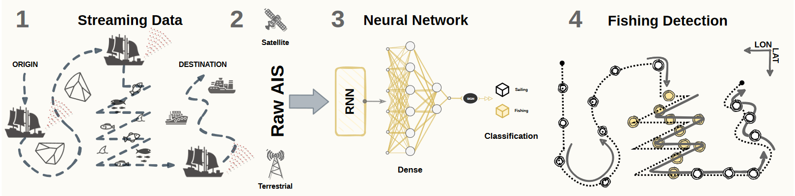

# A Semi-Supervised Methodology for Fishing Activity Detection Using the Geometry behind the Trajectory of Multiple Vessels
## Materials and Methods

### Dataset
数据集网站：https://marinecadastre.gov/AIS/

