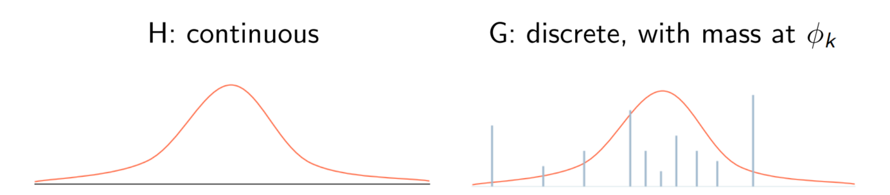
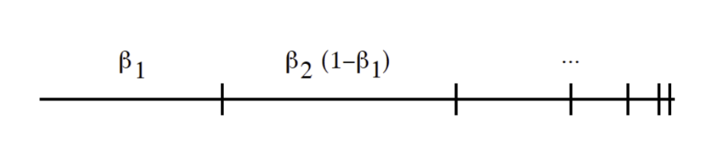

## Non-parametric Bayesian Models

### Introduction

我们将要从以下方面谈论无参贝叶斯：

+ 回归、分类：高斯过程
+ 聚类：狄利克雷过程

对于贝叶斯模型：

在训练时，我们只是估计$f$的后验估计：
$$
p(f\mid D) = \frac{p(D\mid f)p(f)}{p(D)}
$$
在预测时，我们不再需要点估计。相反，我们考虑所有可能的模型并且取期望：
$$
p(y\mid x,D) = \int_f p(y\mid f,x) p(f\mid D)df
$$
为什么要选用贝叶斯呢？

对于无限可交换：
$$
\forall n,\forall \sigma, \quad p(x_1,\cdots,x_n) = p(x_{\sigma(1)},\cdots,x_{\sigma(n)})
$$
`De Finetti's`定理：如果$(x_1,x_2,\cdots)$为无限可交换的，则存在随机变量$f,\forall n$：
$$
p(x_1,\cdots,x_n) = \int_f\prod_{i=1}^n p(x_i\mid f)p(f)df
$$
但是怎么定义先验$f$呢？

### Gaussian Process

我们先复习一下高斯分布：
$$
x \sim \mathcal{N}(\mu,\Sigma)
$$
其中
$$
p(x) = \frac{1}{\sqrt{(2\pi)^n|\Sigma|}}\exp\left(-\frac{1}{2}(x-\mu)^T\Sigma^{-1}(x-\mu)\right)
$$
其中
$$
\mathbb{E}[x] = \mu
$$

$$
\mathbb{E}[(x_i-\mu_i)(x_j-\mu_j)] = \Sigma_{ij}
$$

假设
$$
\begin{bmatrix}x_1\\x_2\end{bmatrix}\sim \mathcal{N}\left(\begin{bmatrix}\mu_1\\\mu_2\end{bmatrix}, \begin{bmatrix}\Sigma_{11}&\Sigma_{12}\\\Sigma_{21}&\Sigma_{22}\end{bmatrix}\right)
$$
则
$$
x_1 \sim \mathcal{N}(\mu_1,\Sigma_{11})
$$
条件分布：
$$
\begin{aligned}
p(x_1\mid x_2) &= \mathcal{N}(x_1\mid \mu_{1\mid 2},\Sigma_{1\mid 2})\\
\mu_{1\mid 2} &= \mu_1 + \Sigma_{12}\Sigma_{22}^{-1}(x_2-\mu_2)\\
\Sigma_{1\mid 2} &= \Sigma_{11} - \Sigma_{12}\Sigma_{22}^{-1}\Sigma_{21}
\end{aligned}
$$
证明：

首先我们先对协方差矩阵进行对角化，方便对其取逆：
$$
\left[\begin{array}{cc}
\Sigma_{11} / \Sigma_{22} & 0 \\
0 & \Sigma_{22}
\end{array}\right]=\left[\begin{array}{cc}
I_1 & -\Sigma_{12} \Sigma_{22}^{-1} \\
0 & l_2
\end{array}\right]\left[\begin{array}{cc}
\Sigma_{11} & \Sigma_{12} \\
\Sigma_{21} & \Sigma_{22}
\end{array}\right]\left[\begin{array}{cc}
I_1 & 0 \\
-\Sigma_{22}^{-1} \Sigma_{21} & I_2
\end{array}\right]
$$
定义：$\Sigma/\Sigma_{22} = \Sigma_{11}-\Sigma_{12}\Sigma_{22}^{-1}\Sigma_{21}$。则：
$$
\begin{aligned}
{\left[\begin{array}{ll}
\Sigma_{11} & \Sigma_{12} \\
\Sigma_{21} & \Sigma_{22}
\end{array}\right]^{-1}=} & {\left[\begin{array}{cc}
I_1 & 0 \\
-\Sigma_{22}^{-1} \Sigma_{21} & I_2
\end{array}\right] } \\
& {\left[\begin{array}{cc}
\left(\Sigma / \Sigma_{22}\right)^{-1} & 0 \\
0 & \Sigma_{22}^{-1}
\end{array}\right]\left[\begin{array}{cc}
I_1 & -\Sigma_{12} \Sigma_{22}^{-1} \\
0 & I_2
\end{array}\right] }
\end{aligned}
$$
则：
$$
\begin{aligned}
& \left(x_1-\mu_1, x_2-\mu_2\right)\left[\begin{array}{cc}
\Sigma_{11} & \Sigma_{12} \\
\Sigma_{21} & \Sigma_{22}
\end{array}\right]^{-1}\left(\begin{array}{l}
x_1-\mu_1 \\
x_2-\mu_2
\end{array}\right) \\
& =\left(\begin{array}{c}
x_1-\mu_1 \\
x_2-\mu_2
\end{array}\right)^T\left[\begin{array}{cc}
I_1 & 0 \\
-\Sigma_{22}^{-1} \Sigma_{21} & I_2
\end{array}\right]\left[\begin{array}{cc}
\left(\Sigma / \Sigma_{22}\right)^{-1} & 0 \\
0 & \Sigma_{22}^{-1}
\end{array}\right] \\
& {\left[\begin{array}{cc}
I_1 & -\Sigma_{12} \Sigma_{22}^{-1} \\
0 & I_2
\end{array}\right]\left(\begin{array}{l}
x_1-\mu_1 \\
x_2-\mu_2
\end{array}\right)} \\
& =\left(x_1-\mu_1-\Sigma_{12} \Sigma_{22}^{-1}\left(x_2-\mu_2\right)\right)^T\left(\Sigma / \Sigma_{22}\right)^{-1} \\
& \left(x_1-\mu_1-\Sigma_{12} \Sigma_{22}^{-1}\left(x_2-\mu_2\right)\right)+C \\
&
\end{aligned}
$$
注意$p(x_1\mid x_2) = \frac{p(x_1,x_2)}{p(x_2)}$，而$C$只是$p(x_2)$的组分。这样我们可以得出条件分布的均值和协方差。

#### Definite

高斯过程是将多元高斯分布拓展到无限变量——随机过程：
$$
\forall x_1,\cdots,x_n,\quad (f(x_1),\cdots,f(x_n))
$$
为联合高斯分布。高斯分布完全由均值函数$m(x)$和协方差函数$k(x,x^\prime)$决定：
$$
\begin{aligned}
m(x) &= \mathbb{E}[f(x)]\\
k(x,x^\prime) &= \mathbb{E}[(f(x)-m(x))(f(x^\prime) - m(x^\prime))]
\end{aligned}
$$
则
$$
(f(x_1,f(x_2),\cdots,f(x_n)))^T \sim \mathcal{N}(\mu, K)
$$
其中
$$
\mu_i = m(x_i), K_{ij} = k(x_i,x_j)
$$
需要$k$为正定核。

#### GP Regression

**无噪声观测**的GP回归：

训练数据集$D = \{(x_i,f_i)\}$，其中$f_i = f(x_i)$。测试集$X_\star$。我们想要去预测输出$f_\star$。根据GP的定义：
$$
\begin{pmatrix}f\\f_\star\end{pmatrix}\sim \mathcal{N}\left(\begin{pmatrix}\mu\\\mu_\star\end{pmatrix},\begin{bmatrix}K&K_\star\\K_\star^T&K_{\star\star}\end{bmatrix}\right)
$$
使用边缘多元高斯分布的结论：
$$
\begin{aligned}
p\left(\boldsymbol{f}_* \mid \boldsymbol{X}_*, \boldsymbol{X}, \boldsymbol{f}\right) & =\mathcal{N}\left(\boldsymbol{\mu}_*, \boldsymbol{\Sigma}_*\right) \\
\boldsymbol{\mu}_* & =\boldsymbol{\mu}\left(\boldsymbol{X}_*\right)+\boldsymbol{K}_*^{\top} \boldsymbol{K}^{-1}(\boldsymbol{f}-\boldsymbol{\mu}(\boldsymbol{X})) \\
\boldsymbol{\Sigma}_* & =\boldsymbol{K}_{* *}-\boldsymbol{K}_*^T \boldsymbol{K}^{-1} \boldsymbol{K}_*
\end{aligned}
$$

---

当观测存在噪声时，真正的$f$是隐藏的。假设我们的观测为：
$$
y = f(x) + \epsilon
$$
其中
$$
\epsilon \sim \mathcal{N}(0,\sigma_y^2)
$$
现在
$$
\text{cov}[y_p,y_q] = k(x_p,x_q) + \sigma_y^2\delta_{pq}
$$
或者
$$
\text{cov}[y\mid X] = K + \sigma_y^2I \triangleq K_y
$$
在这里取$m(x)=0$，我们有：
$$
\begin{pmatrix}y\\f_\star\end{pmatrix}\sim \mathcal{N}\left(0,\begin{bmatrix}K_y&K_\star\\K_\star^T&K_{\star\star}\end{bmatrix}\right)
$$

$$
\begin{aligned}
p\left(\boldsymbol{f}_* \mid \boldsymbol{X}_*, \boldsymbol{X}, \boldsymbol{y}\right) & =\mathcal{N}\left(\boldsymbol{\mu}_*, \boldsymbol{\Sigma}_*\right) \\
\boldsymbol{\mu}_* & =\boldsymbol{K}_*^T \boldsymbol{K}_{\boldsymbol{y}}^{-1} \boldsymbol{y} \\
\boldsymbol{\Sigma}_* & =\boldsymbol{K}_{* *}-\boldsymbol{K}_*^T \boldsymbol{K}_{\boldsymbol{y}}^{-1} \boldsymbol{K}_*
\end{aligned}
$$

假设只对单个样本$x_\star$进行推测：
$$
\begin{array}{rlr}
p\left(f_* \mid \boldsymbol{x}_*, \boldsymbol{X}, \boldsymbol{y}\right) & =\mathcal{N}\left(\boldsymbol{k}_*^T \boldsymbol{K}_{\mathbf{y}}^{-1} \boldsymbol{y}, k_{* *}-\boldsymbol{k}_*^{\top} \boldsymbol{K}_{\boldsymbol{y}}^{-1} \boldsymbol{k}_*\right) \\
\bar{f}_* & =\sum_i \alpha_i \kappa\left(\boldsymbol{x}_{\boldsymbol{i}}, \boldsymbol{x}_*\right) & \boldsymbol{\alpha}=\boldsymbol{K}_{\boldsymbol{y}}^{-1} \boldsymbol{y}
\end{array}
$$
我们可以发现什么呢？尽管我们将GP定义在无穷维上，只考虑$n+1$维也是足够的。

对于预测均值，GP回归可以被认为是通过特征映射$\phi(\cdot)$将特征映射到高维空间的线性预测($k(x_i,x_j)=\phi(x_i)^T\phi(x_j)$)。

---

核参数在GP中非常重要。RBF核：$k(x_i,x_j) = \sigma_f^2 \exp\{(x_i-x_j)^TM(x_i-x_j)\}+\sigma_y^2\delta_{ij}$。

> + $M = I$
> + $M = \text{diag}(1,3)^{-2}$
> + $M = (1,-1;-1,1)+\text{diag}(6,6)^{-2}$

### Dirichlet Process

高斯混合聚类：假设数据集是由$K$个高斯组成产生的。

生成步骤：
$$
\begin{aligned}
\phi_k=\left(\mu_k, \Sigma_k\right) & \sim \mathcal{N I W}(\nu) \\
\pi & \sim \operatorname{Dirichlet}(\alpha / K, \ldots, \alpha / K) \\
z_i & \sim \operatorname{Multinomial}(\pi) \\
x_i & \sim \mathcal{N}\left(\mu_{z_i}, \Sigma_{z_i}\right)
\end{aligned}
$$
其中：

+ $\mathcal{NIW}(\nu)$：高斯的共轭先验
+ Dirichlet($\cdots$)：多项式分布的共轭先验
+ $z_i$：$x_i$的混合索引。

---

无限混合模型：想象$K\gg 0$，在贝叶斯推断中，我们将$\phi_k,\pi$积分积掉。隐变量的数目将不会随着$K$的增长而增长。如果我们取$K\rightarrow \infty$。为无限混合模型。

---

混合模型的另一种视角：

每个数据点的混合参数(Mixture parameter)可以被直接采样。$z_i$被吸收到一个离散概率测度$G$。$\delta_{\phi_k}$位于$\phi_k$。$\theta_i$是用来产生$x_i$的采样得到的高斯分布参数：
$$
\begin{aligned}
\phi_k &\sim H\\
\pi_k &\sim \text{Dirichlet}(\alpha/K,\cdots,\alpha/K)\\
G &= \sum_{k=1}^K\pi_k\delta_{\phi_k}\\
\theta_i &\sim G\\
x_i &\sim p(x_i\mid \theta_i)
\end{aligned}
$$

我们有：
$$
G = \sum_{k=1}^K\pi_k\delta_{\phi_k}
$$
取$K\rightarrow \infty$，
$$
G = \sum_{k=1}^\infty \pi_k\delta_{\phi_k}
$$
为了实行贝叶斯推断，我们需要找到$G$的先验(**狄利克雷过程**)。

---

我们先看看狄利克雷分布：

狄利克雷分布是定义在$K$-维概率单纯形上的分布：
$$
\Omega_K = \{(\pi_1,\cdots,\pi_K):\pi_k\ge 0,\sum_k\pi_k=1\}
$$
我们称$(\pi_1,\cdots,\pi_K)$是狄利克雷分布，参数为$(\alpha_1,\cdots,\alpha_K)$，如果：
$$
p(\pi_1,\cdots,\pi_K) = \frac{\Gamma(\sum_k\alpha_k)}{\prod_k\Gamma(\alpha_k)}\prod_k\pi_k^{\alpha_k-1}
$$
下面我们看狄利克雷分布的性质：

**聚合性质**

如果
$$
(\pi_1,\cdots,\pi_i,\pi_{i+1},\cdots,\pi_K) \sim \text{Dirichlet}(\alpha_1,\cdots,\alpha_i,\alpha_{i+1},\cdots,\alpha_K)
$$
则
$$
(\pi_1,\cdots,\pi_i+\pi_{i+1},\cdots,\pi_K)\sim \text{Dirichlet}(\alpha_1,\cdots,\alpha_i+\alpha_{i+1},\cdots,\alpha_K)
$$

**逆聚合性质**：

如果
$$
\begin{aligned}
(\pi_1,\cdots,\pi_K) &\sim \text{Dirichlet}(\alpha_1,\cdots,\alpha_K)\\
t&\sim \text{Beta}(\alpha_i\beta,\alpha_i(1-\beta))\\
(t,1-t) &\sim \text{Dirichlet}(\beta\alpha_i,(1-\beta)\alpha_i)
\end{aligned}
$$
则
$$
(\pi_1,\cdots,t\pi_i,(1-t)\pi_{i+1},\cdots,\pi_K)\sim \text{Dirichlet}(\alpha_1,\cdots,\beta\alpha_i,(1-\beta)\alpha_{i+1},\cdots,\alpha_K)
$$
**狄利克雷-多项式分布共轭**：

如果
$$
\begin{aligned}
(\pi_1,\cdots,\pi_K) &\sim \text{Dirichlet}(\alpha_1,\cdots,\alpha_K)\\
(n_1,\cdots,n_K)&\sim \text{Multinomial}(\pi_1,\cdots,\pi_K)
\end{aligned}
$$
则
$$
p(\pi_1,\cdots,\pi_K\mid n_1,\cdots,n_K) = \text{Dirichlet}(\alpha_1+n_1,\cdots,\alpha_K+n_K)
$$

---

#### Definition

从$\pi$开始，将空间切割地越来越细：
$$
\begin{aligned}
(\pi) &\sim \text{Dirichlet}(\alpha)\\
(\pi_1,\pi_2) &\sim \text{Dirichlet}(\alpha_1,\alpha_2)\\
(\pi_{11},\pi_{12},\pi_{13},\pi_{14})&\sim \text{Dirichlet}(\alpha_{11},\alpha_{12},\alpha_{13},\alpha_{14})\\
\cdots
\end{aligned}
$$
任何有限的分割都符合狄利克雷分布。

狄利克雷过程是狄利克雷分布拓展到无限个组成部分，类似于高斯分布和高斯过程。

令$G$为$\Omega$上的概率测度。对于任何可测子集$A\subset \Omega$，$G(A) = p(x\in A),x\in \Omega$。

狄利克雷过程为$G$上的分布：

我们写为：
$$
G\sim \text{DP}(\alpha, H)
$$
如果对于$\Omega$的任何有限分割$(A_1,\cdots,A_n)$：
$$
(G(A_1),\cdots,G(A_n)) \sim \text{Dirichlet}(\alpha H(A_1),\cdots,\alpha H(A_n))
$$
$H$为基分布(base distribution)：
$$
E(G(A)) = H(A)
$$
$\alpha$为集中参数(concentration parameter)：
$$
\text{Var}(G(A)) = \frac{H(A)(1-H(A))}{\alpha + 1}
$$
我们的定义都是关于狄利克雷过程的性质，那么怎么去从DP中构建一个具体的样本呢？

---

后验狄利克雷过程：假设$G\sim \text{DP}(\alpha,H),\theta\sim G$。$p(\theta),G\mid\theta$是什么？

对于任何$\theta \in A \subset \Omega$，
$$
p(A) = \int_G G(A)p(G)dG = H(A)
$$
所以$\theta \sim H$。

使用Dirichlet-multinomial共轭，对于任何分割$(A_1,\cdots,A_n)$，
$$
(G(A_1),\cdots,G(A_n))\mid \theta \sim \text{Dirichlet}(\alpha H(A_1)+\delta_\theta(A_1),\cdots,\alpha H(A_n)+\delta_\theta(A_n))
$$
其中$\delta_\theta(A)=1$当且仅当$\theta\in A$。

因此，后验分布也为DP：
$$
G\mid\theta \sim \text{DP}\left(\alpha+1,\frac{\alpha H + \delta_\theta}{\alpha +1}\right) 
$$
拓展到$n$个观测：
$$
G\mid \theta_1,\cdots,\theta_n \sim \text{DP}\left(\alpha + n,\frac{\alpha H + \sum_{i=1}^n\delta_{\theta_i}}{\alpha + n}\right)
$$
我们将根据后验构建DP的一个样本。

#### Stick Breaking Construction

定义一个Beta随机变量的无限序列：
$$
\beta_k \sim \text{Beta}(1,\alpha_0),\quad k=1,2,\cdots
$$
并且定义一个混合组分的无限序列：
$$
\begin{aligned}
\pi_1 &= \beta_1\\
\pi_k &= \beta_k\prod_{l=1}^{k-1}(1-\beta_l),\quad k=2,3,\cdots
\end{aligned}
$$
可以被看作是一个棍子的截断：

---

**Stick Breaking Construction with Dirichlet Process**

从$H$中采样$\theta_1$，考虑分割$\{\theta_1,\Omega-\{\theta_1\}\}$：
$$
(G(\theta_1),G(\Omega-\{\theta_1\}))\mid \theta_1 \sim \text{Dir}(\alpha H(\theta_1)+1,\alpha H(\Omega - \{\theta_1\}))
$$
注意：$G(\Omega-\{\theta_1\}) = 1-G(A_1),H(\theta)=0,H(\Omega)=1$，我们有：
$$
G(\theta_1) \sim \text{Beta}(1,\alpha)
$$
令$\beta_1=G(\theta_1)$：
$$
G = \beta_1\delta_{\theta_1} + (1-\beta_1)G_1
$$
其中$G_1$为$\Omega - \{\theta_1\}$上的重归一化概率测度，那么什么是$G_1$？

考虑任意划分$(\theta_1,A_1,\cdots,A_n)$，我们有：
$$
\begin{aligned}
(G(\theta_1),G(A_1),\cdots,G(A_n)) &= (\beta_1,(1-\beta_1)G_1(A_1),\cdots,(1-\beta_1)G_1(A_n))\\
&\sim \text{Dirichlet}(1,H(A_1),\cdots,H(A_n))
\end{aligned}
$$

> 这一步是根据
> $$
> (G(A_1),\cdots,G(A_n))\mid \theta \sim \text{Dirichlet}(\alpha H(A_1)+\delta_\theta(A_1),\cdots,\alpha H(A_n)+\delta_\theta(A_n))
> $$
> 

使用狄利克雷分布的条件分布：
$$
\frac{1}{1-\beta_1}((1-\beta_1)G_1(A_1),\cdots,(1-\beta_1)G_1(A_n))\sim (H(A_1),\cdots,H(A_n))
$$
因此，我们构建了一个新的DP：
$$
G_1\sim \text{DP}(\alpha, H)
$$
我们可以按照这样继续breaking process。

#### Blackwell-MacQueen Urn Scheme

考虑两个样本$\theta_1,\theta_2$。
$$
\begin{aligned}
p(\theta_2\mid \theta_1) &= \int_Gp(\theta_2,G\mid \theta_1)dG\\
&= \int_Gp(\theta_2\mid G)p(G\mid \theta_1)dG
\end{aligned}
$$
我们一定知道在给定$\theta_1$下的后验分布：
$$
G\mid \theta_1 \sim \text{DP}(\alpha+1, \frac{\alpha H+\delta_{\theta_1}}{\alpha + 1})
$$
则，给定$\theta_1$，第二个样本$\theta_2$可以在后验分布上采样。

采样流程可以总结为：

第一个样本
$$
\theta_1\sim H,\quad G\mid\theta_1\sim \text{DP}\left(\alpha+1,\frac{\alpha H+\delta_{\theta_1}}{\alpha+1}\right)
$$
第二个样本：
$$
\theta_2\mid \theta_1\sim \frac{\alpha H+\delta_{\theta_1}}{\alpha + 1},\quad G\mid \theta_1,\theta_2 \sim \text{DP}\left(\alpha+2,\frac{\alpha H+\delta_{\theta_1}+\delta_{\theta_2}}{\alpha + 2}\right)
$$
第$n$个样本：
$$
\theta_n\mid \theta_{1,\cdots,n-1}\sim \frac{\alpha H + \sum_{k=1}^{n-1}\delta_{\theta_k}}{\alpha + n - 1},\quad G\mid \theta_{1,\cdots,n}\sim \text{DP}\left(\alpha+n,\frac{\alpha H + \sum_{k=1}^n\delta_{\theta_k}}{\alpha + n}\right)
$$

---

一个问题，怎么从$\frac{\alpha H + \sum_{k=1}^n \delta_{\theta_k}}{\alpha + n}$中采样？

+ 以正比于$\alpha$的概率，从$H$中采样
+ 以正比于$n$的概率，随机选取一个$\theta_1,\cdots,\theta_n$

上述的采样过程称为*Blackwell-MacQueen Urn Scheme*。

#### Chinese Restaurant Process

CRP的生成过程：

+ 顾客1坐在桌子1上
+ 第$n$个顾客
  + 以概率$\frac{n_k}{\alpha + n-1}$，坐在桌子$k$上，其中$n_k$为在桌子$k$的顾客的数量
  + 以概率$\frac{\alpha}{\alpha + n-1}$，坐在桌子$K+1$上，其中$K$为现在有顾客的桌子数量

CRP从基分布(base distribution)$H$中梳理出DP的聚类特性。

回到Blackwell-MacQueen Urn Scheme，对于每一个桌子$k$采样$\theta_k$。

---

我们可以把数据点看作是顾客，聚类看作是桌子。CRP定义了数据聚类(划分)的先验，聚类的数目可以被推断出。结合每个聚类的参数化概率分布，我们可以得到后验。

#### DP Mixture

吉布斯采样DP Mixtures：

回到原本的高斯混合聚类模型。我们将$\text{DP}(\alpha,H)$作为G-DP模型的先验。$z_i$为数据点$x_i$的聚类标识。

我们使用折叠吉布斯采样(collapsed Gibbs sampling)来推断。
$$
p(z_i = k\mid \mathrm{z}_{-i},\mathrm{x,\nu},\alpha)\propto p(z_i=k\mid \mathrm{z}_{-i},\alpha)p(x_i\mid \mathrm{x}_{-i},z_i=k,\mathrm{z}_{-i},\mathrm{\nu})
$$
其中
$$
p(z_i=k\mid \mathrm{z}_{-i},\alpha) = \frac{n_k}{\alpha + n-1}
$$
对于$\mathrm{z}_{-i}$中已经出现的组分$k$，并且
$$
p(z_i = k\mid \mathrm{z}_{-i},\alpha) = \frac{\alpha}{\alpha + n-1}
$$
对于新组分$K+1$。

那么什么是$p(x_i\mid \mathrm{x}_{-i},z_i=k,\mathrm{z}_{-i},\mathrm{\nu})$。

对于新的组分$K+1$，$x_i$与其他数据点是条件独立的：
$$
p(x_i\mid \mathrm{x}_{-i},z_i=K+1,\mathrm{z}_{-i},\mathrm{\nu}) = \int_\phi p(x_i\mid \phi)p(\phi\mid \nu)d\phi
$$
对于存在的组分$k$，$x_i$与其他类里的数据点是条件独立的：
$$
p(x_i\mid \mathrm{x}_{-i},z_i = k,\mathrm{z}_{-i},\mathrm{\nu}) = \frac{p(x_i,\mathrm{x}_{-i}^{(k)}\mid \mathrm{\nu})}{p(\mathrm{x}_{-i}^{(k)}\mid \mathrm{\nu})}
$$

