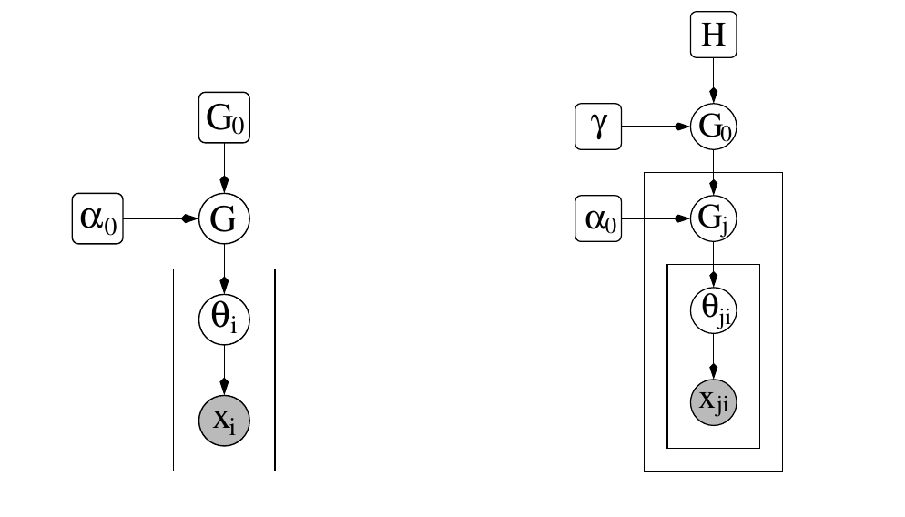
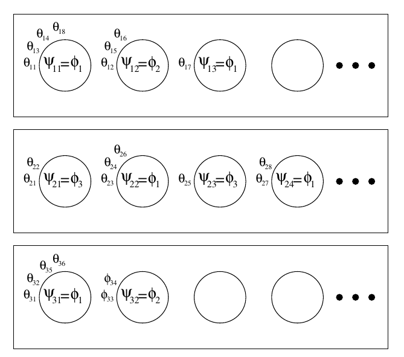

# Hierarchical Dirichlet Process

## Introduction

狄利克雷过程$\text{DP}(\alpha_0,G_0)$是测度上的测度。它有两个参数，一个scaling参数$\alpha_0>0$和一个基概率测度(base probability measure)$G_0$。一个具体的表示从狄利克雷过程中采样的是Sethuranma， 他证明了如果$G\sim \text{DP}(\alpha_0,G_0)$，那么以概率$1$： 
$$ 
G = \sum_{k=1}^\infty \beta_k\delta_{\phi_K} 
$$ 
其中$\phi_k$为服从$G_0$的独立同分布，其中"stick-breaking weights"$\beta_k$依赖于参数$\alpha_0$。

让我们考虑我们的数据被分为一定数量的组(groups)的情况。给定我们在每一个组内进行聚类的问题，我们考虑一系列的随机测度$G_j$，其中$G_j$来自于一个group-specific狄利克雷过程$\text{DP}(\alpha_{0j},G_{0j})$。 为了将这些聚类问题连接起来，我们将group-specific狄利克雷过程链接起来。通过$G_{0j}$，一个自然的方法是分层， 认为$G_j$是从单个狄利克雷过程$\text{DP}(\alpha_0,G_0(\tau))$中抽样得到的，其中$G_0(\tau)$是以随机参数$\tau$为参数的参数分布。 对$\tau$积分引入了DP之间的依赖关系。

但是这样仍然不能解决我们的问题。因为虽然$G_j$都是从$\text{DP}$中抽样得到的，但是每个$G_j$中仍然不会存在相同的元素。我们对此的解决方法也很简单，我们假设$G_0$来自 一个新的狄利克雷过程$\text{DP}(\gamma, H)$，这样$G_0$也为一个离散的分布，我们的问题就解决了。这就是分层狄利克雷过程： 
$$ 
\begin{aligned} 
    G_0\mid \gamma,H &\sim \text{DP}(\gamma,H)\\ 
    G_j\mid \alpha_0,G_0\mid &\sim \text{DP}(\alpha_0,G_0) 
\end{aligned} 
$$

## Setting

我们对观测来自不同组的问题感兴趣，并且假设在每一个组间和组内观测都是可交换的。具体来说，令$j$作为组的索引，$i$作为在每个组内的索引，我们假设$x_{j1},x_{j2},\cdots$在每一个组$j$中是可交换的。我们也假设观测在组的级别上也是可以交换的，也就是说，如果$x_j = (x_{j1},x_{j2},\cdots)$表示所有在组$j$中的观测，则$x_1,x_2,\cdots$是可交换的。

我们令$\theta_{ji}$表示$x_{ji}$所属混合的参数。令$F(\theta_{ji})$表示在给定$\theta_{ji}$后$x_{ji}$的分布。令$G_j$表示$\theta_{j} = (\theta_{j1},\theta_{j2},\cdots)$的先验。我们假设给定$G_j$后$\theta_{ji}$是条件独立的。因此我们有下列的概率模型：
$$
\begin{aligned}
\theta_{ji}\mid G_j &\sim G_j &\text{for each }j\text{ and }i\\
x_{ji}\mid \theta_{ji} &\sim F(\theta_{ji}) &\text{for each }j\text{ and }i
\end{aligned}
$$

> 左图，狄利克雷过程；右图，分层狄利克雷过程

## Hierarchical Dirichlet Processes

分层狄利克雷过程如上图所示，接下来我们将从三个方面来解释分层狄利克雷过程。

### The stick-breaking construction

给定全局测度$G_0$，他可以通过stick-breaking representation来表示：
$$
G_0 = \sum_{k=1}^\infty \beta_k \delta_{\phi_k}
$$
其中$\phi_k\sim H$独立且$\beta = (\beta_k)_{k=1}^\infty \sim \text{GEM}(\gamma)$互相独立。因为$G_0$在点$\phi = (\phi_k)_{k=1}^\infty$处有支撑(support)，那么每一个$G_j$在这些点也存在支撑，因此可以将其写作：
$$
G_j = \sum_{k=1}^\infty \pi_{jk}\delta_{\phi_k}
$$

令$\pi_j = (\pi_{jk})^\infty_{k=1}$。注意权重$\pi_j$在给定$\beta$下是独立的。我们下面描述$\pi_j$是怎么与全局权重$\beta$联系的。

令$(A_1,\cdots,A_r)$为$\Theta$上的测度的划分，并且令$K_l = \{k:\phi_k\in A_l\}, l=1,\cdots,r$。因此对于每一个$j$我们有：
$$
\begin{aligned}
(G_j(A_1),\cdots,G_j(A_r)) &\sim \text{Dir}(\alpha_0G_0(A_1),\cdots,\alpha_0G_0(A_r))\\
\Rightarrow \left(
\sum_{k\in K_1}\pi_{jk},\cdots,\sum_{k\in K_r}\pi_{jk} \right) &\sim \text{Dir}\left(\alpha_0\sum_{k\in K_1}\beta_k,\cdots,\alpha_0\sum_{k\in K_r}\beta_k\right)
\end{aligned}
$$
对于任何有限的分割。因此，每一个$\pi_j$都是$\text{DP}(\alpha_0,\beta)$上独立同分布的。

令$z_{ji}$为指示变量使得$\theta_{ji} = \phi_{z_{ji}}$，给定$z_{ji}$我们有$x_{ji}\sim F(\phi_{z_{ji}})$。因此我们得到如下的表示方法：
$$
\begin{aligned}
\beta\mid \gamma &\sim \text{GEM}(\gamma)\\
\pi_j\mid \alpha_0,\beta &\sim \text{DP}(\alpha_0,\beta)\quad &z_{ji}\mid \pi_j \sim \pi_j\\
\phi_k\mid H &\sim H \quad &x_{ji}\mid z_{ji},(\phi_k)_{k=1}^\infty \sim  F(\phi_{z_{ji}})
\end{aligned}
$$

我们现在推理出在$\beta$和$\pi_j$一个明确的关系。回想对狄利克雷过程的stick-breaking按照如下定义了变量$\beta_k$：
$$
\beta_k^\prime \sim \text{Beta}(1,\gamma)\quad  \beta_k = \beta_k^\prime \prod_{l=1}^{k-1}(1-\beta_l^\prime)
$$

我们可以证明下列的stick-breaking 构建产生一个随机概率测度$\pi_j \sim \text{DP}(\alpha_0,\beta)$：
$$
\pi_{jk}^\prime \sim \text{Beta}\left(\alpha_0\beta_k,\alpha_0\left(1-\sum_{l=1}^k\beta_l\right)\right)\quad \pi_{jk} = \pi^\prime_{jk}\prod_{l=1}^{k-1}(1-\pi_{jl}^\prime)
$$
为了证明上式，首先指出对于划分$(\{1,\cdots,k-1\},\{k\},\{k+1,k+2,\cdots\})$，我们有
$$
\left(\sum_{l=1}^{k-1}\pi_{jl},\pi_{jk},\sum_{l=k+1}^\infty\pi_{jl}\right) \sim \text{Dir}\left(\alpha_0\sum_{l=1}^{k-1}\beta_l,\alpha_0\beta_k,\alpha_0\sum_{l=k+1}^\infty\beta_l\right)
$$
移除第一项，利用狄利克雷分布的性质：
$$
\frac{1}{1-\sum_{l=1}^{k-1}\pi_{jl}}\left(\pi_{jk},\sum_{l=k+1}^\infty\pi_{jl}\right) \sim \text{Dir}\left(\alpha_0\beta_k, \alpha_0\sum_{l=k+1}^\infty \beta_l\right)
$$
最后，定义$\pi_{jk} = \frac{\pi_{jk}}{1-\sum_{l=1}^{k-1}\pi_{jl}}$并且观测到$1-\sum_{l=1}^k\beta_l = \sum_{l=k+1}^\infty \beta_l$，得证。

### The Chinese restaurant franchise

我们采用类似中国餐馆过程的术语中国餐馆特许经营(The Chinese restaurant franchise)来类比分层狄利克雷过程。

其比喻如下图所示：

> 对于Chinese restaurant franchise的描述。每个餐馆都用矩形表示。客户$\theta_{ij}$坐在桌子(圆圈)上。在每个桌子上都提供菜(dish)。菜是从全局菜单(global menu)$\phi_k$来的，其中参数$\psi_{jt}$是一个值得是在第$j$个餐馆第$t$个桌子的菜品。

在这个设置中，餐馆对应于组(group)顾客对应于$\theta_{ji}$。我们令$\phi_1,\cdots,\phi_K$表示$K$个服从分布$H$的独立同分布变量。我们规定如下符号表示：

+ $t_{ji}$：在餐馆$j$的顾客$i$坐的桌子为$t_{ji}$
+ $k_{jt}$：在餐馆$j$的桌子$t$上的菜为$k_{jt}$
+ $n_{jtk}$：表示在餐馆$j$在桌子$t$吃菜$k$的顾客的数量。使用`.`表示边缘分布
  
  + $n_{jt\cdot}$表示在餐馆$j$坐在桌子$t$上的顾客数量
  + $n_{j\cdot k}$表示在餐馆$j$吃菜$k$的顾客的数量

+ $m_{jk}$表示在餐馆$j$提供菜品$k$的桌子的数量

  + $m_{j\cdot}$表示餐馆$j$的桌子数量
  + $m_{\cdot k}$表示提供菜品$k$的桌子数量
  + $m_{\cdot\cdot}$表示桌子的总数量

首先我们先考虑在给定$G_0$和$\theta_{j1},\cdots,\theta_{j,i-1}$下$\theta_{ji}$的条件分布，其中$G_j$被积分掉：
$$
\theta_{ji}\mid \theta_{j1},\cdots,\theta_{j,i-1},G_0 \sim \sum_{t=1}^{m_{j\cdot}}\frac{n_{jt\cdot}}{i-1+\alpha_0}\delta_{\psi_{jt}} + \frac{\alpha_0}{i-1+\alpha_0}G_0
$$
如果我们选择第一个求和项，则设置$\theta_{ji} = \psi_{jt}, t_{ji}=t$如果选择$t$，如果选择了第二个求和项，我们对$m_{j\cdot}$加一，采样$\psi_{jm_{j\cdot}}\sim G_0$并且设置$\theta_{ji}=\psi_{jm_{j\cdot}},t_{ji}=m_{j\cdot}$。

下面我们积分掉$G_0$：
$$
\psi_{jt}\mid \psi_{11},\psi_{12},\cdots,\psi_{21},\cdots,\psi_{j,t-1},\gamma,H\sim \sum_{k=1}^K\frac{m_{\cdot k}}{m_{\cdot\cdot}+\gamma}\delta_{\phi_k} + \frac{\gamma}{m_{\cdot\cdot}+\gamma}H
$$

如果我们选择第一个求和项，设置$\psi_{jt} = \phi_k$并且令$k_{jt}=k$对于选择$k$，第二项被选中，$K$加一，抽样$\phi_K\sim H$并且设置$\psi_{jt}=\phi_K$和$k_{jt}=K$。

为了得到$\theta_{ji}$的样本，对于每一个$j$和$i$，首先抽样$\theta_{ji}$，如果需要从$G_0$中抽样，则使用上式得到新的样本$\psi_{jt}$并且令$\theta_{ji}=\psi_{jt}$。

### The infinite limit of finite mixture models

在本节中，我们提出了两个显然不同的有限模型，它们都在无限极限内产生分层狄利克雷过程混合。

第一种：

$$
\begin{array}{rlrl}
\boldsymbol{\beta} \mid \gamma & \sim \operatorname{Dir}(\gamma / L, \ldots, \gamma / L) \\
\boldsymbol{\pi}_{j} \mid \alpha_{0}, \boldsymbol{\beta} & \sim \operatorname{Dir}\left(\alpha_{0} \boldsymbol{\beta}\right) & z_{j i} \mid \boldsymbol{\pi}_{j} & \sim \boldsymbol{\pi}_{j} \\
\phi_{k} \mid H & \sim H & x_{j i} \mid z_{j i},\left(\phi_{k}\right)_{k=1}^{L} & \sim F\left(\phi_{z_{j i}}\right)
\end{array}
$$

第二种：

$$
\begin{aligned}
\beta \mid \gamma &\sim \text{Dir}(\gamma/L,\cdots,\gamma/L) &k_{jt}\mid \beta \sim \beta\\
\pi_j\mid \alpha_0 &\sim \text{Dir}(\alpha_0/T,\cdots,\alpha_0/T) &t_{ji}\mid \pi_j\sim \pi_j\\
\phi_k\mid H&\sim H  &x_{ji}\mid t_{ji},(k_{jt})_{t=1}^T,(\phi_k)_k^L \sim F(\phi_{k_j t_{ji}}) 
\end{aligned}
$$

## Inference

我们将讨论三种相关的马尔科夫链蒙特卡洛方法来进行采样。为了简便我们假设基分布$H$与数据分布$F$是共轭的。

我们规定一下符号，变量$x_{ji}$为观测变量。每一个$x_{ji}$被认为是从分布$F(\theta_{ji})$抽样得到的。我们令$\theta_{ji}$和餐馆表示中的桌子$t_{ji}$联系起来，令$\theta_{ji}=\psi_{jt_{ji}}$。随机变量$\psi_{jt}$为混合组分$k_{jt}$的实例，也就是$\psi_{jt}=\phi_{k_{jt}}$。参数$\phi_k$的先验为$H$。令$z_{ji}=k_{jt_{ji}}$表示与观测$x_{ji}$对应的混合组分。

令$x=(x_{ji}:\text{all }j,i),x_{jt}=(x_{ji}:\text{all }i\text{ with }t_{ji} = t), t=(t_{ji}:\text{all }j,i),k=(k_{jt}:\text{all }j,t),z=(z_{ji}:\text{all }j,i),m=(m_{jk}:\text{all }j,k),\phi=(\phi_1,\cdots,\phi_K)$。我们用`-`表示对应的索引被移除，比如$x^{-ji},k^{-jt},n_{jt\cdot}^{-ji}$，$x^{-ji}=x\backslash x_{ji},k^{-jt}=k\backslash k_{jt}$并且$n_{jt\cdot}^{-ji}$为在组$j$并且与$\psi_{jt}$相联系，但是去除$x_{ji}$。

令$F(\theta)$有密度$f(\cdot\mid \theta)$并且$H$有密度$h(\cdot)$。因为$H$与$F$是共轭的，我们积分掉$\phi$，得到条件密度：

$$
f_k^{-x_{ji}}(x_{ji}) = \frac{\int f(x_{ji}\mid\phi_k)\prod_{j^\prime i^\prime \neq ji,z_{j^\prime i^\prime }=k}f(x_{j^\prime i^\prime }\mid \phi_k)h(\phi_k)d\phi_k}{\int \prod_{j^\prime i^\prime =ji,z_{j^\prime i^\prime}=k}f(x_{j^\prime i^\prime }\mid \phi_k)d\phi_k}
$$
相似地表示$f_k^{-x_{jt}}(x_{jt})$表示在一直与第$k$个混合组分相关的元素(除了$x_{jt}$)之后$x_{jt}$的条件概率。

### Posterior sampling in the Chinese restaurant franchise

不是直接处理$\theta_{ji}$和$\psi_{jt}$，我们对它们的索引变量$t_{ji},k_{jt}$进行采样。
> 后面的感觉没必要看了
