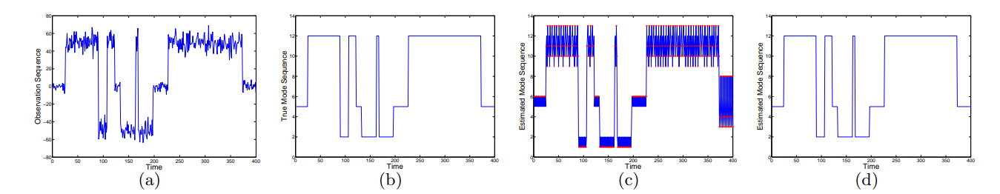
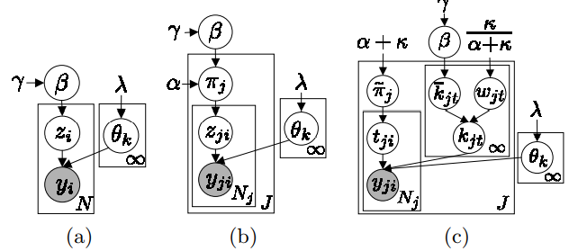
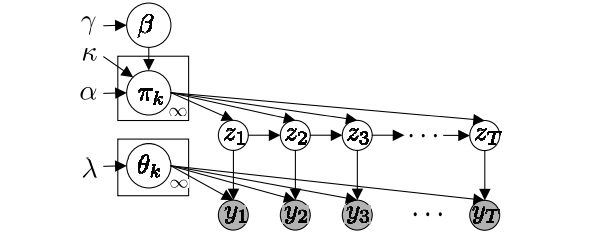

# An HDP-HMM for Systems with State Persistence

HDP-HMM是在可数无线状态空间上定义了转移概率矩阵上的先验分布，但是存在缺陷，即没有考虑状态的持续，即与隐马尔科夫模型(HHM)和半隐马尔科夫模型一样，但是在无参数模型下会加剧，因为其中
贝叶斯对更简单模型的偏差不足以防止HDP-HMM学习具有不切实际的快速动态的模型，如下中所示：

> 图1：(a)观测序列，(b)真实状态序列，(c)HDP-HMM结果，(d)我们改进的HDP-HMM结果。

## Background: Dirichlet Process

狄利克雷过程(DP)，表示为$\text{DP}(\gamma,H)$，可以表示为：
$$
G_0(\theta) = \sum_{k=1}^\infty \beta_k\delta(\theta-\theta_k)\quad \theta_k \sim H
$$
其中权重是通过stick-breaking construction进行采样得到的：
$$
\beta_k = \beta_k^\prime\prod_{l=1}^{k=1}(1-\beta_l^\prime)\quad \beta_k^\prime \sim \text{Beta}(1,\gamma)
$$
我们将其表示为$\beta \sim \text{GEM}(\gamma)$。

DP一般被用来作为分类问题的先验，即DPMM。采样过程可以这样描述：指示变量$z_i\sim \beta$，之后$y_i \sim F(\theta_{z_i})$。图2(a)

分层狄利克雷过程(HDP)有一个全局狄利克雷过程先验$\text{DP}(\alpha,G_0)$，其中$G_0$是与DP中的$G_0$相同，模型描述为(图2(b))：
$$
\begin{aligned}
    G_j(\theta) &= \sum_{t=1}^\infty \tilde{\pi}_{jt}\delta(\theta-\tilde{\theta}_{jt}) &\tilde{\pi}_j \sim \text{GEM}(\alpha)\\
    &= \sum_{k=1}^\infty \pi_{jk}\delta(\theta-\theta_k) &\pi_j\sim \text{DP}(\alpha,\beta)
\end{aligned}
$$

我们也可以采用Chinese restaurant franchise(CRF)进行描述(图2(c))，在此情况下$\kappa = 0$。

> 图2

## The Sticky HDP-HMM

> 图3：Sticky HDP-HMM

对于这个HDP-HMM，每一个HDP group-specific分布$\pi_j$，为一个状态转移分布(state-special transition distribution)。令$z_t$表示马尔科夫链在$t$时刻的状态。当时的HMM状态$z_t$索引参数$\theta_{z_t}$来生成观测$y_t$。(图3)

通过采样$\pi_j \sim \text{DP}(\alpha,\beta)$，HDP先验鼓励转移具有相似的转移分布($E[\pi_{jk}]=\beta_k$)。但是，然而，它并没有将自转移与状态之间的转移区分开来。当建模具有状态维持(state persistence)的系统时，HDP-HMM的灵活特性会允许状态序列以不真实的快速动态来获得高的后验概率。

为了解决这个问题，我们定义转移概率$\pi_j$为：
$$
\pi_j \sim \text{DP}\left(\alpha + \kappa, \frac{\alpha\beta + \kappa\delta_j}{\alpha + \kappa}\right)
$$

$\kappa >0$加到第$j$项上，增加了$E[\pi_{jj}]$的概率，即自我转移的概率，我们将这种拓展称为sticky HDP-HMM。

### A CRF with Loyal Customers

我们将CRF的概念进行拓展，每个餐馆有与其索引相同的特殊菜，尽管这种菜在每个地方都可以提供，但是在与其同名的餐馆中更加受欢迎。我们从下述事实中看出其更受欢迎：
$$
k_{jt} \sim \frac{\alpha\beta + \kappa\delta_j}{\alpha + \kappa}
$$

我们将$z_t$称作父亲，$z_{t+1}$为孩子。父亲进入一个餐馆$j$由其父亲($z_{t-1}=j$)决定。假设存在一个索引的双射$f:t\rightarrow ji$。父亲选择了桌子$t_{ji}\sim \tilde{\pi}_j$，这个桌子的菜的索引为$k_{jt_{ij}}$。注意$z_t = z_{ji}=k_{it_{ji}}$。家庭特色菜越来越受欢迎意味着孩子们更有可能和他们的父母在同一家餐厅吃饭，反过来，也更有可能吃这家餐厅的特色菜。

如果我们引入一系列辅助随机变量$\bar{k}_{jt}$和$w_{jt}$，我们的推理算法就会被简化：
$$
\begin{aligned}
    \bar{k}_{jt} &\sim \beta\\
    w_{jt} &\sim \text{Ber}\left(\frac{\kappa}{\alpha+\kappa}\right)\\
    k_{jt} &=
    \begin{cases}
        \bar{k}_{jt},&w_{jt}=0\\
        j,&w_{jt}=1
    \end{cases}
\end{aligned}
$$
其中$\text{Ber}(p)$指的是伯努利分布。

### Sampling via Direct Assignments

采样$z_t$：后验分布可以分解为：
$$
\begin{aligned}
        &p(z_t=k\mid z_{\backslash t},y_{1:T},\beta, \alpha, \kappa, \lambda) \propto\\
        &p(z_t=k\mid z_{\backslash t,\beta,\alpha, \kappa})p(y_t\mid y_{\backslash t},z_t=k,z_{\backslash t},\lambda)
    \end{aligned}
$$
我们使用上面$\pi_j$的定义和狄利克雷分布与$z_t$的多项式观测分布共轭推导出下列条件分布：
$$
\begin{gathered}
p\left(z_t=k \mid z_{\backslash t}, \beta, \alpha, \kappa\right) \propto\left(\alpha \beta_k+n_{z_{t-1} k}^{-t}+\kappa \delta\left(z_{t-1}, k\right)\right) \\
\left(\frac{\alpha \beta_{z_{t+1}}+n_{k z_{t+1}}^{-t}+\kappa \delta\left(k, z_{t+1}\right)+\delta\left(z_{t-1}, k\right) \delta\left(k, z_{t+1}\right)}{\alpha+n_{k .}^{-t}+\kappa+\delta\left(z_{t-1}, k\right)}\right)
\end{gathered}
$$
符号$n_{jk}$表示从状态$j$转换为$k$的马尔可夫链的数量，$n_{j\cdot}=\sum_k n_{jk}$，并且$n_{jk}^{-t}$表示从状态$j$转移到状态$k$的数量但是不包括转移$z_{t-1}$到$z_t$或$z_t$到$z_{t+1}$。直观的，这个表达式选择状态$k$依赖于我们已经看到多少次$z_{t-1}$到$k$和$k$到$z_{t+1}$的转移。注意这里有一个关于是否是自转移的依赖，当$\kappa > 0$时很强烈。

采样$\beta$：假设现在有$\bar{K}$个唯一的菜品需要考虑并且取$\Theta$的有限分割$\{\theta_1,\theta_2,\cdots,\theta_{\bar{K}},\theta_{\tilde{k}}\}$，其中$\theta_{\tilde{k}}=\Theta\backslash\cup_{k=1}^{\bar{K}}\{\theta_k\}$，因为$\tilde{\theta}_{jt}\sim G_0$并且$\bar{m}_{\cdot k}$为考虑菜品$\theta_k$的桌子，狄利克雷分布的性质可以得到：
$$
p((\beta_1,\cdots,\beta_{\bar{K}})\mid \bar{k})
$$

