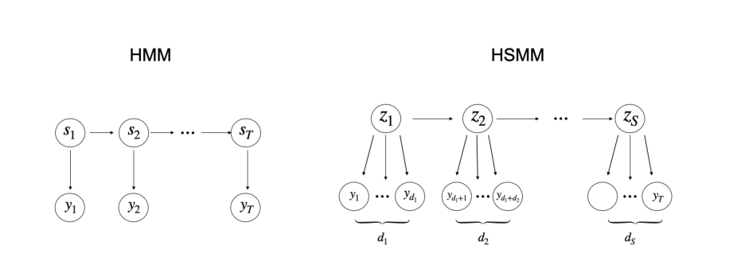
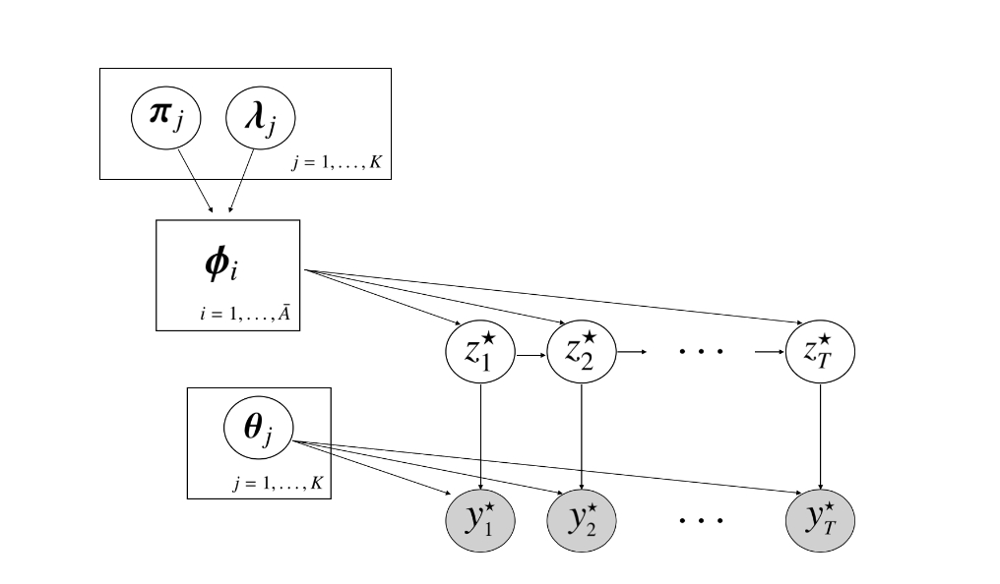

## Bayesian Approximations to Hidden Semi-Markov Models for Telemetric Monitoring of Physical Activity

### Modeling Approach

#### Overview of Hidden Markov and Semi-Markov Models

对于马尔可夫模型，我们有
$$
\begin{aligned}
&s_t\mid s_{t-1}\sim \gamma_{s_{t-1}}\\
&y_t\mid s_t \sim f(\theta_{s_t})\quad t=1,\cdots,T
\end{aligned}
$$
其中$\gamma_{j}=(\gamma_{j1},\cdots,\gamma_{jK})$表示由状态$j$转移到其他状态的概率。根据马尔可夫链的性质我们很容易得到在状态$j$下停留时间$d$的概率为$p_j(d) = (1-\gamma_{jj})\gamma_{jj}^{d-1}$。

更为灵活的框架为HSMM，他在HMM的基础上引入了一个持续时间变量。

如图所示，每个超状态$z = (z_1,\cdots,z_S)$都与持续时间$d_s$和观测序列$y_s = (y_{t_s}^1,\cdots,y_{t_s}^2)$相关联，其中$t_s^1 = 1+\sum_{r<s}d_r$并且$t_s^2 = t_s^1+d_s-1$为片段$s$的第一个和最后一个索引，并且$S$为片段的数量。这里，$d_s$表示$z_s$的长度。HSMM的生成机理可以被总结为：
$$
\begin{aligned}
&z_s\mid z_{s-1} \sim \pi_{z_{s-1}}\\
&d_s\mid z_s \sim g(\lambda_{z_s})\\
&y_s\mid z_s \sim f(\theta_{z_s}) \quad s = 1,\cdots,S
\end{aligned}
$$
其中$\pi_j = (\pi_{j1},\cdots,\pi_{jK})$为状态转移概率，其中$\pi_{jk} = p(z_t=k\mid z_{t-1}=j,z_t\neq j)$。注意$\pi_{jj}=0$，因为自我转移是禁止的。这里$g$表示以$\lambda_j$为参数的停留时间的分布族。但是这样导致了计算似然的负担，HSMM的计算复杂度为$\mathcal{O}(T^2K+TK^2)$，而HMM只有$\mathcal{O}(TK^2)$。

#### Approximations to Hidden Semi-Markov Models

由于本文章中对此的描述不太详细，不容易理解，故找到本文章引用的源文章**Hidden Markov models with arbitrary state dwell-time distributions**来进行说明。

**我们要做的是用HMM来近似HSMM**，这样我们就可以利用HMM的技术来学习HSMM的参数，减少时间复杂度。

下面我们规定一下符号：

1. 原来的HSMM过程

   1. 观察序列：$(X_t)_{t=1,\cdots,T}$，状态序列$(S_t)_{t=1,\cdots,T}$。
   2. $p_k$表示在状态$k(k\in \{1,\cdots,N\})$下的持续时间的概率密度函数，$F_k$表示其累积概率密度函数。
   3. 定义状态转移矩阵$\mathrm{A}=\{a_{ij}\}$，其中$a_{ij}=\Pr(S_{t+1}=j\mid S_t=i,S_{t+1}\neq i),i,j=1,\cdots,N$，其中$\sum_ja_{ij}=1,a_{ii}=0$。

2. 用来近似HSMM的HMM：

   1. 观测序列：$(X_t^\star)_{t=1,\cdots,T}$，状态序列$(S_t^\star)_{t=1,\cdots,T} \in \{1,2,\cdots,\sum_{i=1}^Nm_i\}$，其中$m_1,m_2,\cdots,m_N\in \mathbb{N},m_0 := 0$。
   2. 状态聚合：$I_k = \{n\mid \sum_{i=0}^{k-1} m_i < n \le \sum_{i=0}^k m_i\},k=1,\cdots,N$，并且定义$i_k^- := \min(I_k)$和$i_k^+ := \max(I_k)$，我们假设属于$I_k$的每个状态的取值的发射概率密度函数相同，并且与状态为$k$的HSMM的发射概率密度函数相同，即$\Pr^{X_t^\star\mid S_t^\star \in I_k} = \Pr^{X_t\mid S_t=k},t=1,\cdots,T,k=1,\cdots,N$。

我们定义$(S_t^\star)_{t=1,\cdots,T}$的状态转移矩阵为$\mathrm{B}=\{b_{ij}\}$，其中$b_{ij}=\Pr(S_{t+1}^\star\mid S_t^\star=i),i,j=1,\cdots,\sum_{i=1}^N m_i$，$\mathrm{B}$的结构为：
$$
   \mathbf{B}=\left(\begin{array}{ccc}
   \mathbf{B}_{11} & \cdots & \mathbf{B}_{1 N} \\
   \vdots & \ddots & \vdots \\
   \mathbf{B}_{N 1} & \cdots & \mathbf{B}_{N N}
   \end{array}\right)
$$
而$m_i\times m_i$的对角矩阵$B_{ii}(i=1,\cdots,N)$，对于$m_i\ge 2$，为：
$$
   \mathbf{B}_{i i}:=\left(\begin{array}{c|cccc}
   0 & 1-c_i(1) & 0 & \ldots & 0 \\
   \vdots & 0 & \ddots & & \vdots \\
   & \vdots & & & 0 \\
   0 & 0 & \ldots & 0 & 1-c_i\left(m_i-1\right) \\
   \hline 0 & 0 & \ldots & 0 & 1-c_i\left(m_i\right)
   \end{array}\right)
$$
对于$m_i=1$，我们定义$\mathrm{B_{ii}}:=1-c_i(1)$，并且$m_i\times m_j$的矩阵$\mathrm{B_{ij}}(i,j=1,\cdots,N,i\neq j)$为：
$$
   \mathbf{B}_{i j}:=\left(\begin{array}{cccc}
   a_{i j} c_i(1) & 0 & \ldots & 0 \\
   a_{i j} c_i(2) & 0 & \cdots & 0 \\
   \vdots & & & \\
   a_{i j} c_i\left(m_i\right) & 0 & \ldots & 0
   \end{array}\right)
$$
这里，对于$r=1,2,3,\cdots$，我们有：
$$
c_k(r):= \begin{cases}\frac{p_k(r)}{1-F_k(r-1)} & \text { for } F_k(r-1)<1 \\ 1 & \text { for } F_k(r-1)=1\end{cases}
$$
函数$c_k$称为停留时间分布的`hazard rates`。注意矩阵$\mathrm{B}$确实为一个合格的状态转移矩阵，因为他的元素的取值范围为$[0,1]$，并且每一行的和为$1$。同时我们也有如下的性质成立：

1. 对于$i\neq j ,1\le i,j\le N$，$a_{ij}^\star = a_{ij}$。
2. 对于任何$k\in \{1,\cdots,N\}$，我们有：$p_k^{\star}(r)= \begin{cases}p_k(r) & \text { for } r \leq m_k \\ p_k\left(m_k\right)\left(1-c_k\left(m_k\right)\right)^{r-m_k} & \text { for } r>m_k\end{cases}$，虽然当$r>m_k$的时候$p^\star_k(r)\neq p_k(r)$，但是我们可以选择大的$m_k$使得两者近似相等。

### Bayesian Inference

我们对参数$\eta = \{(\pi_j,\lambda_j,\theta_j)\}_{j=1}^K$添加先验，先验为：
$$
\begin{aligned}
&\pi_j\sim \text{Dir}(\alpha_0), (\theta_j,\lambda_j)\sim H\times G,\quad j=1,\cdots,K\\
&z_t^\star\mid z_{t-1}^\star\sim \phi_{z_{t-1}^\star}\\
&y_t^\star\mid z_t^\star \in A_j\sim f(\theta_j),\quad t=1,\cdots,T
\end{aligned}
$$
其图模型为：

> 状态转移矩阵$\phi_j$完全由$\pi_j$和$p(d_j=r\mid \lambda_j)$确定，因此他们不再是随机变量。

$\eta$的后验分布有如下的形式：
$$
p(\eta\mid y)\propto \mathscr{L}(y\mid \eta) \times \left[\prod_{j=1}^K p(\pi_j)\times p(\lambda_j)\times p(\theta_j)\right]
$$
其中$\mathscr{L}(\cdot)$表示模型的似然概率。因为我们已经将其构建为了HMM，所以我们就可以用HMM的方法来计算似然函数：
$$
\mathscr{L}(y\mid \eta) = \pi_0^{\star'}P(y_1)\Phi P(y_2)\Phi\cdots\Phi P(y_{T-1})\Phi P(y_T)\mathrm{1}
$$
其中$\bar{A}\times \bar{A}$的对角矩阵$\mathrm{P}(y)$定义为：
$$
\boldsymbol{P}(y)=\operatorname{diag}\{\underbrace{p\left(y \mid \theta_1\right), \ldots, p\left(y \mid \theta_1\right)}_{a_1 \text { times }}, \ldots, \underbrace{p\left(y \mid \theta_K\right) \ldots p\left(y \mid \theta_K\right)}_{a_K \text { times }}\}
$$

#### Hamiltonian Monte Carlo, No-U-Turn Sampler and Stan Modelling Language

模型建立完成下面要采样了，由于我们的先验分布与似然分布不是共轭的，得到的后验不具有封闭形式，因此我们采用MCMC的方法对后验分布进行采样。

HMC通过增加动量变量，根据汉密尔顿动力学在高维空间上进行高效的采样，但是步长的选择会影响HMC采样的结果。NUTS绕过了这个麻烦，它使用汉密尔顿动力学来构建采样轨迹，这些轨迹从采样器的当前值移开，直到产生`U-Turn`开始返回，从而最大程度地提高了轨迹的距离。

`stan`建模语言提供了一个概率编程的环境来实现NUTS采样。用户只需要提供模型的三个组成：

1. 采样器的输入：数据和先验超参数
2. 输出：需要的参数
3. 计算非归一化后验的步骤

#### Bridge Sampling Estimation of the Marginal Likelihood

`bridge sampling`通过从两个不同分布的MC估计的比值来估计边缘分布，一个是后验分布另一个是合适的提议分布$q(\eta)$。边缘分布`bridge sampling`的估计为：
$$
p(\boldsymbol{y})=\frac{\mathbb{E}_{q(\boldsymbol{\eta})}[h(\boldsymbol{\eta}) \mathscr{L}(\boldsymbol{y} \mid \boldsymbol{\eta}) p(\boldsymbol{\eta})]}{\mathbb{E}_{p(\eta \mid y)}[h(\boldsymbol{\eta}) q(\boldsymbol{\eta})]} \approx \frac{\frac{1}{n_2} \sum_{j=1}^{n_2} h\left(\tilde{\boldsymbol{\eta}}^{(j)}\right) \mathscr{L}\left(\boldsymbol{y} \mid \tilde{\boldsymbol{\eta}}^{(j)}\right) p\left(\tilde{\boldsymbol{\eta}}^{(j)}\right)}{\frac{1}{n_1} \sum_{i=1}^{n_1} h\left(\overline{\boldsymbol{\eta}}^{(i)}\right) q\left(\overline{\boldsymbol{\eta}}^{(i)}\right)}
$$
其中$h(\eta)$为一个选择合理的`bridge`函数，而$p(\eta)$表示先验分布的联合分布。

#### Comparable Dwell Priors

根据边缘分布来选择模型对先验分布非常敏感，因此我们需要选择好的先验分布。比如我们要从几何分布、负二项分布或者泊松分布中选择合适的分布来对持续时间进行建模。偏移的泊松分布为严格正的，均值为$\lambda_i+1$，方差为$\lambda_i$。在泊松分布分布和负二项分布中，参数$\lambda_j$的先验一般都是$\lambda_j\sim \text{Gamma}(a_{0j},b_{0j})$，其中$\mathbb{E}[\lambda_j]=a_{0j}/b_{0j}$并且方差$\text{Var}[\lambda_j]=a_{0j}/b_{0j}^2$。为了让所有模型都是可以比较的，我们将几何分布表示为持续时间为$\tau_j=1(1-\gamma_{jj})$，其中$\gamma_{jj}$为自我转移的概率。并且先验为$\gamma_j=(\gamma_{j1},\cdots,\gamma_{jK})\sim \text{Dirichlet}(v_j)$，其中$v_j=(v_{j1},\cdots,v_{jK})$并且$\beta_j=\sum_{i\neq j}v_{ij}$，并且有：
$$
\mathbb{E}\left[\tau_j\right]=\frac{v_{j j}+\beta_j-1}{\beta_j-1} \text { and } \operatorname{Var}\left[\tau_j\right]=\frac{\left(v_{j j}+\beta_j-1\right)\left(v_{j j}+\beta_j-2\right)}{\left(\beta_j-1\right)\left(\beta_j-2\right)}-\left(\frac{v_{j j}+\beta_j-1}{\beta_j-1}\right)^2
$$
所以我们认为可比较的先验需要满足$\mathbb{E}[\tau_j]=\mathbb{E}[\lambda_j+1]$并且$\text{Var}[\tau_j] = \text{Var}[\lambda_j+1]$。

## Code

负二项分布：

1. 实验包含一系列独立的实验
2. 每个实验都有成功、失败两种结果
3. 成功的概率是恒定的
4. 实验持续到$r$次失败，$r$可以为任意正数

其概率密度函数为：
$$
f(k;r,p) = \begin{pmatrix}k+r-1\\r-1\end{pmatrix}\cdot p^r\cdot (1-p)^k
$$

