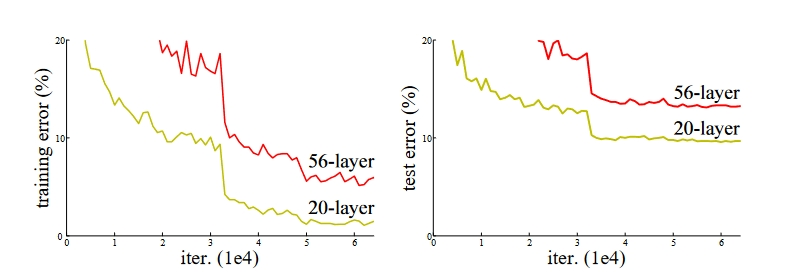
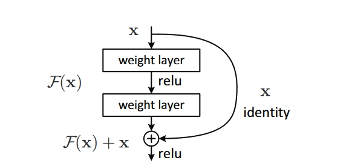

## Deep Residual Learning for Image Recognition

### Introduction

在早期的神经网络的研究中，人们发现随着神经网络的层数的增加，训练效果会越来越好。在理论上缺失如此，但是事实真是如此吗？随着神经网络的深度的增加，梯度爆炸和梯度消失的问题层出不穷。并且人们发现，随着神经网络深度的增加，训练误差会先降低后增加，着并不是因为过拟合造成的，因为是在训练集上的误差增加，如下图所示。

这可能是因为较深的网络不太容易优化的缘故。

> 由于神经网络在训练的时候采用的是梯度下降的方法，通过后向传播的方式对梯度进行相乘，所以会发成梯度消失和梯度爆炸等方面的问题。
>
> + 梯度消失：如果相乘的大部分梯度因子都小于$1$，那么到最后得到的梯度就会接近于$0$。
> + 梯度爆炸：如果相乘的大部分梯度因子都大于$1$，那么到最后得到的梯度就会非常大。

我们想到的一种方法，如果我们将训练好的浅层神经网络作为前几层，然后增加恒等变换的层，那么这个组合起来的较深的神经网络最差的结果也不会比较浅的神经网络差。

在本文中，我们提出了深度残差网络(deep residual learning)。我们将我们想要的映射表示为$\mathcal{H}(\mathrm{x})$，并且让堆叠的非线性层拟合(原神经网络层)映射$\mathcal{F} := \mathcal{H}(\mathrm{x})- \mathrm{x}$。则原始的映射变成了$\mathcal{F}(\mathrm{x})+\mathrm{x}$。

> 这里我们相当于跳过了一层，将一层的结果通过`short-cut`传到了它的下一层，其中$\mathcal{F}(\mathrm{x})$相当于按照之前的神经网络传递得到的值(理解为残差)，则应用激活函数前加上前二层(只有前第二层)的输入。

### Deep Residual Learning

#### Identity Mapping by Shortcuts

我们将残差网络应用到一部分堆叠的层中，就如上图所展示的那样。在本文中我们将残差层定义为：
$$
\mathrm{y} = \mathcal{F}(\mathrm{x},\{W_i\}) + \mathrm{x}
$$
这里的$\mathrm{x},\mathrm{y}$分别指我们考虑的层数的输入和输出。$\mathcal{F}$表示我们要学习的残r差函数，在上图中，我们有：
$$
\mathcal{F} = W_2\sigma(W_1\mathrm{x})
$$
其中$\sigma$表示激活函数。在这里我们并没有增加任何额外的参数和计算复杂度。

$\mathcal{F}$和$\mathrm{x}$的维度必须相同，如果不相同的，可以添加一个线性映射$W_s$：
$$
\mathrm{y}  = \mathcal{F}(\mathrm{x},\{W_i\}) + W_s \mathrm{x}
$$
