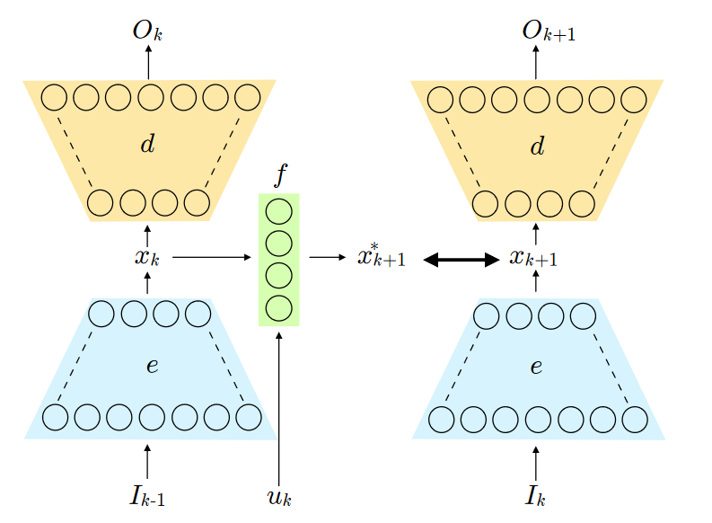
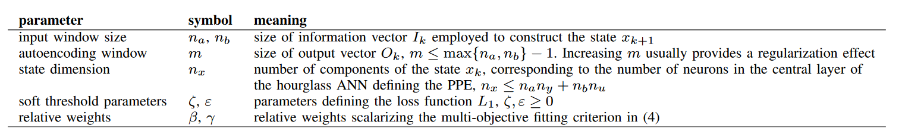

## Learning nonlinear state-space models using deep autoencoders

### Nonlinear Identification Problem

给定从动态系统中收集到的训练数据$Z = \{u_1,y_1,\cdots,u_N,y_N\}$，其中$u_k\in \mathbb{R}^{n_u}$为外源输入并且$y_k \in \mathbb{R}^{n_y}$为观测数据。给定期望的**过去输出的数量**$n_a\ge 1$，**过去的输入的数量**$n_b \ge 1$，一个**给定的状态维度**$n_x\ge 1$，我们的目标是找到映射$e,f,g$，其中$e:\mathbb{R}^{n_I}\rightarrow \mathbb{R}^{n_x}, n_I = n_an_y + n_bn_y$，$f:\mathbb{R}^{n_x+n_y}\rightarrow \mathbb{R}^{n_x}$，$g:\mathbb{R}^{n_x}\rightarrow \mathbb{R}^{n_y}$，优化拟合准则：
$$
\min_{e,f,g}\mathcal{L}(e,f,g,Z)
$$
其中
$$
\begin{array}{rl}
&\mathcal{L}(e,f,g,Z) &= \sum_{k=k_0}^NL(\hat{y}_k,y_k)\\
&\text{s.t.} &x_{k+1} = f(x_k,u_k)\\
&&\hat{y}_k = g(x_k), k = k_0,\cdots,N\\
&& x_{k_0} = e(I{_{k_0-1}})
\end{array}
$$
其中

$L:\mathbb{R}^{2n_y}\rightarrow \mathbb{R}$为给定的损失函数，其中$L(0,0)=0$，$x_k\in \mathbb{R}^{n_x}$为状态向量，$I_k$为下面的信息向量：
$$
I_k = \begin{bmatrix}y_k^\prime &\cdots &y_{k-n_a+1}^\prime &u_k^\prime&\cdots &u^\prime_{k-n_b+1}\end{bmatrix}
$$
并且$k_0\triangleq \max\{n_a,n_b\}$。其中$f$为非线性状态更新映射，$g$为非线性输出映射，$e$为将状态空间坐标变换函数将之前的信息向量$I_k$映射到当前的状态$x_k$。

我们的任务是决定一个合适的状态空间维度$n_x$，$x_k$和之前输入/输出对之间的关系$e$，以及状态更新和输出映射$f,g$。

### State Selection Via Auto-Encoders

我们想要找到单位映射$I_k\in \mathbb{R}^{n_I}\rightarrow I_k$，其中神经网络存在一层$n_x < n_I$，这样这一层就相当于降维的作用了。

#### Partial predictive autoencoder

我们引入**partial predictive autoencoder(PPE)**来将$I_{k-1}$映射到下列输出向量：
$$
O_k=\begin{bmatrix}y_k^\prime&\cdots&y_{k-m}^\prime\end{bmatrix}
$$
其中$0\le m \le \max\{n_a,n_b\}-1$。通过拟合一个隐藏层大小为$n_x,n_x\le n_an_y + n_bn_u$的神经网络，我们得到中间压缩表示$x_k \in \mathbb{R}^{n_x}$。

PPE相当于两个不同的ANN的级联：

+ 编码函数$e:\mathbb{R}^{n_I}\rightarrow \mathbb{R}^{n_x}$，表示将输入$I_{k-1}$变换为$x_k$
+ 解码映射$d:\mathbb{R}^{n_x}\rightarrow \mathbb{R}^{mn_y}$，将$x_k$变换到$O_k$，它的前$n_y$组成表示我们想要的目标函数$g:\mathbb{R}^{n_x}\rightarrow \mathbb{R}^{n_y}$。

### Model Learning

我们构建如下图所示的网络：

那么我们的优化问题变为：
$$
\begin{aligned}
\min _{f, d, e} & \sum_{k=k_0}^{N-1} L_1\left(\hat{O}_k, O_k\right)+L_1\left(\hat{O}_{k+1}, O_{k+1}\right) \\
& +\beta L_2\left(x_{k+1}^{\star}, x_{k+1}\right)+\gamma L_3\left(O_{k+1}, O_{k+1}^{\star}\right) \\
\text { s.t. } & x_k=e\left(I_{k-1}\right), k=k_0, \ldots, N \\
& x_{k+1}^{\star}=f\left(x_k, u_k\right), k=k_0, \ldots, N-1 \\
& \hat{O}_k=d\left(x_k\right), k=k_0, \ldots, N \\
& O_k^{\star}=d\left(x_k^{\star}\right), k=k_0+1, \ldots, N
\end{aligned}
$$
其中$L_i$为损失函数，$\beta,\gamma >0 $为常数。

#### Choice of the loss function

我们选择：
$$
L_3(O_{k+1},O^\star_{k+1}) = \|O_{k+1}-O_{k+1}^\star\|_2^2
$$

$$
L_2(x_{k+1}^\star,x_{k+1}) = \|x_{k+1}-x^\star_{k+1}\|_2^2
$$

我们选$L_1$为边缘损失函数(margin-loss function)：
$$
L_1(O_k,\hat{O}_k) = \sum_{i=1}^{(m+1)n_y}\max\{\epsilon,\zeta|O_k^i|,|O_k^i-\hat{O}_k^i|\}^2
$$

#### Tuning parameters

超参数我们选定为：

### Nonlinear State Estimation

#### Filtering and state reconstruction

我们采用两种方法来重建状态，一种是采用EKF，根据学到的模型$f,g$；第二种是采用神经网络的方法。对于神经网络的方法，我们构建新的映射$s:\mathbb{R}^{n_x+n_u+n_y}\rightarrow \mathbb{R}^{n_x}$，输入为$\hat{x}_k,u_k,y_k$，输出为$\hat{x}_{k+1}$。我们通过将$L_3(O^\star_{k+1},O_{k+1})$替换为：
$$
\beta L_4(\hat{x}_{k+1},x_{k+1}) + \gamma L_3(\hat{O}^\star_{k+1},\hat{O}_{k+1})
$$
其中
$$
\begin{aligned}
\hat{x}_{k+1} &= s(x_k, u_k, y_k)\\
\hat{O}_k^\star &= d(\hat{x}_k),k=0,\cdots,N-1
\end{aligned}
$$
并且
$$
L_4(\hat{x}_{k+1},x_{k+1}) = \|\hat{x}_{k+1}-x_{k+1}\|_2^2
$$
