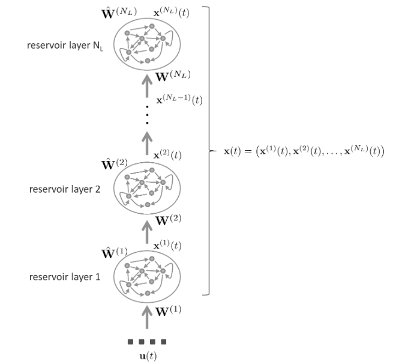

## Deep Echo State Network

> 深度回波状态网络的储集层(Reservoir architecture of a Deep Echo State Network)

在这种情况下，在每个时间步$t$，状态计算通过由外部输入到最顶层的回归运算。在我们的符号中我们用$N_U$表示外部的输入维度，$N_L$表示储集层(reservoir layer)的数量，为了简单，我们假设每个储集层有$N_R$个回归单元。更进一步，我们使用$\mathrm{u}(t)\in \mathbb{R}^{N_U}$表示在时间点$t$的额外输入，并且$\mathrm{x}^{(i)}(t)\in \mathbb{R}^{N_R}$为在时间点$t$时储集层$i$的状态。在每个时间点$t$，状态的组成为所有的储集层，如
$$
\mathrm{x}(t) = (\mathrm{x}^{(1)}(t),\cdots,\mathrm{x}^{(N_L)}(t)) \in \mathbb{R}^{N_RN_L}
$$

状态$\mathrm{x}(t)$由状态转移函数$F = (F^{(1)},\cdots,F^{(N_L)})$决定。假设每层都有(leaky reservoir units)并且为了符号简便忽略偏差项，则`DeepESN`的数学形式可以表示如下。对于第一层：
$$
\begin{aligned}
\mathbf{x}^{(1)}(t) & =F\left(\mathbf{u}(t), \mathbf{x}^{(1)}(t-1)\right) \\
& =\left(1-a^{(1)}\right) \mathbf{x}^{(1)}(t-1)+a^{(1)} \mathbf{f}\left(\mathbf{W}^{(1)} \mathbf{u}(t)+\hat{\mathbf{W}}^{(1)} \mathbf{X}^{(1)}(t-1)\right)
\end{aligned}
$$
对于后继层$i>1$状态更新：
$$
\begin{aligned}
\mathbf{x}^{(i)}(t) & =F\left(\mathbf{x}^{(i-1)}(t), \mathbf{x}^{(i)}(t-1)\right) \\
& =\left(1-a^{(i)}\right) \mathbf{x}^{(i)}(t-1)+a^{(i)} \mathbf{f}\left(\mathbf{W}^{(i)} \mathbf{x}^{(i-1)}(t)+\hat{\mathbf{W}}^{(i)} \mathbf{x}^{(i)}(t-1)\right)
\end{aligned}
$$
