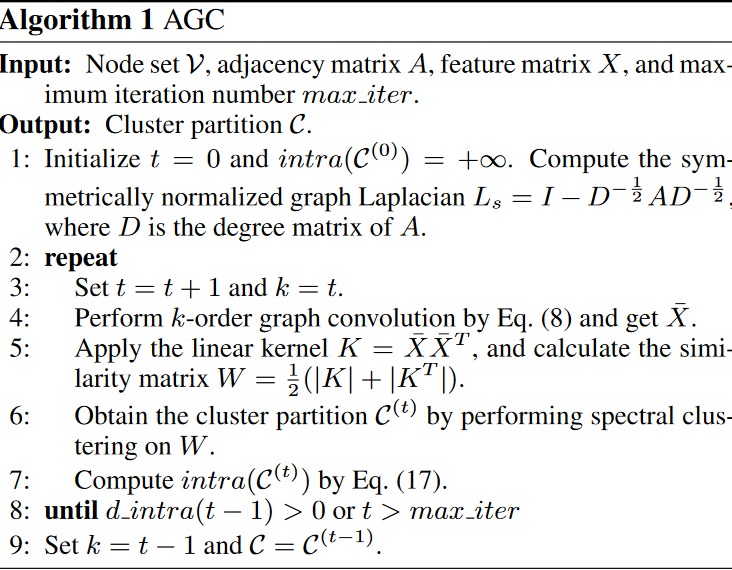

# Attributed Graph Clustering via Adaptive Graph Convolution

## The Proposed Method

### Problem Formulation

给定图$\mathcal{G = V,E},X$。我们想要将其分割为$m$类$\mathcal{C}=\{C_1,C_2,\cdots,C_m\}$。

### Graph Convolution

一个图信号(graph signal)可以被表示为向量$f=[f(v_1),\cdots,f(v_n)]^T$，其中$f:\mathcal{V}\rightarrow \mathbb{R}$为实值函数。给定邻接矩阵$A$和度矩阵$D = \text{diag}(d_1,\cdots,d_n)$，对称归一化graph Laplacian $L_s = I - D^{-\frac{1}{2}}AD^{-\frac{1}{2}}$可以通过特征值分解为$L_s = I- U\Lambda U^{-1}$，其中$\Lambda = \text{diag}(\lambda_1,\cdots,\lambda_n)$为升序排列的特征值，$U = [u_1,\cdots,u_n]$为对应的正交特征向量。一个线性图滤波(graph filter)可以被表示为矩阵$G = Up(\Lambda)U^{-1} = \mathbb{R}^{n\times n}$，其中$p(\Lambda) = \text{diag}(p(\lambda_1),\cdots, p(\lambda_n))$被称为$G$的频率响应函数。图卷积定义为：

$$
\bar{f} = Gf
$$

其中$\bar{f}$为filtered graph signal。

特征矩阵$X$的每一列可以被看作是一个graph signal。在图信号处理中，特征值$(\lambda_q)_{1\le q\le n}$可以被看作是频率，而与之对应的特征向量$(u)_{1 \le q\le n}$被认为是图的傅里叶基。图信号$f$可以被表示为特征向量的线性组合：

$$
f = Uz = \sum_{q=1}^n z_q u_q
$$

一个图被称为是平滑的节点附近的节点有相似的特征。基信号$u_q$的平滑度可以通过Laplacian-Beltrami算子$\Omega(\cdot)$衡量：

$$
\begin{aligned}
\Omega\left(\boldsymbol{u}_q\right) & =\frac{1}{2} \sum_{\left(v_i, v_j\right) \in \mathcal{E}} a_{i j}\left\|\frac{\boldsymbol{u}_q(i)}{\sqrt{d_i}}-\frac{\boldsymbol{u}_q(j)}{\sqrt{d_j}}\right\|_2^2 \\
& =\boldsymbol{u}_q^{\top} L_s \boldsymbol{u}_q=\lambda_q,
\end{aligned}
$$

$u_q(i)$表示向量$u_q$的第$i$个元素。上式表明与低频对应的基更加平滑(不知道为什么)，这意味着平滑的图信号$f$应该包含更多低频的东西。我们可以通过下面得到一个低频图滤波$G$：

$$
\bar{f} = Gf = Up(\Lambda)U^{-1}\cdot U z = \sum_{q=1}^n p(\lambda_q)z_qu_q
$$

在滤波信号$\bar{f}$中，$u_q$的系数被$p(\lambda_q)$所缩放。为了实现低通滤波器，$p(\lambda_q)$应该非负递减：

$$
p(\lambda_q) = 1 - \frac{1}{2}\lambda_q
$$

则我们有：

$$
G = U(I - \frac{1}{2}\Lambda)U^{-1} =  I - \frac{1}{2}L_s
$$

我们得到滤波特征矩阵：

$$
\bar{X} = GX
$$

为了捕获全局信息，我们采用k-阶图卷积。我们定义k阶图卷积：

$$
\bar{X} = (I - \frac{1}{2}L_s)^k X
$$

对应的图滤波为：

$$
G = (I - \frac{1}{2}L_s)^k = U(I - \frac{1}{2}\Lambda)^kU^{-1}
$$

频率响应函数为：

$$
p(\lambda_q) = (1 - \frac{1}{2}\lambda_q)^k
$$

k阶图卷积的递归计算为：

$$
\begin{aligned}
& \overline{\boldsymbol{x}}_i^{(0)}=\boldsymbol{x}_i, \quad \overline{\boldsymbol{x}}_i^{(1)}=\frac{1}{2}\left(\overline{\boldsymbol{x}}_i^{(0)}+\sum_{\left(v_i, v_j\right) \in \mathcal{E}} \frac{a_{i j}}{\sqrt{d_i d_j}} \overline{\boldsymbol{x}}_j^{(0)}\right), \cdots, \\
& \overline{\boldsymbol{x}}_i^{(k)}=\frac{1}{2}\left(\overline{\boldsymbol{x}}_i^{(k-1)}+\sum_{\left(v_i, v_j\right) \in \mathcal{E}} \frac{a_{i j}}{\sqrt{d_i d_j}} \overline{\boldsymbol{x}}_j^{(k-1)}\right),
\end{aligned}
$$

### Clustering via Adaptive Graph Convolution

我们在滤波特征矩阵$\bar{X}$上应用经典的谱聚类方法来将节点$\mathcal{V}$分割为$m$个类。我们首先使用线性核$K = \bar{X}\bar{X}^T$来学习节点之间两两的相似度，之后计算$W = \frac{1}{2}(|K|+|K|^T)$来确保相似矩阵为对称矩阵，其中$|\cdot|$表示求绝对值。最后，我们在$W$上进行谱聚类通过计算与$m$个最大的特征值对应的特征向量，之后再在特征向量上应用k均值聚类来得到聚类。

为了选择阶$k$，我们使用聚类表现矩阵：

$$
\text{intra}(\mathcal{C}) = \frac{1}{|\mathcal{C}|}\sum_{C\in \mathcal{C}}\frac{1}{|C|(|C|-1)}\sum_{v_i,v_j\in C,v_i\neq v_j}\|\bar{x}_i - \bar{x}_j\|
$$

但是随着k的增大，我们的样本被变得越来越相似，无论是类内还是类间的距离都会减少，因此我们选择在找到第一个局部最小值后停止算法。

