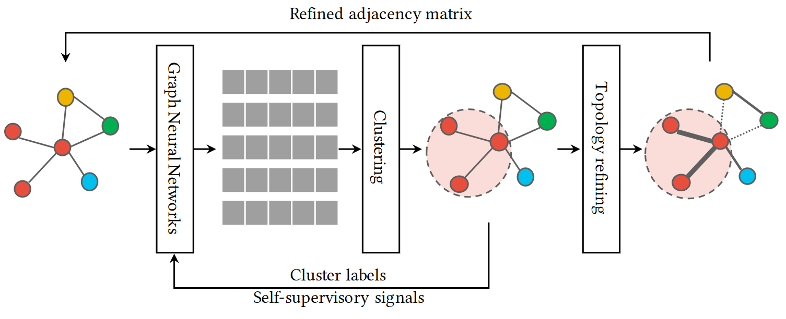
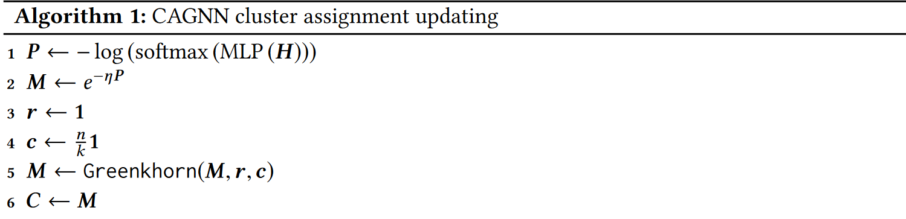
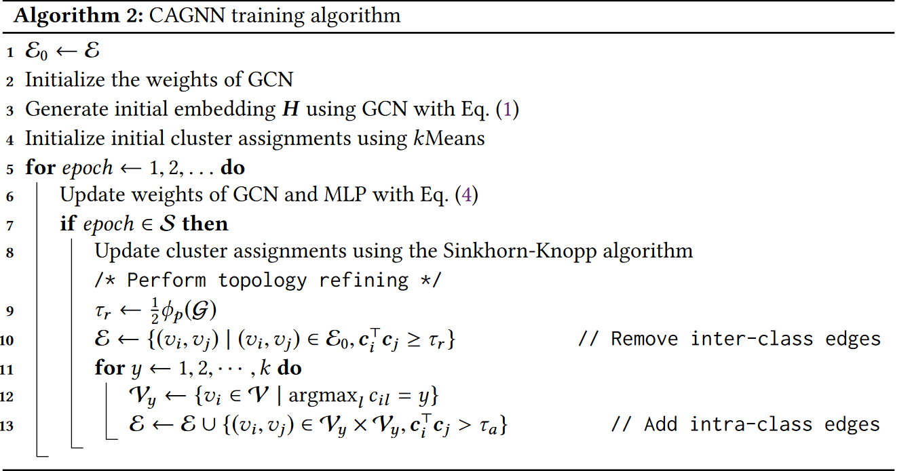
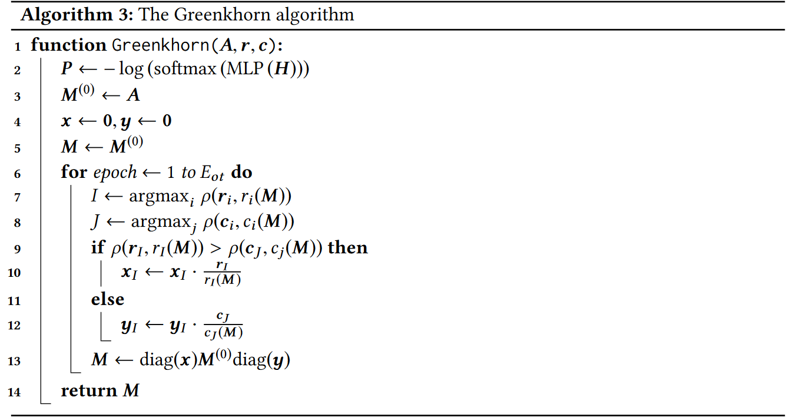

# CAGNN：Cluster-Aware Graph Neural Networks for Unsupervised Graph Representation Learning

> GAGNN的流程。CAGNN模型在节点表示和聚类之间轮流转换。我们首先使用GNN得到节点embeddings。之后，我们进行聚类并且使用类别标签作为自监督信号。之后，我们使用一个新的cluster-aware拓扑改善机制来减少类内边并且加强类间连接来缓和噪声边的影响。

## The Proposed Method: CAGNN

### Problem Formulation and Notation

考虑输入图$\mathcal{G=(V,E)}$，其中$\mathcal{V}=\{v_1,v_2,\cdots,v_n\}$表示节点并且$\mathcal{E}\subseteq \mathcal{V\times V}$表示边。我们表示$\mathrm{X}\in \mathbb{R}^{n\times m}$和$\mathrm{A}\in \mathbb{R}^{n\times n}$为节点特征矩阵和邻接矩阵。图表示学习的目标是学习一个低维表示$h_i \in \mathbb{R}^d$对于每一个节点$v_i\in \mathcal{V}$。

### Self-supervised Learning on Graphs by Clustering

**Graph convolutional networks**：我们定义$\mathcal{H}^{(t)}$为第$t$层的输出。每一层可以定义为：

$$
\mathrm{H}^{(t)} = \sigma(\tilde{D}^{-\frac{1}{2}}\tilde{A}\tilde{D}^{-\frac{1}{2}}H^{(t-1)}W^{(t)})
$$

**Clustering on node embeddings**：假设$v_i \in \mathcal{V}$的聚类标签表示为$y_i\in \{1,2,\cdots,k\}$，从$k$个可能的聚类种采样。我们讲聚类分配表示为$C\in \{0,1\}^{n\times k}$，每一行表示一个数据的类的one-hot编码。K-Means算法旨在学习中心$\mu_1,\mu_2,\cdots,\mu_k$和类分配$y_1,\cdots,y_n$，通过优化：

$$
\min_{\mu_1,\cdots,\mu_k}\sum_{i=1}^n \min_C \|h_i - \mu_{y_i}\|
$$

但是上式会在所有节点都属于同一个类时达到最优解，这是我们不想要的。因此我们将$\mathrm{C}$放松为一个每一行都为一个概率分布的矩阵，即$\mathrm{C1=1}$。并且限制每一个聚类的大小都相等，即

$$
C^T1 = \frac{n}{k}1
$$

但是这个是正则化项，而不是一个限制。

**Self-supervision on cluster assignments**：我们使用多层感知机网络作为分类器，以$H$为输入并预测标签的概率。对于经典分类问题，标签都已经确定的情况下，我们求解下列优化问题：

$$
\min -\frac{1}{n}\sum_{i=1}^n \log P(y=y_i\mid v_i)
$$

其中$p(y\mid v_i) = \text{softmax}(\text{MLP}(h_i))$为节点$v_i$的预测。上式可以通过两个分布$q(y\mid v_i)$和$p(y\mid v_i)$的交叉熵来重写：

$$
\mathcal{L} = -\sum_{i=1}^n\sum_{y=1}^k q(y\mid v_i)\log p(y\mid v_i)
$$

其中$q(y\mid v_i)=c_{ij}$为确定性的。

根据这个公式，给定当前的聚类分配。我们通过最小化$q,p$的交叉熵来更新模型参数。当更新聚类分配时，我们最小化上式根据当前预测分布$p$。这个过程可以被认为是一个最优运输问题，其中$P\in \mathbb{R}^{n\times k}, p_{iy} = -\log p(y\mid v_i)$为代价矩阵。我们可以吧$C$放松为一个运输多面体(transportation polytope)，给定为：

$$
U(r,c) := \{C\in \mathbb{R}_+^{n\times k}\mid C1=r, C^T1 = c\}
$$

其中$r=1,c=\frac{n}{k}1$对应于我们前面的约束，并且我们需要最小化损失：

$$
\langle C,P\rangle
$$

这个问题可以使用Sinkhorn-Knopp矩阵scaling 算法来通过近线性时间求解。特殊地，我们可以通过使用scaling算法来近似$e^{\mu P}$的Sinkhorn投影来求解，其中$\mu$为超参数。在CAGNN种，我们使用Sinkhorn算法的贪心版本，Greenkhorn算法来近似求解。

### Cluster-Aware Topology Refining

我们通过加强类内的连接，减少组间的连接来重新定义图的拓扑结构。特殊地，给定类别分配$C$，对于每一个边$(v_i,v_j)$，如果$v_i,v_j$属于同一个类的概率小于阈值$\tau_r$，我们将其删除。另外，对于每一个点对$(v_i,v_j)$，如果两者属于同一类的概率大于阈值$\tau_a$，我们将其添加到图中。

每一次迭代我们只对原始图的拓扑进行修改，而不是前一个改进的图进行修改。当添加边时，我们只对满足$\argmax_k c_{ik} = \argmax_{l}c_{jl}$的点对$(v_i,v_j)$添加边。

对拓扑结构进行重新定义的目的是增加图的纯度$\phi_{\mathcal{G}}$，定义为$\mathcal{G}$中一个边的两个节点来自于同一个类的概率：

$$
\phi_p(\mathcal{G}) = \frac{1}{|\mathcal{E}|}\sum_{(v_i,v_j)\in \mathcal{E}}p(y_i=y_j) = \frac{1}{|\mathcal{E}|}\sum_{(v_i,v_j)\in \mathcal{E}}c_i^Tc_j
$$

## Detials Of The Greenkhorn Alrorithm

Greenkhorn算法旨在求解矩阵scaling问题：给定非负矩阵$A\in \mathbb{R}_{+}^{n\times k}$，目标是找到两个向量$x\in \mathbb{R}^n, y\in \mathbb{R}^k$，使得在$M = \text{diag}(x)A\text{diag}(y)$中行的和和列的和满足：

$$
\begin{aligned}
    r(M) &= r\\
    c(M) &= c
\end{aligned}
$$

其中$r(M) = M1, c(M)=M^T1$，$r,c$为需要的行/列和。

Greedkhorn贪心的选择一行或者一列来更新，根据距离矩阵$\rho: \mathbb{R}^+\times \mathbb{R}^+ \rightarrow [0, +\infty]$，定义为：

$$
\rho(a, b) = b -a + a\log\frac{a}{b}
$$

