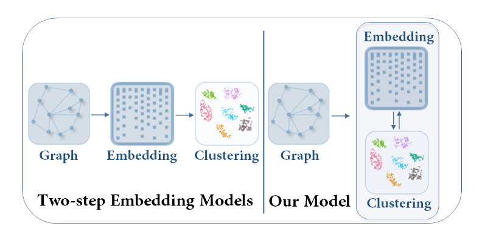
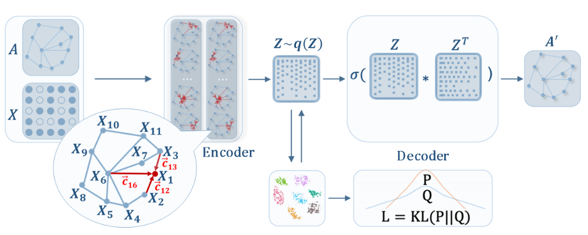
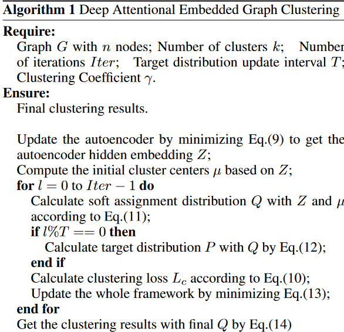

# Attributed Graph Clustering: A Deep Attentional Embedding Approach

> two-step embedding模型和我们的模型的区别。

## Problem Definition and Overall Framework

我们的图可以表示为$G = (V,E,X)$。

## Proposed Method

### Graph Attentional Autoencoder

$$
z_i^{l+1} = \sigma\left(\sum_{j\in N_i}\alpha_{ij}W{z_j^l}\right)
$$

这里$z_i^{l+1}$表示节点$i$的表示，$N_i$表示$i$的邻域。$\alpha_{ij}$为注意力参数。

我们的注意力系数$\alpha_{ij}$可以被表示为一个输入为$x_i$和$x_j$的连接的单层的前馈神经网络，权重向量$a^T = R^{2m^\prime}$：

$$
c_{ij} = a^T[Wx_i\| Wx_j]
$$

我们通过考虑第$k$阶邻域节点来得到邻接矩阵：

$$
M = (B + B^2 + \cdots + B^t) / t
$$

其中$B$为转移矩阵其中$B_{ij}=1/d_i$如果$e_{ij}\in E$，要么$B_{ij}=0$。

注意力参数会归一化：

$$
\alpha_{ij} = \text{softmax}_j(c_{ij}) = \frac{\exp(c_{ij})}{\sum_{r\in N_i}\exp(c_{ij})}
$$

添加拓扑权重$M$和激活函数$\delta$，系数可以计算为：

$$
\alpha_{ij} = \frac{\exp(\delta M_{ij}(a^T[Wx_i\|Wx_j]))}{\sum_{r\in N_i}\exp(\delta M_{ir}(a^T[Wx_i\|Wx_r]))}
$$

我们有$x_i = z_i^0$作为输入，并且堆叠两个图注意力层：

$$
\begin{aligned}
    z_i^{(1)} &= \sigma\left(\sum_{j\in N_i}\alpha_{ij}W^{(0)}x_j\right)\\
    z_i^{(2)} &= \sigma\left(\sum_{j\in N_i}\alpha_{ij} W^{(1)}z_j^{(1)}\right)
\end{aligned}
$$

我们的解码器定义为：

$$
\hat{A}_{ij} = \text{sigmoid}(z_i^Tz_j)
$$

损失定义为：

$$
L_r = \sum_{i=1}^n \text{loss}(A_{i,j},\hat{A}_{i,j})
$$

### Self-optimizing Embedding

$$
L_c = \mathbb{KL}(P\|Q) = \sum_i\sum_u p_{iu}\log \frac{p_{iu}}{q_{iu}}
$$

其中

$$
q_{iu} = \frac{(1+\|z_i - \mu_u\|^2)^{-1}}{\sum_k(1+\|z_i - \mu_k\|^2)^{-1}}
$$

$$
p_{iu} = \frac{q_{iu}^2/\sum_i q_{iu}}{\sum_k (q_{ik}^2/\sum_i q_{ik})}
$$

### Joint Embedding and Clustering Optimization

$$
L = L_r + \gamma L_c
$$

