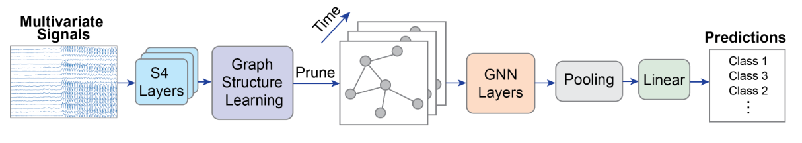

# Modeling Multivariate Biosignals With Graph Neural Networks and Structured State Space Models

## Introduction

> GraphS4mer模型的架构。模型含有三个主要的组成部分。(1) stacked Structured State Space model(S4)来独立学习每个传感器的时间依赖 (2) 一个graph structure learning(GSL)层来动态学习图结构的变化 (3) GNN层学习空间依赖关系

