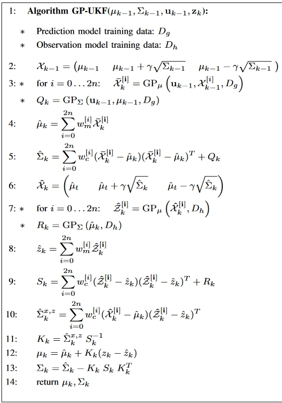

我们定义：
$$
\begin{aligned}
D_g &= \langle (X,U),X^\prime\rangle\\
D_h &= \langle X,Z\rangle
\end{aligned}
$$
其中$X$为真实状态的矩阵，$X^\prime = [\Delta x_1,\Delta x_2,\cdots,\Delta x_k]$为状态转移的矩阵，$Z$为观测矩阵。

$g$和$h$的GP近似表示为$\text{DP}^g$和$\text{DP}^h$，因此：
$$
\begin{aligned}
\mathrm{x}_k &= \text{GP}_\mu^g([\mathrm{x}_{k-1},\mathrm{u}_{k-1}],D_g) + \epsilon_k\\
\mathrm{z}_k &= \text{GP}_\mu^h(\mathrm{x}_k, D_h) +\delta_k
\end{aligned}
$$
其中$\epsilon_k \sim \mathcal{N}(0, \text{GP}_{\Sigma}^g ([\mathrm{x}_{k-1},\mathrm{u}_{k-1}],D_g))$并且$\delta_k \sim \mathcal{N}(0,\text{GP}_\Sigma^h(\mathrm{x}_k,D_h))$。我们想要用$\text{GP}_\mu^g,\text{GP}_\mu^h$分别去近似$g$和$h$，$\text{GP}_\Sigma^g,\text{GP}_\Sigma^h$分别去近似$Q,R$。

将估计的$g,h$表示为$\hat{g},\hat{h}$，高斯过程残差表示为$\hat{\text{GP}}^g$和$\hat{\text{GP}}^h$。则我们的过程和观测模型变为：
$$
\begin{aligned}
\mathrm{x}_k &= \hat{g}([\mathrm{x}_{k-1},\mathrm{u}_{k-1}]) + \hat{\text{GP}}_\mu^g([\mathrm{x}_{k-1},\mathrm{u}_{k-1}],\hat{D}_g) + \epsilon_k\\
\mathrm{z}_k &= \hat{h}(\mathrm{x}_k) + \hat{\mathrm{GP}_\mu^h(\mathrm{x}_k,\hat{D}_h)}+\delta_k
\end{aligned}
$$
其中，训练数据
$$
\begin{aligned}
\hat{D}_g &= \{(X,U),X^\prime - \hat{g}(X,U)\}\\
\hat{D}_h &= \{X,Z-\hat{h}(X)\}
\end{aligned}
$$
这里，$\epsilon_k \sim \mathcal{N}(0, \hat{\text{GP}}_\Sigma^g([\mathrm{x}_{k-1},\mathrm{u}_{k-1}],\hat{D}_g))$并且$\delta_k \sim \mathcal{N}(0, \hat{\text{GP}_\Sigma^h(\mathrm{x}_k, \hat{D}_h)})$。

