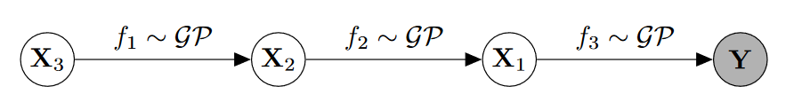
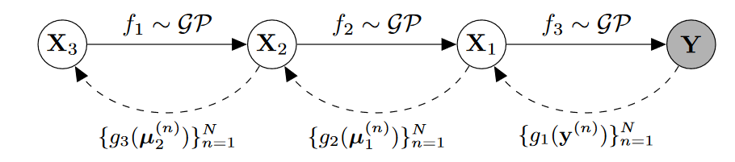

## VARIATIONAL AUTO-ENCODED DEEP GAUSSIAN PROCESSES

### Deep Gaussian Process

> 两层隐藏层的深度高斯过程。

观测输出放置在最下面的层，观测输入放置在最上面的层中。考虑数据$\mathrm{Y}\in \mathbb{R}^{N\times D}$，其中有$N$个$D$维数据点。定义了$L$层隐变量的deep GP，$\{\mathrm{X}_l\}_{l=1}^L,\mathrm{X}_l\in \mathbb{R}^{N\times Q_l}$，我们的模型定义为：
$$
\begin{aligned}
\mathrm{Y} &= f_1(\mathrm{X_1}) + \epsilon_1,\quad \epsilon_1 \sim \mathcal{N}(0, \sigma_1^2\mathrm{I})\\
\mathrm{X}_{l-1} &= f_l(\mathrm{X}_l) + \epsilon_l,\quad \epsilon_l \sim \mathcal{N}(0, \sigma_l^2\mathrm{I}),\quad l=2,\cdots,L
\end{aligned}
$$
其中函数$f_l$从高斯过程中抽样，其协方差函数为$k_l$，如$f_l(x) \sim \mathcal{GP}(0, k_l(x,x^\prime))$。在无监督情况下，最顶层的隐藏层赋值为单位高斯作为一个无信息先验，如$\mathrm{X_L}\sim \mathcal{N}(0, \mathrm{I})$。在有监督的情况下，最上面隐藏层的输入是观测到的并且决定其隐输出。

### Variational Inference

在标准的DP模型中，推断需要积分掉隐函数$f$。在DGP的情况下，隐变量需要被积分掉：
$$
p(\mathrm{Y}) = \int p(\mathrm{Y\mid \mathrm{X_1}})\prod_{l=2}^L p(\mathrm{X_{l-1}\mid \mathrm{X}_l})p(\mathrm{X}_L)d\mathrm{X}_1\cdots d\mathrm{X}_L
$$
为了进行变分推断，假设隐变量的变分后验分布：$q(\{\mathrm{X}_l\}_{l=1}^L) = \prod_{l=1}^L q(\mathrm{X}_l)$，对数边缘分布的下界可以推断为：
$$
\mathcal{L} = \sum_{l=1}^L\mathcal{F}_l + \sum_{l=1}^{L-1}H(q(\mathrm{X}_l)) - \mathbb{KL}(q(\mathrm{X_L})\| p(\mathrm{X_L}))
$$
其中$\mathcal{F}_1 = \langle\log p(\mathrm{Y\mid X_1})\rangle_{q(\mathrm{X_1})}$并且$\mathcal{F}_l = \langle \log p(\mathrm{X}_{l-1}\mid \mathrm{X}_l)\rangle_{q(\mathrm{X_{l-1}})q(\mathrm{X}_l)}$被称为*free energy*。$H(q(\mathrm{X}_l))$表示熵。

### Variational Auto-Encoded Model

对于变分分布，我们将其定义为数据的变换：
$$
\mu_1^{(n)} = g_1(y^{(n)})
$$
其中$g_1$为多重感知机。相同的：
$$
\mu^{(n)}_l = g_l(\mu_{(l-1)}^{(n)})
$$
后验方差$\Sigma_L^{(n)}$假定为对角的并且对于所有数据点都是相同的。

### Distributed Variational Inference

因为*free energy*项，变分下界仍然是不可追踪的。对于贝叶斯高斯过程隐变量模型(BGPLVM)的变分近似技术可以被用来得到这些*free energy*项的下界。以观察层为例，通过引入noise-free观测$\mathrm{F}_1\in \mathbb{R}^{N\times D}$，被称为诱导变量的辅助变量$\mathrm{U}_1\in \mathbb{R}^{M\times D}$和一系列被称为诱导输入的变分参数$\mathrm{Z}_1\in \mathbb{R}^{M\times Q_1}$，条件分布可以被写为：
$$
p(\mathrm{Y\mid X_1}) = \int p(\mathrm{Y\mid F_1})p(\mathrm{F_1\mid U_1,X_1})p(\mathrm{U}_1)d\mathrm{F_1}d\mathrm{U_1}
$$
其中$\mathrm{U}_1$的每一行表示一个诱导变量，与诱导输入$\mathrm{Z_1}$的相同行相对应。假设$\mathrm{F_1,U_1}$的一个特殊的变分分布：$q(\mathrm{F_1,U_1\mid X_1}) = p(\mathrm{F_1\mid U_1,X_1})q(\mathrm{U_1})$，观测层的free energy可以以下面为下界：
$$
\mathcal{F}_1 \ge \langle \log p(\mathrm{Y\mid F_1}) - \mathbb{KL}(q(\mathrm{U_1})\| p(\mathrm{U_1}))\rangle_{p(\mathrm{F_1\mid U_1,X_1})q(\mathrm{U_1})q(\mathrm{X_1})}
$$
对于第$l$个隐藏层，变分后验分布定义为$q(\mathrm{F_l,U_l\mid X_{l-1},X_l}) = p(\mathrm{F_l\mid U_l,X_l})q(\mathrm{U_l\mid X_{l-1}})$。与观测层相同，free energy的下界可以定义为：
$$
\mathcal{F}_l \ge \langle \log p(\mathrm{X_{l-1}\mid F_l}) - \mathbb{KL}(q(\mathrm{U_l\mid X_{l-1}})\| p(\mathrm{U_l}))\rangle_{p(\mathrm{F_l\mid U_l,X_l})q(\mathrm{U_l\mid X_{l-1}})q(\mathrm{X_{l-1}})q(\mathrm{X_l})}
$$
