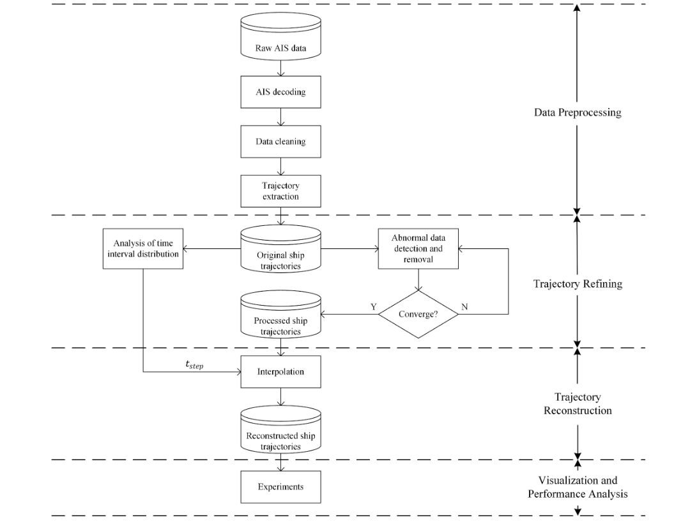
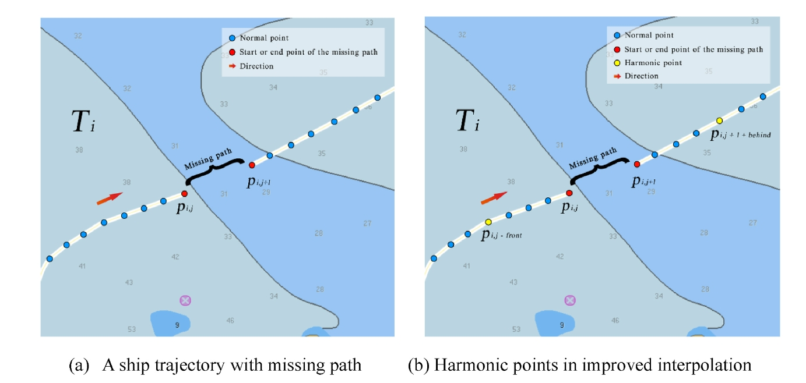
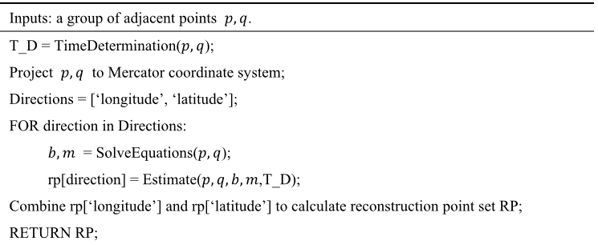
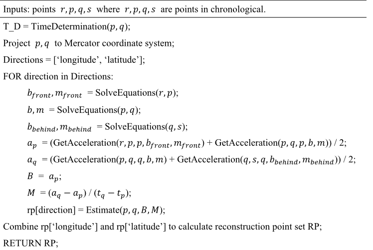
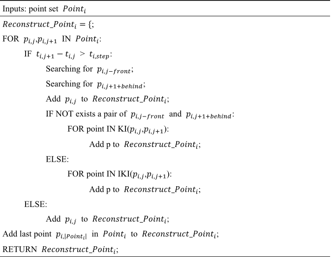
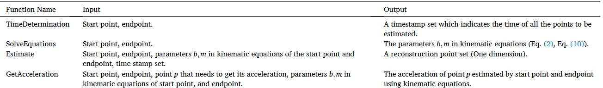

## Improved kinematic interpolation for AIS trajectory reconstruction

我们采用动力学差值的方式来对AIS数据进行插值，构建渔船在一定时间内的加速度的函数，速度可以通过对加速度积分得到，位移可以通过对速度积分得到。
$$
\begin{aligned}
x(t) &= x(t_i) + \int_{t_i}^tv(t)dt\\
v(t) &= v(t_i) + \int_{t_i}^ta(t)dt
\end{aligned}
$$
其中$t_i<t<t_j$，$t_i,t_j$表示两个相邻的给定的点$p,q$的时间。$v(t)$既包括大小也包括方向。

$a(t)$是未知的，假设满足下列线性函数：
$$
a(t) = b+m(t-t_i)
$$
当把$p,q$应用到方程中解出$b,m$。

但是因为轨迹的许多点是已知的，在不同的时间范围内计算得到的$p,q$的加速度是不同的。为了解决这个问题，本文提出了如何构建好的加速度函数。

### Model design

#### Data preprocessing

我们记轨迹的集合为$T$，令$Track_i = (MMSI_i,Points_i)$表示$T$中的第$i$个船舶轨迹。$MMSI_i$第$i$个船舶轨迹的MMSI，$Points_i$表示第$i$个轨迹的点的集合。对于轨迹点$p_{i,j}\in Points_i$，$|Points_i|$表示$Track_i$的点的数目，并且$p_{i,j}=(t_{i,j},lon_{i,j},lat_{i,j},sog_{i,j},cog_{i,j})$。

#### Trajectory refining

##### Analysis of time interval distribution

尽管AIS传输信号的频率可以指示船舶的导航特征，但是其也受到传输时的交通量和传输能力的影响。因此我们需要研究时间差的分布来确定插值的频率。

我们定义
$$
\Delta t_{i,j} = \Delta t_{i,j+1}-t_{i,j}
$$
并且$I_i=\{\Delta t_{i,j}\mid j\in N,1\le j\le |Points_i|-1\}$。我们将$I_i$进行排列记为$I_{i\_sorted}$，定义：
$$
t_{i,step} = I_{i\_sorted_{0.9}}
$$

##### Iterative abnormal data detection and removal

令$P_{num} = |Points_i|$，相邻两点$p_{i,j},p_{i,j+1}$之间的平均速度$\bar{v_{i,j}}$定义为：
$$
\bar{v_{i,j}} = \frac{\Delta d_{i,j}}{\Delta t_{i,j}}
$$

$$
\Delta d_{i,j} = \text{Distance}(lon_{i,j},lat_{i,j},lon_{i,j+1},lat_{i,j+1})
$$

$\Delta c_{i,j}$定义为：
$$
\Delta c_{i,j} = \begin{cases}
\frac{|cog_{i,j+1}-cog_{i,j}|}{\Delta t_{i,j}},|cog_{i,j+1}-cog_{i,j}|\le 180\\
\frac{360-|cog_{i,j+1}-cog_{i,j}|}{\Delta t_{i,j}},|cog_{i,j+1}-cog_{i,j}|> 180
\end{cases}
$$
如果数据是**不正常**的，$\bar{v}_{i,j}$和$\Delta c_{i,j}$必须满足下列规则：
$$
\begin{aligned}
&\bar{v}_{i,j} > v_{\lim}\\
&\left|\max(\bar{v}_{i,j}-sog_{i,j},\bar{v}_{i,j}-sog_{i,j+1})\right| \gg 0\\
&\Delta c_{i,j} > c_{\lim}
\end{aligned}
$$
假设$p_{i,j}$是正确的轨迹，当$\bar{v}_{i,j}$或$\Delta c_{i,j}$有一个不正确则$p_{i,j+1}$被认为是异常点被移除。在每次操作后我们更新点的数量$P_{num} = |Points_i|$直到其不再发生变换而收敛。

#### Trajectory reconstruction

利用KI方法来对轨迹进行插值时我们只考虑两个点$p_{i,j}$和$p_{i,j+1}$，而当使用IKI进行插值时我们采用一组Harmonic点$p_{i,j-front}$和$p_{i,j+1+behind}$。

##### Interpolation time determination

重建轨迹前需要找到有缺失值的轨迹。我们规定当$\Delta t_{i,j}>t_{i,step}$时在$p_{i,j}$和$p_{i+1,j}$之间存在缺失的轨迹，$p_{i,j}$和$p_{i+1,j}$分别为缺失路径的起始点和结束点。需要重建的点的数量$n$由下式确定：
$$
t_{i,j} + n\times t_{i,step} < t_{i,j+1}
$$
每个需要重建的点的时间戳为：
$$
t_u = t_{i,j}+k\times t_{i,step},\quad 1\le k\le n\text{ and } k \in \mathbb{Z}
$$

##### Basic kinematic interpolation

我们首先将加速度线性变化的公式代入两个积分式中，得到：
$$
\begin{aligned}
x(t) &= x(t_i) + v(t_i)(t-t_i) + \frac{1}{2}b(t-t_i)^2 + \frac{1}{6}m(t-t_i)^3\\
v(t) &= v(t_i) + b(t-t_i) + \frac{1}{2}m(t-t_i)^2
\end{aligned}
$$
为了方便，我们将速度投影到经度和纬度方向，利用墨卡托坐标系：
$$
\begin{aligned}
v_{i,j}^{lon} &= sog_{i,j}\times \sin(cog_{i,j})\times \frac{1852}{3600}\\
v_{i,j}^{lat} &= sog_{i,j}\times \cos(cog_{i,j})\times \frac{1852}{3600}
\end{aligned}
$$
$p_{i,j}$的位置为$(x_{i,j},y_{i,j})$，其中$x_{i,j}$为$lon_{i,j}$，$y_{i,j}$为$lat_{i,j}$。我们可以将$v^{lon}_{i,j},v^{lat}_{i,j},x_{i,j},x_{i,j+1},t_{i,j},t_{i,j+1}$来求出参数$b,m$。并且对于$t_u$，可以求得$x(t_u),v(t_u),a(t_u)$，进一步求出$a(t_{i,j})$和$a(t_{i,j+1})$。

##### Improved kinematic interpolation

因为$a(t_{i,j})$和$a(t_{i,j+1})$都是估计得到的，肯定存在误差，为了减少这些误差，我们需要使用一组harmonic点：

如果存在整数*front*和*behind*满足下列公式：
$$
\begin{aligned}
&\left|t_{i,j}-t_{i,j-front}-\Delta t_{i,j}\right| < t_{i,step}\\
&\left|t_{i,j+1+behind}-t_{i,j+1}-\Delta t_{i,j}\right| < t_{i,step}
\end{aligned}
$$
点$p_{i,j-front}$和$p_{i,j+1+behind}$被称为一组harmonic点。我们分别将$p_{i,j-front}$和$p_{i,j}$、$p_{i,j+1}$和$p_{i,j+1+behind}$代入动力学方程，求解出$p_{i,j}$和$p_{i,j+1}$处的加速度分别为$a(t_{i,j})_{front}$和$a(t_{i,j+1})_{behind}$，之后估计$p_{i,j}$和$p_{i,j+1}$处的加速度为：
$$
\begin{aligned}
a_{i,j} &= \frac{a(t_{i,j})_{front}+a(t_{i,j})}{2}\\
a_{i,j+1} &= \frac{a(t_{i,j+1})+a({t_{i,j+1})_{behind}}}{2}
\end{aligned}
$$
使用$a_{i,j}$和$a_{i,j+1}$来求解$m,b$，表示为$B,M$：
$$
\begin{aligned}
B &= a_{i,j},\\
M &= \frac{a_{i,j+1}-a_{i,j}}{\Delta t_{i,j}}
\end{aligned}
$$
之后利用以下公式重建轨迹：
$$
\begin{gathered}
x(t)=x\left(t_i\right)+v\left(t_i\right)\left(t-t_i\right)+\frac{1}{2} B\left(t-t_i\right)^2+\frac{1}{6} M\left(t-t_i\right)^3 \\
v(t)=v\left(t_i\right)+B\left(t-t_i\right)+\frac{1}{2} M\left(t-t_i\right)^2 \\
a(t)=B+M\left(t-t_i\right)
\end{gathered}
$$

##### Algorithm design

算法的伪代码如下：

> KI算法

> IKI算法

> 根据IKI算法的轨迹重建算法

> 函数说明