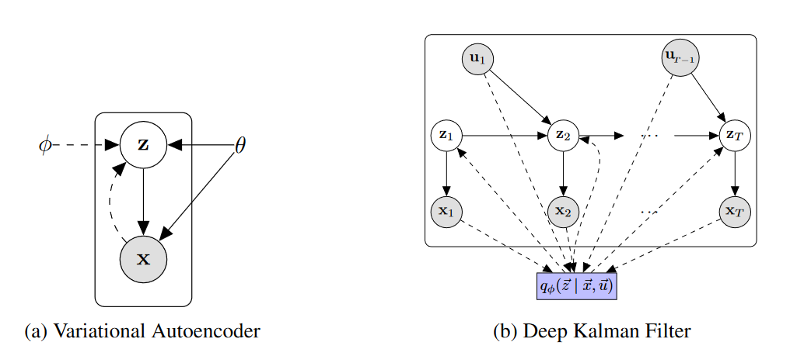
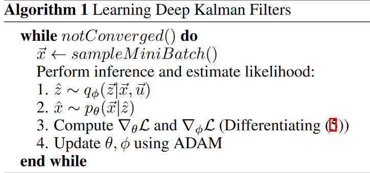

## Deep Kalman Filters

### Background

**Kalman Filters**
$$
z_t = G_tz_{t-1} + B_tu_{t-1} + \epsilon_t \quad x_t = F_tz_t + \eta_t
$$
其中$z_t$为隐状态，$u_t$表示控制输入，$x_t$表示观测。我们将要把线性函数用神经网络代替，但是这样我们的后验分布$p(z_1,\cdots,z_T\mid x_1,\cdots,x_T,u_1,\cdots,u_T)$在计算中将不可追踪。

所以我们用到Stochastic Backpropagation的技术。

**Stochastic Backpropagation(随机反向传播)**

为了克服后验估计的追踪问题，我们使用变分自编码器来优化模型对数似然的变分下界。主要的技术创新是recognition network，一个用来近似可追踪后验的神经网络。

令$p(x,z) = p_0(z)p_\theta(x\mid z)$为观测集合$x$的生成模型，其中$p_0(z)$为$z$的先验，而$p_\theta(x\mid z)$为以$\theta$为参数的生成模型。通过变分规则，我们假定一个近似后验分布$q_\phi(z\mid x)$，也被称为recognition model。那么我们得到边缘似然的下界：
$$
\begin{aligned}
\log p_\theta(x) & =\log \int_z \frac{q_\phi(z \mid x)}{q_\phi(z \mid x)} p_\theta(x \mid z) p_0(z) \mathrm{d} z \geq \int_z q_\phi(z \mid x) \log \frac{p_\theta(x \mid z) p_0(z)}{q_\phi(z \mid x)} \mathrm{d} z \\
& =\underset{q_\phi(z \mid x)}{\mathbb{E}}\left[\log p_\theta(x \mid z)\right]-\operatorname{KL}\left(q_\phi(z \mid x) \| p_0(z)\right)=\mathcal{L}(x ;(\theta, \phi))
\end{aligned}
$$
我们用一个神经网络来对$q_\phi(z\mid x)$进行建模，但是我们的下界是要求以$q_\phi(z\mid x)$为概率密度函数的期望的，依赖于神经网络的参数$\phi$。这个困难可以通过stochastic backpropagation来解决，假设隐状态是正态分布的$q_\phi(z\mid x)\sim \mathcal{N}(\mu_\phi(x),\Sigma_\phi(x))$，一个简单变换，可以允许我们得到$\mathbb{E}_{q_\phi(z\mid x)}[\log p_\theta(x\mid z)]$对于$\phi$梯度的蒙特卡洛估计。KL散度也可以用同样的方法，因为它也是期望。如果我们假设先验$p_0(z)$是正态分布，KL和它的梯度也可以得到解析解。

### Model

观测序列表示为$\vec{x}=\left(x_1, \ldots, x_T\right)$，动作$\vec{u} = (u_1,\cdots,u_{T-1})$，以及与之对应的隐状态$\vec{z} = (z_1,\cdots,z_T)$。我们假设$x_t\in \mathbb{R}^d,u_t\in \mathbb{R}^c, z_t\in \mathbb{R}^s$。深度卡尔曼滤波的生成模型为：
$$
\begin{aligned}
z_1 &\sim \mathcal{N}(\mu_0;\Sigma_0)\\
z_t &\sim \mathcal{N}(G_\alpha(z_{t-1},u_{t-1},\Delta_t), S_\beta(z_{t-1},u_{t-1},\Delta_t))\\
x_t &\sim \Pi(F_\kappa(z_t))
\end{aligned}
$$
函数$G_\alpha,S_\beta,F_\kappa$可以用深度神经网络表示。我们令$\mu_0=0,\Sigma_0=I_d$，那么我们生成模型的参数为$\theta = \{\alpha,\beta,\kappa\}$。我们使用三角协方差矩阵$S_\beta(\cdot)$，使用对数参数化，这样就保证了协方差矩阵为正定的。

> 图1

### Learning using Stochastic Backpropagation

#### Maximizing a Lower Bound

我们有
$$
q_\phi(\vec{z}\mid \vec{x},\vec{u}) =\prod_{t=1}^T q(z_t\mid z_{t-1},x_t,\cdots,x_T,\vec{u})
$$

> 这个公式的推理很简单，主要是从后往前推理：比如当$t$取$T$和$T-1$时，
> $$
> q(z_T\mid z_{T-1},x_T,\vec{u})q(z_{T-1}\mid z_{T-2},x_{T-1},x_T,\vec{u}) = q(z_{T-1},z_T\mid x_{T-1},x_T,\vec{u})
> $$

对于条件对数似然，我们有：
$$
\begin{aligned}
\log p_{\theta}(\vec{x}\mid \vec{u}) &= \log \int_{\vec{z}}\frac{q_\phi(\vec{z}\mid \vec{x},\vec{u})}{q_\phi(\vec{z}\mid \vec{x},\vec{u})}p_{\theta}(\vec{x},\vec{z}\mid \vec{u})d\vec{z}\\
&\ge \int_{\vec{z}}q_\phi(\vec{z}\mid \vec{x},\vec{u})\log\frac{p_{\theta}(\vec{x},\vec{z}\mid \vec{u})}{q_\phi(\vec{z}\mid \vec{x},\vec{u})}d\vec{z}\\
&\ge \int_{\vec{z}}q_\phi(\vec{z}\mid \vec{x},\vec{u})\log\frac{p_0(\vec{z}\mid\vec{u})p_{\theta}(\vec{x}\mid \vec{z}, \vec{u})}{q_\phi(\vec{z}\mid \vec{x},\vec{u})}d\vec{z}\\
&= \underset{q_\phi(\vec{z}\mid \vec{x},\vec{u})}{\mathbb{E}}[\log p_\theta(\vec{x}\mid \vec{z},\vec{u})] - \mathbb{KL}(q_\phi(\vec{z}\mid \vec{x},\vec{u})\| p_0(\vec{z}\mid \vec{u}))\\
&\overset{x_t\perp x_{\neg t}\mid \vec{z}}{=} \sum_{t=1}^T\underset{z_t\sim q_\phi(z_t\mid \vec{x},\vec{u})}{\mathbb{E}}[\log p_\theta(x_t\mid z_t,u_{t-1})] - \mathbb{KL}(q_\phi(\vec{z}\mid \vec{x},\vec{u})\|p_0(\vec{z}\mid \vec{u})) = \mathcal{L}(x;(\theta,\phi))
\end{aligned}
$$
KL散度可以被分解为：
$$
\begin{aligned}
-\mathbb{KL}(q_\phi(\vec{z}\mid \vec{x},\vec{u})\|p_0(\vec{z})) &= \int_{\vec{z}}q_\phi(\vec{z}\mid \vec{x},\vec{u})\frac{p_0(\vec{z}\mid \vec{u})}{q_\phi(\vec{z}\mid \vec{x},\vec{u})}d\vec{z}\\
&= \int_{z_1}\cdots\int_{z_T}q_\phi(z_1\mid \vec{x},\vec{u})\cdots q_\phi(z_T\mid z_{T-1},\vec{x},\vec{u})\log\frac{p_0(z_1,\cdots,z_T\mid \vec{u})}{q_\phi(z_1\mid \vec{x},\vec{u})\cdots q_\phi(z_T\mid z_{T-1},\vec{x},\vec{u})}d\vec{z}\\
&=\int_{z_1}\cdots\int_{z_T}q_\phi(z_1\mid \vec{x},\vec{u})\cdots q_\phi(z_T\mid z_{T-1},\vec{x},\vec{u})\log\frac{p_0(z_1)p_0(z_2\mid z_1,u_1)\cdots p_0(z_T\mid z_{T-1},u_{T-1})}{q_\phi(z_1\mid\vec{x},\vec{u})\cdots q_\phi(z_T\mid z_{T-1},\vec{x},\vec{u})}d\vec{z} \\
&= \int_{z_1}\cdots\int_{z_T}q_\phi(z_1\mid \vec{x},\vec{u})\cdots q_\phi(z_{T}\mid z_{T-1},\vec{x},\vec{u})\log \frac{p_0(z_1)}{q_\phi(z_1\mid \vec{x},\vec{u})}d\vec{z} + \sum_{t=2}^T\int_{z_1}\cdots\int_{z_T}q_\phi(z_1\mid \vec{x},\vec{u})\cdots q_\phi(z_{T}\mid z_{T-1},\vec{x},\vec{u})\log\frac{p_0(z_t\mid z_{t-1},u_{t-1})}{q_\phi(z_t\mid z_{t-1},\vec{x},\vec{u})}d\vec{z}\\
&= \int_{z_1}q_\phi(z_1\mid \vec{x},\vec{u})\log\frac{p_0(z_1)}{q_\phi(z_1\mid \vec{x},\vec{u})}dz_1 + \sum_{t=2}^T\int_{z_{t-1}}q_{\phi}(z_{t-1}\mid \vec{x},\vec{u}) \int_{z_t}q_\phi(z_t\mid z_{t-1},\vec{x},\vec{u})\log\frac{p_0(z_t\mid z_{t-1},u_{t-1})}{q_\phi(z_t\mid z_{t-1},\vec{x},\vec{u})}dz_{t-1}dz_t\\
&= -\mathbb{KL}(q_\phi(z_1\mid \vec{x},\vec{u})) - \sum_{t=2}^T\underset{q_\phi(z_{t-1}\mid \vec{x},\vec{u})}{\mathbb{E}}[\mathbb{KL}(q_\phi(z_t\mid z_{t-1},\vec{x},\vec{u})\| p_0(z_t\mid z_{t-1},u_{t-1}))]
\end{aligned}
$$
那么我们的结果为：
$$
\begin{aligned}
& \log p_\theta(\vec{x} \mid \vec{u}) \geq \mathcal{L}(x ;(\theta, \phi))= \\
& \sum_{t=1}^T \underset{q_\phi\left(z_t \mid \vec{x}, \vec{u}\right)}{\mathbb{E}}\left[\log p_\theta\left(x_t \mid z_t\right)\right]-\operatorname{KL}\left(q_\phi\left(z_1 \mid \vec{x}, \vec{u}\right) \| p_0\left(z_1\right)\right) \\
& -\sum_{t=2}^T \underset{q_\phi\left(z_{t-1} \mid \vec{x}, \vec{u}\right)}{\mathbb{E}}\left[\operatorname{KL}\left(q_\phi\left(z_t \mid z_{t-1}, \vec{x}, \vec{u}\right)|| p_0\left(z_t \mid z_{t-1}, u_{t-1}\right)\right)\right]
\end{aligned}
$$
上式对参数$(\theta,\phi)$都是可导的，我们可以使用反向传播算法来更新$\theta$，使用随机反向传播算法估计$\phi$的梯度。使用下述算法：

> 式(5)指的即为上式。Adam优化算法是一种对随机梯度下降法的扩展。

#### On the choice of the Optimal Variational Model

对于recognition network我们有多种选择：

+ q-INDEP：$q(z_t\mid x_t,u_t)$通过多层感知机进行参数化
+ q-LR：$q(z_t\mid x_{t-1},x_t,x_{t+1},u_{t-1},u_t,u_{t+1})$通过多层感知机进行参数化
+ q-RNN：$q(z_t\mid x_1,\cdots,x_t,u_1,\cdots,u_t)$通过RNN进行参数化
+ q-BRNN：$q(z_t\mid x_1,\cdots,x_T,u_1,\cdots,u_T)$通过双向RNN进行参数化

定理：对于图(1b)中描述的图模型，后验可以分解为：
$$
p(\vec{z}\mid\vec{x},\vec{u}) = p(z_1\mid \vec{x},\vec{u})\prod_{t=2}^T p(z_t\mid z_{t-1},x_t,\cdots,x_T,u_{t-1},\cdots,u_{T-1})
$$
证明：

下式一定成立：
$$
p(\vec{z}\mid \vec{x},\vec{u}) = p(z_1\mid \vec{x},\vec{u})\prod_{t=2}^T p(z_t\mid z_{t-1},\vec{x},\vec{u})
$$
我们注意到：$z_t \perp x_1,\cdots,z_{t-1}\mid z_{t-1}$并且$z_t \perp u_1,\cdots,u_{t-2}\mid z_{t-1}$，所以：
$$
p(\vec{z}\mid\vec{x},\vec{u}) = p(z_1\mid \vec{x},\vec{u})\prod_{t=2}^T p(z_t\mid z_{t-1},x_t,\cdots,x_T,u_{t-1},\cdots,u_{T-1})
$$
