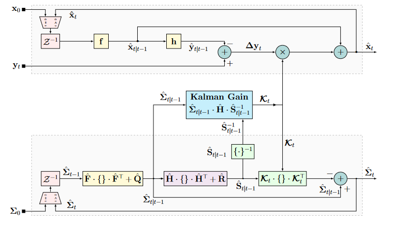

## KalmanNet

### Model-Based Kalman Filtering

KF可以被描述为两步的过程：**预测**和**更新**。

第一步从前一个后验的状态预测当前状态的先验：
$$
\begin{aligned}
\hat{x}_{t\mid t-1} &= F\cdot \hat{x}_{t-1\mid t-1}\\
\Sigma_{t\mid t-1} &= F\cdot \Sigma_{t-1\mid t-1}\cdot F^T+Q
\end{aligned}
$$
观测$y$：
$$
\begin{aligned}
\hat{y}_{t\mid t-1} &= H\cdot \hat{x}_{t\mid t-1}\\
S_{t\mid t-1} &= H\cdot \Sigma_{t\mid t-1}\cdot H^T+R
\end{aligned}
$$
在第二步预测步中：
$$
\begin{aligned}
\hat{x}_{t\mid t} &= \hat{x}_{t\mid t-1} + \mathcal{K}_t\cdot \Delta y_t\\
\Sigma_{t\mid t} &= \Sigma_{t\mid t-1} - \mathcal{K}_t\cdot S_{t\mid t-1}\cdot \mathcal{K}_t^T
\end{aligned}
$$
在这里，$\mathcal{K}_t$为KG(卡尔曼增益)，定义为：
$$
\mathcal{K}_t = \Sigma_{t\mid t-1}\cdot H^T\cdot S^{-1}_{t\mid t-1}
$$
其中
$$
\Delta y_t = y_t - \hat{y}_{t\mid t-1}
$$

> 卡尔曼滤波的框图，$\mathcal{Z}^{-1}$为单位延迟。

### KalmanNet

Kalman结合了卡尔曼滤波和RNN来处理非线性。

对于KalmanNet，我们假设函数$f(\cdot)$和$h(\cdot)$是已知的，但是协方差矩阵$Q,R$未知。这些未知的统计量只被用来计算KG。因此，我们设置KalmanNet来从数据中学习KG。

> KalmanNet

与之前类似，Kalman也分两步来估计$\hat{x}_t$：预测和更新，但是KG改用RNN去计算。

但是我们对RNN存在如下问题：

1. 输入特征是什么？
2. RNN内部的架构是什么？
3. 怎么从数据中进行训练？

#### Input Features

$\mathcal{K}_t$需要观测$y_t$和状态估计$\hat{x}_{t-1}$方面的信息，因此我们可以采用如下输入特征：

+ F1：观测差异：$\Delta \tilde{y}_t = y_t - y_{t-1}$
+ F2：innovation 差异：$\Delta y_t = y_t - \hat{y}_{t\mid t-1}$
+ F3：前向计算差异：$\Delta \tilde{x}_t = \hat{x}_{t\mid t} - \hat{x}_{t-1\mid t-1}$
+ F4：前向更新差异：$\Delta \hat{x}_t = \hat{x}_{t\mid t} - \hat{x}_{t\mid t-1}$

我们的经验观测发现{F1,F2,F4}和{F1,F3,F4}的组合比较好。

#### Neural Network Architecture

我们采用两种类型的架构。

---

第一种是采用门控结构单元(GRU)：

对于这种架构，我们使用GRU单元，其隐状态为$m^2+n^2$的整数倍，为$\hat{\Sigma}_{t\mid t-1}$和$\hat{S}_t$维度的联合维度。我们首先先通过一个全连接层，其输出为GRU的输入。GRU的隐状态$h_t$以全连接层(FC)输出的$mn$个神经元作为输入映射到估计KG：$\mathcal{K}_t \in \mathbb{R}^{m\times n}$。这种设计方法并没有直接将GRU的隐状态与KF的二阶统计量相对应。

---

第二种架构采用分离的GRU单元来追踪不同的二阶统计量。

#### Training Algorithm

> 该死，他是有监督算法。

我们使用平法误差损失：
$$
\mathcal{L} = \|x_t-\hat{x}_{t\mid t}\|^2
$$
那么我们就可以对$\mathcal{K}_t$求导：
$$
\begin{aligned}
\frac{\partial \mathcal{L}}{\partial\mathcal{K}_t}  &= \frac{\partial \|\mathcal{K}_t\Delta y_t - \Delta x_t\|^2}{\partial \mathcal{K}_t}\\
&= 2\cdot(\mathcal{K}_t\cdot \Delta y_t - \Delta x_t)\cdot \Delta y_t^T
\end{aligned}
$$
其中$\Delta x_t \triangleq x_t - \hat{x}_{t\mid t-1}$。

训练数据包含$N$条长度不一样的轨迹。令$T_i$表示第$i$条轨迹的长度，数据集为$\{(Y_i,X_i)\}_1^N$，其中：
$$
Y_i = [y_i^{(i)},\cdots,y_{T_i}^{(i)}]\quad X_i = [x_0^{(i)},x_1^{(i)},\dots,x_{T_i}^{(i)}]
$$
令$\Theta$表示RNN要训练的参数，$\gamma$表示正则化参数，则：
$$
\ell_i(\Theta) = \frac{1}{T_i}\sum_{t=1}^T\left\|\hat{x}_t\left(y_t^{(i)};\Theta\right)-x_t^{(i)}\right\|^2 + \gamma\|\Theta\|^2
$$
