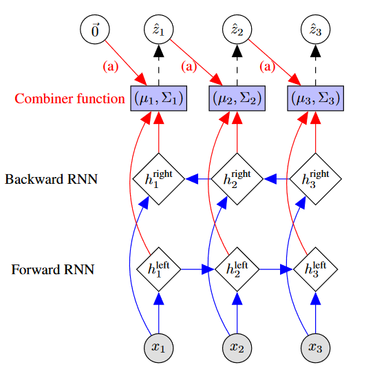

# Structured Inference Networks for Nonlinear State Space Models

## Introcution

一些序列数据的生成模型：

 >左上为HMM，右上为DMM(深度马尔可夫模型)，下面为RNN。

我们的算法为在似然的变分下界上应用随机梯度上升。

## Background

**高斯状态空间模型(Gaussian State Space Models)**:我们用$z_t$表示状态向量，$x_t$表示观测向量。上述隐变量和观测的序列表示为$\vec{z},\vec{x}$。我们的模型可以表示为：
$$
\begin{aligned}
    z_t&\sim \mathcal{N}(G_\alpha(z_{t-1},\Delta t), S_\beta(z_{t-1},\Delta t)) &\text{(Transition)}\\
    x_t &\sim \Pi(F_\kappa(z_t)) &\text{(Emission)}  
\end{aligned}
$$

我们假设隐状态的分布为多元高斯分布，其均值和方差为上一个状态和$\Delta t$的可微函数。多元观测$x_t$服从参数为相应的状态$z_t$的函数的分布$\Pi$。我们表示$\theta=\{\alpha,\beta,\kappa\}$为生成模型的参数。

**变分学习(Variational Learning)**:变分学习最大的创新是引入了*inference network*或者*recognition network(推理网络)*。我们用$\theta$表示生成模型的参数，$\phi$表示推理网络的参数。

我们在贝叶斯的框架下进行学习，其中$p(x,z) = p_\theta(z)p_\theta(x\mid z)$。后验分布$p_\theta(z\mid x)$一般不可追踪。使用变分原则，我们使用近似后验估计$q_\phi(z\mid x)$来得到下列的下界：
$$
\log p_\theta(x) \ge \underset{q_\phi(z\mid x)}{\mathbb{E}}[\log p_\theta(x\mid z)] - \mathbb{KL}(q_\phi(z\mid x)\| p_\theta(z))
$$
我们使用神经网络来参数化$q_\phi$。

## A Factorized Variational Lower Bound

我们的后验估计可以分解为：
$$
p(\vec{z}\mid \vec{x}) = p(z_1\mid \vec{x})\prod_{t=2}^Tp(z_t\mid z_{t-1},x_t,\cdots,x_T)
$$
如果我们假设$z_t\perp x_1,\cdots,x_{t-1}\mid z_{t-1}$，可以将其写为
$$
p(\vec{z}\mid \vec{x}) = p(z_1\mid \vec{x})\prod_{t=2}^Tp(z_t\mid z_{t-1},\vec{x})
$$
模仿上面可以将我们的变分近似分解为：
$$
q_\phi(\vec{z}\mid \vec{x}) = q_\phi(z_1\mid x_1,\cdots,x_T)\prod_{t=2}^Tq_\phi(z_t\mid z_{t-1},x_t,\cdots,x_T)
$$
其中
$$
q_\phi(z_t\mid z_{t-1},x_t,\cdots,x_T)\sim \mathcal{N}(\mu_\phi(z_{t-1},x_t,\cdots,x_T),\Sigma_\phi(z_{t-1},x_t,\cdots,x_T))
$$
**推断变分下界(Deriving a Variational Lower Bound)**:变分下界可以推断为：
$$
\begin{aligned}
& \mathcal{L}(\vec{x} ;(\theta, \phi))=\sum_{t=1}^I \underset{q_\phi\left(z_t \mid \vec{x}\right)}{\mathbb{E}}\left[\log p_\theta\left(x_t \mid z_t\right)\right] \\
& -\mathrm{KL}\left(q_\phi\left(z_1 \mid \vec{x}\right) \| p_\theta\left(z_1\right)\right) \\
& -\sum_{t=2}^T \underset{q_\phi\left(z_{t-1} \mid \vec{x}\right)}{\mathbb{E}}\left[\operatorname{KL}\left(q_\phi\left(z_t \mid z_{t-1}, \vec{x}\right) \| p_\theta\left(z_t \mid z_{t-1}\right)\right)\right] \\
\end{aligned}
$$
**使用梯度下降学习(Learning with Gradient Descent)**：

>使用随机梯度下降算法学习DMM

## Structured Inference Networks

我们采用不同的推理网络：
|Inference NetWork|Variational Approximation for $z_t$|Implement With|
|:----:|:----:|:---:|
|MF-LR|$q(z_t\mid x_1,\cdots,x_T)$|BRNN|
|MF-L|$q(z_t\mid x_1,\cdots,x_t)$|RNN|
|ST-L|$q(z_t\mid z_{t-1},x_1,\cdots,x_t)$|RNN&comb.fxn|
|DKS|$q(z_t\mid z_{t-1},x_t,\cdots,x_T)$|RNN&comb.fxn|
|ST-LR|$q(z_t\mid z_{t-1},x_1,\cdots,x_T)$|BRNN&comb.fxn|
>其中DKS表示Deep Kalman Smoother。还有两个中心场(mean-field)模型(表示为ML)，两个结构模型(structured models)(表示为ST)。它们的区别在于是否应用过去的信息(表示为L，意思是Left)或者未来的信息(表示为R，意思是Right)。

>Structured Inference Networks：MF-LR和ST-LR变分近似长度为$3$的序列，使用双向RNN(BRNN)。BRNN使用序列$(x_1,x_2,x_3)$作为输入，经过蓝色箭头表示的一系列非线性变换变为隐状态从左边和右边($h_t^{\text{left}}$和$h_t^{\text{right}}$)。之后通过我们称为"combine function"的非线性变换，表示为红色，输出两个向量$\mu,\Sigma$来参数化$q_\phi(z_t\mid z_{t-1},\vec{x})$。样本$\hat{z}_t$是从$q_\phi(z_t\mid z_{t-1},\vec{x})$中抽样得到的。对于结构变分模型ST-LR，样本$\hat{z}_t$被输入到$\mu_{t+1},\Sigma_{t+1}$的计算中去，用红色箭头表示并且标记label(a)。

**(中心场近似的组合函数)Combiner Function for Mean Field Approximations**:在MF-LR推理网络中，变分分布$q_\phi(z_t\mid \vec{x})$均值$\mu_t$和对角方差$\sigma_t^2$使用RNN的输出预测，其中$\text{softplus}(x) = \log(1+\exp(x))$。
$$
\begin{aligned}
    & \mu_{\mathrm{r}}=W_{\mu_{\mathrm{r}}}^{\text {right }} h_t^{\text {right }}+b_{\mu_{\mathrm{r}}}^{\text {right }} \\
    & \sigma_{\mathrm{r}}^2=\operatorname{softplus}\left(W_{\sigma_{\mathrm{r}}^2}^{\text {right }} h_t^{\text {right }}+b_{\sigma_{\mathrm{r}}^2}^{\text {right }}\right) \\
    & \mu_{\mathrm{l}}=W_{\mu_{\mathrm{l}}}^{\text {left }} h_t^{\text {left }}+b_{\mu_{\mathrm{l}}}^{\text {left }} ; \\
    & \sigma_1^2=\operatorname{softplus}\left(W_{\sigma_1^2}^{\text {left }} h_t^{\text {left }}+b_{\sigma_1^2}^{\text {left }}\right) \\
    & \mu_t=\frac{\mu_{\mathrm{r}} \sigma_1^2+\mu_{\mathrm{l}} \sigma_{\mathrm{r}}^2}{\sigma_{\mathrm{r}}^2+\sigma_1^2} ; \sigma_t^2=\frac{\sigma_{\mathrm{r}}^2 \sigma_1^2}{\sigma_{\mathrm{r}}^2+\sigma_1^2}
\end{aligned}
$$
**(结构近似的组合函数)Combiner Function for Structured Approximations**:对于ST-LR，为：
$$
h_{\text{combined}} = \frac{1}{3}(\text{tanh}(Wz_{t-1}+b)+h_t^{\text{left}} + h_t^{\text{right}})
$$
对于DKS:
$$
h_\text{combined} = \frac{1}{2}(\text{tanh}(Wz_{t-1}+b)+h_t^{\text{right}})
$$
后验均值和方差：
$$
\begin{aligned}
\mu_t &= W_\mu h_\text{combined} + b_\mu\\
\sigma_t^2 &= \text{softplus}(W_{\sigma^2}h_{\text{combined}}+ b_{\sigma^2})
\end{aligned}
$$

## Deep Markov Models

**Emission Function**:我们将发射函数$F_\kappa$参数化为一个两层的多层感知机：$\text{MLP}(x,\text{NL}_1,\text{NL}_2) = \text{NL}_2(W_2\text{NL}_1(W_1x+b_1)+b_2)$，其中$\text{NL}$表示非线性函数。
**Gated Transition Function**:我们将从$z_t$到$z_{t+1}$的转移函数参数化为门控单元。
$$
\begin{aligned}
& g_t=\operatorname{MLP}\left(z_{t-1}, \operatorname{ReLU},\right. \text { sigmoid) (Gating Unit) } \\
& h_t=\operatorname{MLP}\left(z_{t-1}, \operatorname{ReLU}, \mathbb{I}\right) \text { (Proposed mean) } \\
& \left(\text { Transition Mean } G_\alpha \text { and } S_\beta\right) \\
& \mu_t\left(z_{t-1}\right)=\left(1-g_t\right) \odot\left(W_{\mu_p} z_{t-1}+b_{\mu_p}\right)+g_t \odot h_t \\
& \sigma_t^2\left(z_{t-1}\right)=\operatorname{softplus}\left(W_{\sigma_p^2} \operatorname{ReLU}\left(h_t\right)+b_{\sigma_p^2}\right)
\end{aligned}
$$

## Appendix

### KL divergence between Prior and Posterior

最大似然估计需要我们计算：
$$
\begin{aligned}
& \mathbb{KL}\left(q\left(z_1, \ldots, z_T\right) \| p\left(z_1, \ldots, z_T\right)\right) \\
& =\mathbb{KL}\left(q\left(z_1\right) \| p\left(z_1\right)\right) \\
& +\sum_{t=2}^{T-1} \underset{q\left(z_{t-1}\right)}{\mathbb{E}}\left[\mathbb{KL}\left(q\left(z_t \mid q_{t-1}\right) \| p\left(z_t \mid z_{t-1}\right)\right)\right]
\end{aligned}
$$
两个高斯分布$q,p$的KL散度可以写作：
$$
\begin{aligned}
& \mathbb{KL}(q \| p)=\frac{1}{2}(\underbrace{\log \frac{\left|\Sigma_p\right|}{\left|\Sigma_q\right|}-D+}_{(a)} \\
& \underbrace{\operatorname{Tr}\left(\Sigma_p^{-1} \Sigma_q\right)}_{(b)}+\underbrace{\left(\mu_p-\mu_q\right)^T \Sigma_p^{-1}\left(\mu_p-\mu_q\right)}_{(c)})
\end{aligned}
$$
我们可以推导出$q(z_1,\cdots,z_T)$和$p(z_1,\cdots,z_T)$KL散度的解析解。$\mu_q,\Sigma_q$是变分模型的输出。$\mu_p,\Sigma_p$的函数形式基于我们的生成模型，可以被总结为：
$$
\mu_{p1} = 0\quad \Sigma_{p1} = \mathbb{1}
$$
$$
\mu_{pt} = G(z_{t-1},\mu_{t-1}) = G_{t-1}\quad \Sigma_{pt} = \Delta \vec{\sigma}
$$
其中$\Delta$为常数参数。
对于项(a)对$t=1$我们有：
$$
\log\frac{|\Sigma_{p1}|}{|\Sigma_{q1}|} = -\log|\Sigma_{q1}|
$$
对于$t>1$，我们有：
$$
\log\frac{|\Sigma_{pt}|}{|\Sigma_{qt}|} = D\log(\Delta) + \log|\vec{\sigma}| - \log|\Sigma_{qt}|
$$
对于项(b)，对$t=1$，我们有：
$$
\text{Tr}(\Sigma_{p1}^{-1}\Sigma_{q1}) = \text{Tr}(\Sigma_{q1})
$$
对于$t>1$，我们有：
$$
\operatorname{Tr}\left(\Sigma_{p t}^{-1} \Sigma_{q t}\right)=\frac{1}{\Delta} \operatorname{Tr}\left(\operatorname{diag}(\vec{\sigma})^{-1} \Sigma_{q t}\right)
$$
项(c)，对于$t=1$，我们有：
$$
\left(\mu_{p 1}-\mu_{q 1}\right)^T \Sigma_{p 1}^{-1}\left(\mu_{p 1}-\mu_{q 1}\right)=\left\|\mu_{q 1}\right\|^2
$$
对于$t>1$，有
$$
\left(\mu_{p t}-\mu_{q t}\right)^T \Sigma_{p t}^{-1}\left(\mu_{p t}-\mu_{q t}\right)= 
\Delta\left(G_{t-1}-\mu_{q t}\right)^T \operatorname{diag}(\vec{\sigma})^{-1}\left(G_{t-1}-\mu_{q t}\right)
$$
重写公式，我们可以得到：
$$
\begin{aligned}
& \operatorname{KL}\left(q\left(z_1, \ldots, z_T\right) \| p\left(z_1, \ldots, z_T\right)\right) \\
& =\frac{1}{2}\left((T-1) D \log (\Delta) \log |\vec{\sigma}|-\sum_{t=1}^T \log \left|\Sigma_{q t}\right|\right. \\
& +\operatorname{Tr}\left(\Sigma_{q 1}\right)+\frac{1}{\Delta} \sum_{t=2}^T \operatorname{Tr}\left(\operatorname{diag}(\vec{\sigma})^{-1} \Sigma_{q t}\right)+\left\|\mu_{q 1}\right\|^2 \\
& \left.+\Delta \sum_{t=2}^T \underset{z_{t-1}}{\mathbb{E}}\left[\left(G_{t-1}-\mu_{q t}\right)^T \operatorname{diag}(\vec{\sigma})^{-1}\left(G_{t-1}-\mu_{q t}\right)\right]\right)
\end{aligned}
$$
