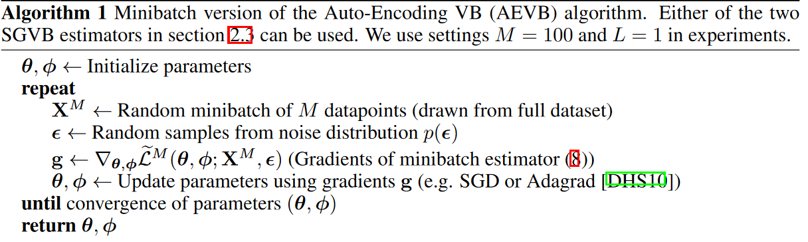

## Auto-Encoding Variational Bayes

> 术语：
>
> + Variational Bayesian(VB)：变分贝叶斯
> + Stochastic Gradient Variational Bayes(SGVB)：随机梯度变分贝叶斯
> + Auto-Encoding Variational Bayes(AEVB)：自编码变分贝叶斯

### Method

#### Problem scenario

我们的数据集$\mathrm{X} = \{\mathrm{x}\}_{i=1}^N$独立同分布。假设我们的数据是从一些随机过程中产生的，这个过程包含两个步骤：

+ $\mathrm{z}^{(i)}$是从先验分布$p_{\theta^\star}(\mathrm{z})$中产生的。
+ $\mathrm{x}^{(i)}$是从条件分布$p_{\theta^\star}(\mathrm{x\mid z})$中产生的。

我们着重解决下列情况：

+ 不可追踪：在边缘似然$p_\theta(x) = \int p_\theta(x)p_\theta(x\mid z)dz$是不可追踪的，比如我们的$p_\theta(x\mid z)$是一个神经网络。
+ 大数据：我们有很多的数据以至于批量优化很费力，我们将会用小批量甚至单个数据点来更新参数。

我们将要解决下面三个问题：

+ 对于参数$\theta$的ML或者MAP的高效近似。
+ 选定$\theta$和给定观测变量$x$后隐变量$z$后验推断的高效近似。
+ 变量$x$边缘推断的高效近似。

为了解决上述问题，我们引入了recognition模型$q_\phi(z\mid x)$：对不可追踪的真正后验$p_\theta(z\mid x)$的近似。我们认为$q_\phi(z\mid x)$是编码器，而$p_\theta(x\mid z)$是解码器。

#### The variational bound

因为数据是独立同分布的：
$$
\log p_\theta(x^{(1)},\cdots,x^{(N)}) = \sum_{i=1}^N\log p_\theta(x^{(i)})
$$
可以被写为：
$$
\log p_\theta(x^{(i)}) \ge \mathcal{L}(\theta,\phi;x^{(i)}) = -\mathbb{KL}(q_\phi(z\mid x^{(i)})\| p_\theta(z)) + \underset{q_\phi(z\mid x^{(i)})}{\mathbb{E}}\left[\log p_\theta(x^{(i)}\mid z)\right]
$$
我们想要优化$\mathcal{L}(\theta,\phi;x^{(i)})$，需要对其求导，但是$\phi$的梯度有一些病态。一般的蒙特卡洛方法来估计其梯度是：
$$
\nabla_\phi\mathbb{E}_{q_\phi(z)}\left[f(z)\right] = \mathbb{E}_{q_\phi(z)}\left[f(z)\nabla_{q_\phi(z)}\log q_\phi(z)\right] \simeq \frac{1}{L}\sum_{l=1}^Lf(z)\nabla_{q_\phi(z^{(l)})}\log q_{\phi}(z^{(l)})
$$
这是怎么来的呢？我们推理一下：
$$
\begin{aligned}
\nabla_\phi\mathbb{E}_{q_\phi(z)}[f(z)] &= \nabla_\phi \int f(z)q_\phi(z)dz\\
&= \int f(z)\nabla q_\phi(z)dz\\
&= \int f(z)q_\phi(z)[\nabla_{q_\phi(z)}\log q_{\phi}(z)]dz
\end{aligned}
$$
但是这种方式存在问题，因为$q_\phi(z)\in (0,1)$，而$\log$函数在$(0,1)$之间的梯度变换很大，这就导致结果有很大的变异性。

#### The SGVB estimator and AEVB algorithm
对于选择的后验$q_\phi(z\mid x)$我们可以使用一个可微分的变换$g_\phi(\epsilon,x)$来重参数化随机变量$\tilde{z}\sim q_{\phi}(z\mid x)$，通过辅助噪声变量$\epsilon$：
$$
\tilde{z} = g_\phi(\epsilon, x), \text{with } \epsilon \sim p(\epsilon)
$$
> 后面会讲如何选择合适的分布$p(\epsilon)$和函数$g_\phi(\epsilon,x)$。

我们现在可以通过使用蒙特卡洛方法来估计函数$f(z)$的期望：
$$
\mathbb{E}_{q_\phi(z\mid x^{(i)})}[f(z)] = \mathbb{E}_{p(\epsilon)}\left[f(g_\phi(\epsilon, x^{(i)}))\right] \simeq \frac{1}{L}\sum_{l=1}^L f(g_\phi(\epsilon^{(l)},x^{(i)})), \text{where }\epsilon^{(l)} \sim p(\epsilon)
$$
我们将这个技术应用到变分下界，就形成了随机梯度变分贝叶斯(SGVB)估计$\tilde{\mathcal{L}}^A(\theta,\phi;x^{(i)})\simeq \mathcal{L}(\theta,\phi;x^{(i)})$：
$$
\begin{aligned}
&\tilde{\mathcal{L}}^A(\theta,\phi;x^{(i)}) = \frac{1}{L}\sum_{l=1}^L\log p_\theta(x^{(i)},z^{(i,l)}) - \log q_\phi(z^{(i,l)}\mid x^{(i)})\\
&\text{where }z^{(i,l)} = g_\phi(\epsilon^{(i,l)},x^{(i)})\text{ and }\epsilon^{(l)}\sim p(\epsilon)
\end{aligned}
$$
一般，KL散度$\mathbb{KL}(q_\phi(z\mid x^{(i)})\| p_\theta(z))$的积分是有解析解的，因此只有$\mathbb{E}_{q_\phi(z\mid x^{(i)})}[\log p_\theta(x^{(i)}\mid z)]$需要通过采样来估计。我们可以把$\mathbb{KL}$项看作是对$\phi$的正则化。这就形成了SGVB的另一个版本：
$$
\begin{aligned}
\tilde{\mathcal{L}}^B(\theta,\phi;x^{(i)}) &= -\mathbb{KL}(q_\phi(z\mid x^{(i)})\| p_\theta(z)) + \frac{1}{L}\sum_{l=1}^L(\log p_\theta(x^{(i)}\mid z^{(i,l)}))\\
\text{where }z^{(i,l)} &= g_\phi(\epsilon^{(i,l)},x^{(i)})\text{ and }\epsilon^{(l)}\sim p(\epsilon)
\end{aligned}
$$
假设我们的所有数据为有$N$个点的数据集$X$，我们可以从小批量的下界来得到整个数据集的下界：
$$
\mathcal{L}(\theta,\phi;X)\simeq \tilde{\mathcal{L}}^M(\theta,\phi;X^M) = \frac{N}{M}\sum_{i=1}^M\tilde{\mathcal{L}}(\theta,\phi;x^{(i)})
$$
其中小批量$X^M = \{x^{(i)}\}_{i=1}^M$为随机从具有$N$个数据的数据集$X$中随机抽样得到的。我们发现当$M$足够大的时候可以将$L$设置为$1$。计算随机梯度的算法如下图所示：

#### The reparameterization trick

重参数化的技巧很简单。令$z$为连续随机变量，$z\sim q_\phi(z\mid x)$。我们可以将随机变量$z$表述为确定变量$z = g_\phi(\epsilon,x)$，其中$\epsilon$是具有独立的边缘分布$p(\epsilon)$的辅助变量，$g_\phi(\cdot)$是以$\phi$为参数的向量值函数。

> 这样做的目的是将以$q_\phi(z\mid x)$为概率密度函数的期望重写使得对期望的蒙特卡洛估计对$\phi$是可导的。

---

证明如下：

给定确定的映射$z = g_\phi(\epsilon,x)$，我们知道：
$$
q_\phi(z\mid x)\prod_idz_i = p(\epsilon)\prod_id\epsilon_i
$$
因此：
$$
\int q_\phi(z\mid x)f(z)dz = \int p(\epsilon)f(z)d\epsilon = \int p(\epsilon)f(g_\phi(\epsilon,x))d\epsilon
$$
一个可微分的估计可以写作：
$$
\int q_\phi(z\mid x)f(z)dz\simeq \frac{1}{L}\sum_{l=1}^L f(g_\phi(x,\epsilon^{(l)})),\quad \epsilon^{(l)}\sim p(\epsilon)
$$

---

例如，单变量高斯例子：令$z \sim p(z\mid x) = \mathcal{N}(\mu,\sigma^2)$。在此情况下，一个重参数化是$z = \mu + \sigma\epsilon$，其中$\sigma$为辅助噪声变量$\epsilon \sim \mathcal{N}(0,1)$。因此，
$$
\mathbb{E}_{\mathcal{N}(z;\mu,\sigma^2)}[f(z)] = \mathbb{E}_{\mathcal{N}(\epsilon;0,1)}[f(\mu+\sigma\epsilon)]\simeq \frac{1}{L}\sum_{l=1}^Lf(\mu + \sigma\epsilon^{(l)})\quad \epsilon^{(l)}\sim \mathcal{N}(0,1)
$$

---

那么我们应该如何选择可微分的变换$g_\phi(\cdot)$和辅助变量$\epsilon\sim p(\epsilon)$呢？三种基本方法为：

1. 可追踪的逆CDF。在这种情况下，令$\epsilon \sim \mathcal{U}(0,I)$，令$g_\phi(\epsilon, x)$为$q_\phi(z\mid x)$的逆CDF。
2. 与高斯分布的例子类似，对于任何"location-scale"族分布我们可以选择标准分布(location$=0$，scale$=1$)作为辅助分布$\epsilon$，并且令$g(\cdot) = $location + scale $\cdot \epsilon$。
3. Composition：可以把随机变量表达成辅助变量的不同变换，利用对数正态。

### Example: Variational Auto-Encoder

我们将给出我们使用神经网络来作为概率编码器$q_\phi(z\mid x)$。我们假设隐变量的先验为中心各向同性的多元高斯分布$p_\theta(z) = \mathcal{N}(z;0,I)$。注意在此情况下真正的后验分布$p_\theta(z\mid x)$是不可追踪的。但是在$q_\phi(z\mid x)$的形式下我们有更多自由度，我们假设真正的后验分布取协方差矩阵近似对角矩阵的高斯分布。在这种情况下，我们可以让变分近似后验为协方差矩阵为对角矩阵的多元高斯分布：
$$
\log q_\phi(z\mid x^{(i)}) = \log \mathcal{N}(z;\mu^{(i)},\sigma^{2(i)}I)
$$
其中$\mu^{(i)},\sigma^{(i)}$都是编码器的输出结果。

之前提到过，我们从后验$z^{(i,l)}\sim q_\phi(z\mid x^{(i)})$使用$z^{(i,l)} = g_\phi(x^{(i)},\epsilon^{(l)}) = \mu^{(i)} + \sigma^{(i)}\odot \epsilon^{(l)}$，其中$\epsilon^{(l)}\sim \mathcal{N}(0,I)$。在$p_\theta(z)$和$q_\phi(z\mid x)$都为高斯分布的情况下，KL散度的计算和梯度有解析解，并且我们的变分下限为：
$$
\begin{aligned}
\mathcal{L}(\theta,\phi;x^{(i)}) &\simeq \frac{1}{2}\sum_{j=1}^J\left(1 + \log((\sigma_j^{(i)})^2) - (\mu_j^{(i)})^2 - (\sigma_j^{(i)})^2\right) + \frac{1}{L}\sum_{l=1}^L\log p_\theta(x^{(i)}\mid z^{(i,l)})\\
\text{where }z^{(i,l)} &= \mu^{(i)} + \sigma^{(i)}\odot \epsilon^{(l)} \text{ and }\epsilon^{(l)}\sim \mathcal{N}(0,I)
\end{aligned}
$$

## Appendix

下面我们看一下在高斯的情况下，$\mathbb{KL}(q_\phi(z)\|p_{\theta}(z))$的解：

我们假设$p_\theta(z)=\mathcal{N}(0,I)$并且后验近似$q_\phi(z\mid x^{(i)})$为高斯分布。令$J$为$z$的维数，$\mu,\sigma$为在数据点$i$处的变分均值和标准差，$\mu_j,\sigma_j$表示这些向量的第$j$个元素。则：
$$
\begin{aligned}
\int q_\theta(z)\log p(z)dz &= \int\mathcal{N}(z;\mu,\sigma^2)\log \mathcal{N}(z;0,I)dz\\
&= -\frac{J}{2}\log(2\pi) - \frac{1}{2}\sum_{j=1}^J(\mu_j^2 + \sigma_j^2)
\end{aligned}
$$
并且：
$$
\begin{aligned}
\int q_\theta(z)\log q_\theta(z)dz &= \int\mathcal{N}(z;\mu,\sigma^2)\log\mathcal{N}(z;\mu,\sigma^2)dz\\
&= -\frac{J}{2}\log(2\pi)-\frac{1}{2}\sum_{j=1}^J(1+\log\sigma_j^2)
\end{aligned}
$$
因此
$$
\begin{aligned}
-\mathbb{KL}(q_\phi(z)\| p_\theta(z)) &= \int q_\theta(z)(\log p_\theta(z) - \log q_{\theta}(z))dz\\
&= \frac{1}{2}\sum_{j=1}^J(1+\log((\sigma_j)^2) - (\mu_j)^2 - (\sigma_j)^2)
\end{aligned}
$$

---

我们下面看多层感知机(MLP)作为编码器和解码器：

首先是伯努利MLP作为解码器：
$$
\begin{aligned}
\log p(x\mid z) &= \sum_{i=1}^D x_i\log y_i + (1-x_i)\cdot \log(1-y_i)\\
\text{where }y&= f_\sigma(W_2\text{tanh}(W_1z+b_1)+b_2)
\end{aligned}
$$
高斯MLP作为编码器或者解码器：
$$
\begin{aligned}
\log p(x\mid z) &= \log\mathcal{N}(x;\mu,\sigma^2I)\\
\text{where }\mu &= W_4h + b_4\\
\log\sigma^2 &= W_5h + b_5\\
h&=\text{tanh}(W_3z + b_3)
\end{aligned}
$$

---

边缘似然估计：令$p_\theta(x,z)=p_\theta(z)p_\theta(x\mid z)$为我们要从中采样的生成模型，对于给定数据点$x^{(i)}$，我们想要估计边缘似然$p_\theta(x^{(i)})$。

估计步骤包含三步：

第一步，使用基于梯度的MCMC从后验中采样$L$个数值$\{z^{(l)}\}$，使用$\nabla_z\log p_\theta(z\mid x) = \nabla_z\log p_\theta(z) + \nabla_z\log p_\theta(x\mid z)$。

第二步，对于这些样本$\{z^{(l)}\}$拟合一个密度估计$q(z)$

第三步，从后验中采样$L$个新的样本。加上这些样本，以及拟合的$q(z)$，插入下列估计：
$$
p_\theta(x^{(i)})\simeq \left(\frac{1}{L}\sum_{l=1}^L\frac{q(z^{(l)})}{p_\theta(z)p_\theta(x^{(i)}\mid z^{(l)})}\right)^{-1}\text{ where }z^{(l)}\sim p_\theta(z\mid x^{(i)})
$$
第三步的估计推导：
$$
\begin{aligned}
\frac{1}{p_{\boldsymbol{\theta}}\left(\mathbf{x}^{(i)}\right)} & =\frac{\int q(\mathbf{z}) d \mathbf{z}}{p_{\boldsymbol{\theta}}\left(\mathbf{x}^{(i)}\right)}=\frac{\int q(\mathbf{z}) \frac{p_{\boldsymbol{\theta}}\left(\mathbf{x}^{(i)}, \mathbf{z}\right)}{p_{\boldsymbol{\theta}}\left(\mathbf{x}^{(i)}, \mathbf{z}\right)} d \mathbf{z}}{p_{\boldsymbol{\theta}}\left(\mathbf{x}^{(i)}\right)} \\
& =\int \frac{p_{\boldsymbol{\theta}}\left(\mathbf{x}^{(i)}, \mathbf{z}\right)}{p_{\boldsymbol{\theta}}\left(\mathbf{x}^{(i)}\right)} \frac{q(\mathbf{z})}{p_{\boldsymbol{\theta}}\left(\mathbf{x}^{(i)}, \mathbf{z}\right)} d \mathbf{z} \\
& =\int p_{\boldsymbol{\theta}}\left(\mathbf{z} \mid \mathbf{x}^{(i)}\right) \frac{q(\mathbf{z})}{p_{\boldsymbol{\theta}}\left(\mathbf{x}^{(i)}, \mathbf{z}\right)} d \mathbf{z} \\
& \simeq \frac{1}{L} \sum_{l=1}^L \frac{q\left(\mathbf{z}^{(l)}\right)}{p_{\boldsymbol{\theta}}(\mathbf{z}) p_{\boldsymbol{\theta}}\left(\mathbf{x}^{(i)} \mid \mathbf{z}^{(l)}\right)} \quad \text { where } \quad \mathbf{z}^{(l)} \sim p_{\boldsymbol{\theta}}\left(\mathbf{z} \mid \mathbf{x}^{(i)}\right)
\end{aligned}
$$

---

