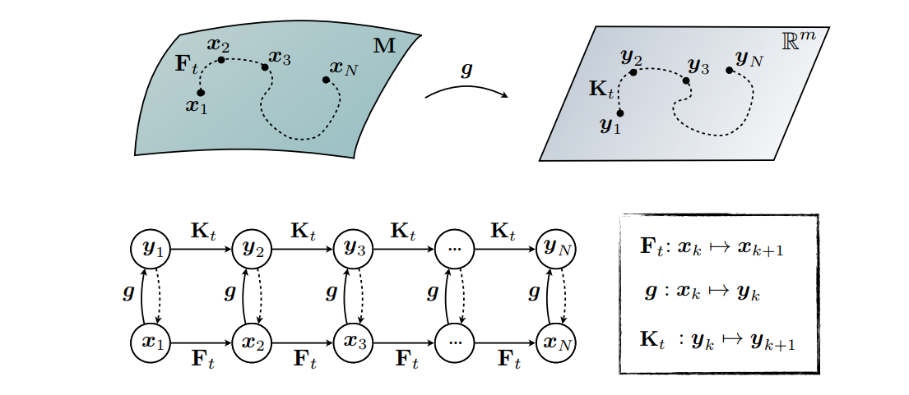

# Koopman Operator Theory for Nonlinear Dynamic Modeling using Dynamic Mode Decomposition

Koopman算子为无穷维希尔伯特空间上的线性算子。可以将有穷维空间上的非线性系统转换为无穷维希尔伯特空间上的线性系统。

> 希尔伯特空间是对欧式空间的拓展，其也是完备的内积空间，可以拓展到无穷维。

## Introduction

在本文中，我们使用数据驱动的方法例如动态模式分解(dynamic mode decomposition)(DMD)算法来求解Koopman算子。

## Preliminaries

对于一般连续系统：

$$
\frac{d}{dt}x(t) = F(x(t), t;\mu)
$$

离散系统可以描述为：

$$
x_{k+1} = f(x_k)
$$

### Koopman Operator

Koopman算法是线性但是无限维算子，可以在自主的、离散的、动态的系统上定义。考虑动态系统$x_{k+1} = f(x_k)$系统的变化，$f$只是在状态空间本身上的映射$f:\mathbb{R}^n \rightarrow \mathbb{R}^n$，使用Koopman算子我们可以定义一个不同的规则：$g:\mathbb{R}^n \rightarrow\mathbb{M}^{n_y}$，其中$n_y$为接近无穷的列向量的维度，它定义了给定时间步长$x$的可观察量(observable)的维数。

Koopman算子对所有observables定义，因此Koopman算子$\mathcal{K}$也是无限维的。这里$g$是一个实值、标量、测度函数，其为无限维希尔伯特空间的一个元素，被称为一个observable。Koopman算子在这个observable上运算使得：

$$
\begin{aligned}
    \mathcal{K}_tg &= g\circ F(x(t))\\
    \mathcal{K}_{\Delta t}g(x_k) &= g(f(x_k))
\end{aligned}
$$

上面两个式子允许我们定义类似的连续和离散动态系统：

$$
\begin{aligned}
    \frac{d}{dt}g &= \mathcal{K}g\\
    g(x_{k+1}) &= \mathcal{K}_{\Delta t}g(x_k)
\end{aligned}
$$

我们可以对$\mathcal{K}$进行特征值分解，使得：

$$
\mathcal{K}\psi_j(x_k) = \lambda_j \psi_j(x_k)
$$

其中$\lambda,\psi$为Koopman特征值和特征向量，用来描述Koopman算子的变化。而observable, $g(x)$，可以被展开为：

$$
g(x) = \begin{bmatrix}
    g_1(x)\\g_2(x)\\\vdots\\g_i(x)
\end{bmatrix} = \sum_{j=1}^\infty \psi_j(x)v_j
$$

对于保守的动态系统(conservative dynamical systems)，如Hamiltonian dynamics，Koopman算子是正交的，所以我们可以通过下面的式子得到Koopman modes $v_j$：

$$
v_j = \begin{bmatrix}
\langle \psi_j, g_1\rangle\\
\langle \psi_j, g_2 \rangle\\
\vdots\\
\langle \psi_j, g_i\rangle
\end{bmatrix}
$$

> 描述Koopman算子的比较好的一个图。

$$
\mathcal{K}g(x_k) = g(f(x_k)) = \sum_{j=1}^\infty \lambda_j \psi_j v_j
$$

上面应该是根据公式：

$$
\psi(x_{k+1}) = \mathcal{K}_{\Delta t}\psi(x_k) = \lambda \psi(x_k)
$$

### Dynamic Mode Decomposition(DMD)

DMD假设我们的系统为：

$$
x_{k+1} = Ax_{k}
$$

其中$x(t)\in \mathbb{R}^n, A\in \mathbb{R}^{n\times n}$。

假设我们的离散系统是等时间间隔的，对于：

$$
\begin{aligned}
\mathbf{X} & =\left[\begin{array}{cccc}
\mid & \mid & & \mid \\
\mathbf{x}_1 & \mathbf{x}_2 & \ldots & \mathbf{x}_{m-1} \\
\mid & \mid & & \mid
\end{array}\right], \\
\mathbf{X}^{\prime} & =\left[\begin{array}{cccc}
\mid & \mid & & \mid \\
\mathbf{x}_2 & \mathbf{x}_3 & \ldots & \mathbf{x}_m \\
\mid & \mid & & \mid
\end{array}\right],
\end{aligned}
$$

那么我们有：

$$
\mathrm{X}^\prime \approx \mathrm{AX}
$$

我们的$\mathrm{A}$可以通过下式近似：

$$
\mathrm{A = X^\prime X^{+}}
$$

其中+表示伪逆。考虑$n$比较大计算可能比较耗时，我们可以应用SVD分解来找到$\mathrm{X}$的伪逆：

$$
\mathrm{X} \approx \mathrm{U\Sigma V^\star}
$$

其中$\mathrm{U}\in \mathbb{R}^{n\times r}, \mathrm{\Sigma}\in \mathbb{R}^{r\times r},\mathrm{V}\in \mathbb{R}^{n\times r}$。那么我们有：

$$
\mathrm{A} \approx \bar{\mathrm{A}} = \mathrm{X^\prime \tilde{V}\tilde{\Sigma}^{-1}\tilde{U}^\star}
$$

但是实际上因为$A$的维度太大我们不得不将其近似为：

$$
\tilde{\mathrm{A}} = \mathrm{U^\star X^\prime V\Sigma^{-1}} \in \mathbb{R}^{r\times r}
$$

其中$\mathrm{\tilde{A}}$为一个秩为$r$的线性模型，使得：

$$
\tilde{\mathrm{x}}_{k+1} = \mathrm{\tilde{A}\tilde{x}_k}
$$

这里$\tilde{x}\in \mathbb{R}^{r\times 1}$：

$$
\mathrm{\tilde{x}}:\mathrm{x} = \tilde{\mathrm{U}}\tilde{\mathrm{x}}
$$

下一步是找到$\tilde{\mathrm{A}}$的谱分解：

$$
\mathrm{\tilde{A}W = W\Lambda}
$$

其中$\mathrm{\Lambda, W}$分别为对应的特征值和特征矩阵。(下面的看不懂了)我们现在可以重建$\mathrm{A}$的特征值分解，通过$\mathrm{W,\Lambda}$以及$\mathrm{\Phi}$的列对应的特征向量：

$$
\mathrm{\Phi = X^\prime V\Sigma^{-1}W}
$$

现在我们可以重建$x(t)$的动态：

$$
x(t) \approx \sum_{k=1}^r \phi_k \exp(w_k t)b_k = \Phi \exp(\Omega t)b
$$

其中$b_k$为每一个DMD mode的初始振幅(amplitude)，$\phi$为列组成$\Phi$，而$\Omega$为对角矩阵，元素为$w_k = \ln(\lambda_k)/\Delta t$。

### Extended Dynamic Mode Decomposition

我们的增广向量(augmented vector)通过下面的公式创建：

$$
\mathrm{y = \Theta^T(x)} = \begin{bmatrix}
    \theta_1(x)\\\theta_2(x)\\\vdots \\\theta_p(x)
\end{bmatrix}
$$

其中$p$为增广向量的秩使得$p \gg n$。这里$\Theta$为系统测度的集合，可以包含原来的系统状态$\mathrm{x}$以及其他的非线性测度。一旦$\mathrm{y}$得到，我们利用在DMD中相同的方式创建两个矩阵。在这里最好的线性算子$\mathrm{A_Y}$为：

$$
\mathrm{A_Y} = \argmin_{\mathrm{A_Y}} \|\mathrm{Y^\prime -A_YY}\| = \mathrm{Y^\prime Y^+}
$$

$\mathrm{A}_Y$是我们推理得到Koopman算子的基础。

### Approximating Koopman Eigenfunctions from Data

我们的koopman 特征函数可以近似为：

$$
\psi(x) \approx \sum_{k=1}^p\theta_k(x)\xi_k = \Theta(x)\xi
$$

我们同时可以得到：

$$
\left[\begin{array}{c}
\lambda \varphi\left(\mathbf{x}_1\right) \\
\lambda \varphi\left(\mathbf{x}_2\right) \\
\vdots \\
\lambda \varphi\left(\mathbf{x}_m\right)
\end{array}\right]=\left[\begin{array}{c}
\varphi\left(\mathbf{x}_2\right) \\
\varphi\left(\mathbf{x}_3\right) \\
\vdots \\
\varphi\left(\mathbf{x}_{m+1}\right)
\end{array}\right]
$$

那么我们有：

$$
[\lambda \Theta(\mathrm{X}) - \Theta(\mathrm{X}^\prime)]\xi = 0
$$

应用最小二乘法求解得：

$$
\lambda \xi  = \Theta(\mathrm{X})^+\Theta(X^\prime) \xi
$$

