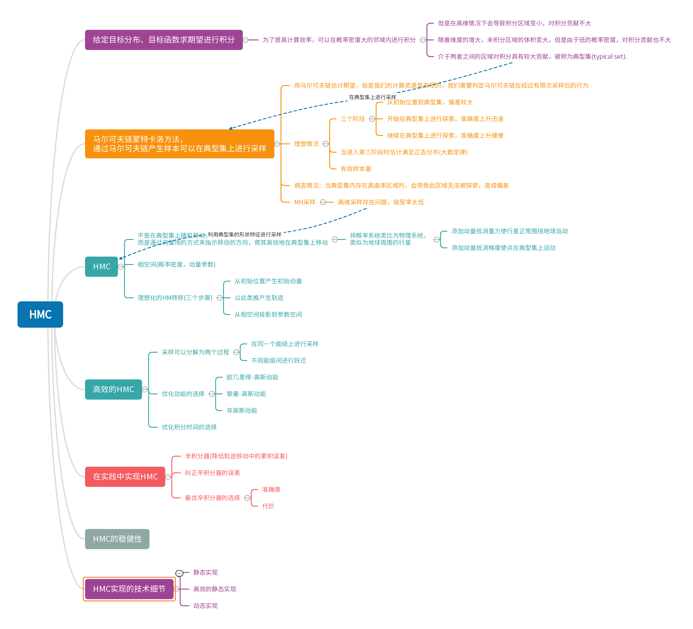
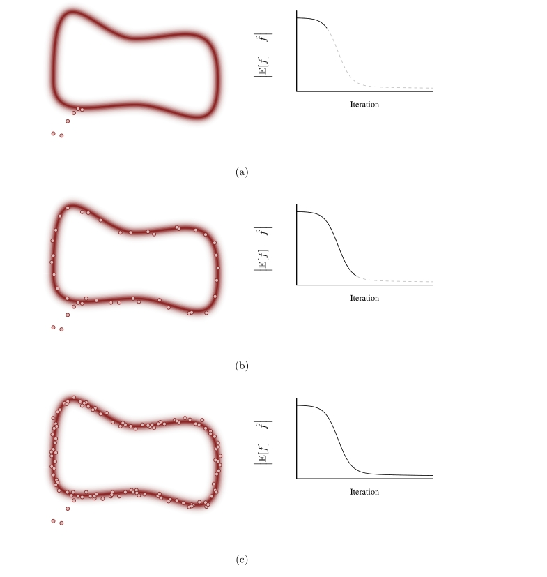
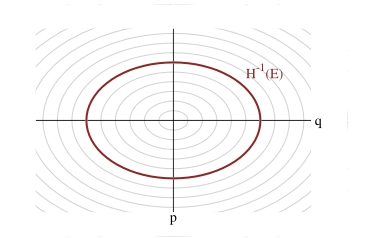
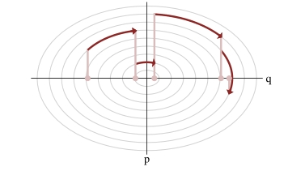
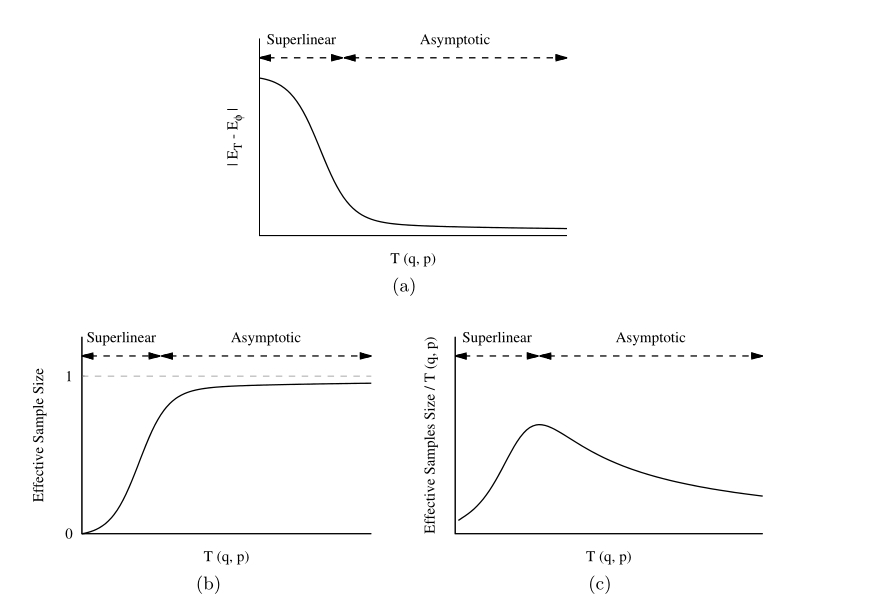

## A Conceptual Introduction to Hamiltonian Monte Carlo

> 文章链接：https://arxiv.org/abs/1701.02434

### 期望的计算

对于给定函数$f(q)$，我们在给定的$q$的分布$\pi (q)$上计算其期望：
$$
\mathbb{E}_{\pi}[f] = \int_{\mathcal{Q}}\pi(q)f(q)dq
$$
一般情况下此积分的原函数得不到，因此我们采用蒙特卡洛的方法，在$\pi(q)$上对$q$进行采样，用下式计算期望：
$$
\mathbb{E}_{\pi}[f]\approx \frac{1}{n}\sum_{i=1}^n f(q_i)\quad q_i\sim \pi(q)
$$
但是我们如何在$\pi(q)$上进行采样呢？为了节省时间，我们一般选择在概率密度较高的位置进行采样，即在概率密度最高的邻域内进行采样。但是在高维情况下存在问题，假设我们在概率密度最高的$1/3$邻域内进行采样，当维度为$n$时，积分区域的体积为$(1/3)^n$，当$n$很大时趋近于$0$，因此对积分的贡献很小。而概率密度较小的地方由于概率密度趋近于$0$，对积分的贡献也不大。我们着重关注的应该是介于两者之间的区域，其对积分的贡献较大，成为典型集(typical set)。我们研究的重点在于如何在**典型集上采样**。

### 马尔可夫链蒙特卡洛方法

#### 理想状态

利用马尔可夫链蒙特卡洛(MCMC)方法可以在典型集上进行采样。在理想状态下，MCMC的采样过程可以分为三个阶段：

1. 从初始位置到典型集，此时偏差(bias)较大。
2. 进入典型集后，在典型集上进行探索，准确度迅速上升。
3. 继续在典型集上进行探索，准确度上升缓慢。

如下图所示：

> 图(a)表示阶段1，图(b)表示阶段2，图(c)表示阶段3。

当达到阶段3时，估计的结果符合大数定律：
$$
\hat{f}^{\text{MCMC}}_N\sim \mathcal{N}(\mathbb{E}_{\pi}[f],\text{MCMC-SE})
$$
其中蒙特卡洛误差为：
$$
\text{MCMC-SE}\equiv \sqrt{\frac{\text{Var}_{\pi}[f]}{\text{ESS}}}
$$
其中ESS为有效样本量，定义为：
$$
\text{ESS} = \frac{N}{1+2\sum_{l=1}^\infty \rho_l}
$$
其中$\rho_l$为之后$l$的自相关系数。

#### 病态情况

当典型集内存在高曲率区域时，会导致此区域无法被探索，造成偏差。

> 病态情况：其中绿色区域表示高曲率区域。存在三种情况：
>
> 1. 无法跨过此高曲率区域，仅在一侧进行采样。
> 2. 在高曲率区域周围震荡。
> 3. 可以跨过高区域区域，在整个典型集上进行采样。

#### Metropolis-Hastings采样

一个较为简单的MCMC方法为M-H采样(Metropolis-Hastings采样)，在局部利用建议分布对目标分布进行近似，其分为两个步骤：

1. 在提议分布$\mathbb{Q}(q^\prime\mid q)$进行采样
2. 计算接受率$$a(q^\prime\mid q) = \min\left(1,\frac{\mathbb{Q}(q\mid q^\prime)\pi(q^\prime)}{\mathbb{Q}(q^\prime\mid q)\pi(q)}\right)$$，如果$a$大于生成的$0\sim1$之间的随机数，接受样本$q^\prime$，否则继续接受样本$q$。
但是M-H采样在高维情况下存在接受率过低的问题。

### Hamiltonian Monte Carlo

汉密尔顿蒙特卡洛(HMC)方法：我们可以利用典型集的形状的特征来进行采样。我们不再在典型集上随机移动，而是通过向量场的形式来指示移动的方向，使其高效地在典型集上移动。

我们将概率系统类比于物理系统，典型集类似于行星绕地球旋转地轨道。对于行星，我们需要添加动量来抵消重力使行星正常围绕地球运动；类比于概率空间，我们需要添加动量来抵消梯度使马尔可夫链在典型集上采样。

#### 相空间和汉密尔顿方程

我们需要引入动量参数来补充目标参数空间的每个维度：
$$
q_n \rightarrow (q_n,p_n)
$$
这样将$D$维空间拓展为了$2D$维的空间，我们就将目标参数空间拓展为了相空间。相空间上的联合分布成为典型分布(canonical distribution)：
$$
\pi(q,p) = \pi(p\mid q)\pi(q)
$$
这样我们对动量参数进行积分后很容易得到我们要采样的目标参数。

我们将典型分布写为不变的汉密尔顿函数的形式：
$$
\pi(q,p) = \exp^{-H(q,p)}
$$
所以：
$$
\begin{aligned}
H(q,p) &= -\log\pi(p\mid q) - \log\pi(q)\\
&\equiv K(p,q) + V(q)
\end{aligned}
$$
其中$K(p,q)$被称为动能，$V(q)$被称为势能。

我们利用汉密尔顿方程来生成向量场：
$$
\begin{aligned}
\frac{dq}{dt} &= + \frac{\partial H}{\partial p} = \frac{\partial K}{\partial p}\\
\frac{dp}{dt} &= -\frac{\partial H}{\partial q} = -\frac{\partial K}{\partial q} - \frac{\partial V}{\partial q}
\end{aligned}
$$
所以汉密尔顿方程是不随时间发生改变的，因为：
$$
\begin{aligned}
\frac{dH}{dt} &= \frac{\partial H}{\partial p}\frac{d p}{dt} + \frac{\partial H}{\partial q}\frac{d q}{dt}\\
&= -\frac{\partial H}{\partial p}\frac{\partial H}{\partial q} + \frac{\partial H}{\partial q}\frac{\partial H}{\partial p}\\
&=0
\end{aligned}
$$

#### 理想条件下的汉密尔顿转移

理想条件下的HMC可以分为3个步骤：

1. 从初始位置产生初始动量
2. 以此类推产生轨迹
3. 从相空间投影到参数空间

### 高效的HMC

#### 相空间的几何形状

汉密尔顿公式的性质使汉密尔顿方程的值始终保持不变。话句话说，每一个汉密尔顿轨迹都使一个能级：
$$
H^{-1}(E) = \{q,p\mid H(q,p)=E\}
$$
如下图所示，相空间可以被分解维汉密尔顿能级。

所以我们的采样过程可以分解为两个步骤，一个是在相同的能级上进行采样，一个是在不同的能级上进行跃迁，如下图：

> 深红色表示在相同的能级上进行采样，浅红色的表示在不同能级上进行跃迁。

#### 对动能的优化

欧几里得-高斯动能：
$$
\begin{aligned}
\Delta(q,q^\prime) &= (q-q^\prime)^\top\cdot M\cdot(q-q^\prime)\\
\Delta(p,p^\prime) &= (p-p^\prime)^\top\cdot M^{-1}\cdot(p-p^\prime)
\end{aligned}
$$
我们一般定义条件分布为：
$$
\pi(p\mid q) = \mathcal{N}(p\mid 0,M)
$$

这种特殊选择定义了欧几里得-高斯动能：
$$
K(q,p) = \frac{1}{2}P^\top \cdot M^{-1}\cdot p + \frac{1}{2}\log|M|+\text{const}
$$

黎曼-高斯动能函数：与欧几里得-高斯动能函数不同之处为协方差与位置有关：
$$
\pi(p\mid q) = \mathcal{N}(p\mid 0,\Sigma(q))
$$
定义了黎曼-高斯动能：
$$
K(q,p) = \frac{1}{2}p^\top\cdot\Sigma^{-1}(q)\cdot p+\frac{1}{2}\log|\Sigma(q)| + \text{const}
$$

#### 对积分时间的优化

这里的积分时间指的是在某个特定能级上的探索时间(步数)。随着积分时间的增加，时间期望会收敛到空间期望。

> 图(a)：时间期望与空间期望的差值的绝对值随着积分时间的变化，可以看到到积分时间到达一定的程度后，增加积分时间对结果产生的影响并不大；图(b)：有效样本数随着积分时间的变化，与图(a)变化类似；图(c)：有效样本数/积分时间随着积分时间的变化，先增加后减小，存在最大值。

当目标概率密度为：
$$
\pi_\beta(q)\propto \exp(-|q|^\beta)
$$
动能函数为欧几里得动能：
$$
\pi(p\mid q) = \mathcal{N}(0,1)
$$
最优积分时间与包含轨迹的能级的能量成比例：
$$
T_{\text{optimal}}(q,p)\propto (H(q,p))^{\frac{2-\beta}{2\beta}}
$$

### 在实践中实现HMC

由于在绝大数情况下我们不能准确地求解哈密顿方程，必须采用数值求解的方法，但是数值求解的过程会累积误差，对我们的结果产生影响。

#### Symplectic Integrators

Symplectic Integrators(辛积分器)是一个强大的积分器，它产生的数值轨迹不会偏离精确的能级，而是在其附近震荡，即使在很长的积分时间内也是如此。
$$
\begin{aligned}
&q_{0} \leftarrow q, p_{0} \leftarrow p \\
&\text {for } 0 \leq n<\llcorner T / \epsilon\lrcorner \text { do } \\
&\quad p_{n+\frac{1}{2}}  \leftarrow p_{n}-\frac{\epsilon}{2} \frac{\partial V}{\partial q}\left(q_{n}\right) \\
&\quad q_{n+1}  \leftarrow q_{n}+\epsilon p_{n+\frac{1}{2}} \\
&\quad p_{n+1} \leftarrow p_{n+\frac{1}{2}}-\frac{\epsilon}{2} \frac{\partial V}{\partial q}\left(q_{n+1}\right)\\
&\text {end for. }
\end{aligned}
$$

#### 纠正辛积分器

我们在每个能级上运行$L$步，取最后一个样本$(q_L,p_L)$，之后进行能级跃迁。因为我们是使用数值的方法，因此在同一个能级上采样上可能不能保持能量不变。因此我们借用M-H采样的思想来对样本进行进行接受-拒绝，因为在同一个能级上采样当确定初始点时采到的样本是固定的，所以：
$$
\mathbb{Q}(q_0,p_0\mid q_L,p_L) = \mathbb{Q}(q_L,p_L\mid q_0,p_0)=1
$$
其接受概率为：
$$
\begin{aligned}
a\left(q_{L},p_{L} \mid q_{0}, p_{0}\right) &=\min \left(1, \frac{\mathbb{Q}\left(q_{0}, p_{0} \mid q_{L},p_{L}\right) \pi\left(q_{L},p_{L}\right)}{\mathbb{Q}\left(q_{L},p_{L} \mid q_{0}, p_{0}\right) \pi\left(q_{0}, p_{0}\right)}\right) \\

&=\min \left(1, \frac{\pi\left(q_{L},p_{L}\right)}{\pi\left(q_{0}, p_{0}\right)}\right) \\
&=\min \left(1, \frac{\exp \left(-H\left(q_{L},p_{L}\right)\right)}{\exp \left(-H\left(q_{0}, p_{0}\right)\right)}\right) \\
&=\min \left(1, \exp \left(-H\left(q_{L},p_{L}\right)+H\left(q_{0}, p_{0}\right)\right)\right)
\end{aligned}
$$

