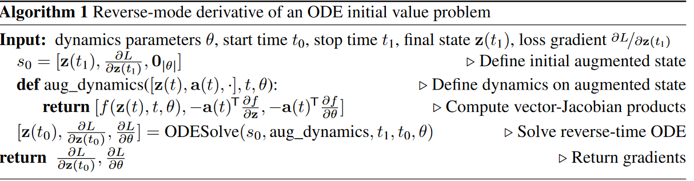
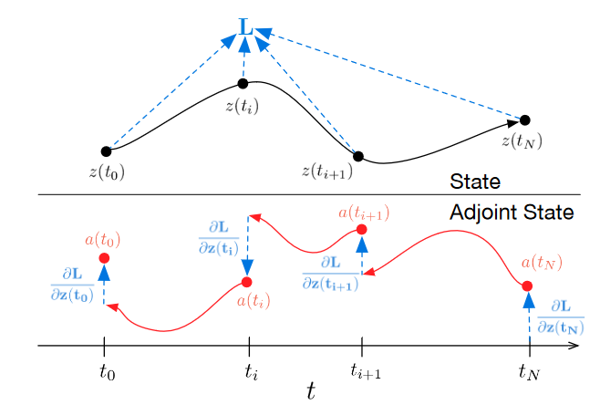
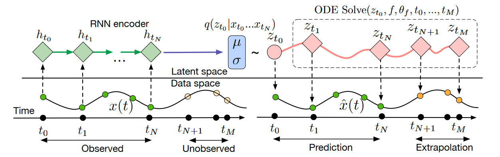

# Neural Ordinary Differential Equations

## Introduction

我们应用一个ODE神经网络来参数化隐藏神经元的连续动态：

$$
\frac{d h(t)}{dt} = f(h(t), t, \theta)
$$

通过输入层$h(0)$，我们可以定义在时间$T$时刻的输出层$h(T)$。

## Reverse-mode automatic differentiation of ODE solutions

我们将ODE求解器当作是一个黑盒，并且使用伴随灵敏度法(adjoint sensitivity method)来求解其梯度。

考虑优化一个常数值损失函数$L()$，输入是一个ODE求解器：

$$
L(z(t_1)) = L\left(z(t_0) + \int_{t_0}^{t_1} f(z(t), t, \theta)dt\right) = L(\text{ODESolve}(z(t_0), f, t_0, t_1, \theta))
$$

为了求解损失函数对于参数$\theta$的梯度，我们首先定义伴随(adjoint) $a(t) = \partial L/ \partial z(t)$。它的动态由另一个ODE控制：

$$
\frac{d a(t)}{dt} = -a(t)^T \frac{\partial f(z(t), t, \theta)}{\partial z}
$$

> 下面我们看一下上式的推导过程：
> $$
> a(t) = a(t+\delta) \frac{\partial z(t+\delta)}{\partial z(t)}
> $$
> 代入到$a(t)$中：
> $$
> a(t) = a(t+\delta)\frac{\partial}{\partial z(t)}\left(z(t) + \int_{t}^{t+\delta} f(z(t^\prime),t^\prime,\theta)dt^\prime\right)
> $$
> 整理得到：
> $$
> a(t) = a(t+\delta) + a(t+\delta)\frac{\partial}{\partial z(t)}\left(\int_{t}^{t+\delta} f(z(t^\prime),t^\prime,\theta)dt^\prime\right)
> $$
> 因此我们求得$a(t)$的导数：
> $$
> \begin{aligned}
> \frac{da(t)}{dt} &= \lim_{\delta\rightarrow 0^+}\frac{a(t+\delta) - a(t)}{\delta}\\
> &=\lim_{\delta\rightarrow 0^+} \frac{-a(t+\delta)\frac{\partial}{\partial z(t)}(\int_{t}^{t+\delta }f(z(t^\prime),t^\prime, \theta)dt^\prime)}{\delta}\\
> &= -a(t)\frac{\partial f(z(t),t,\theta)}{\partial z(t)}
\end{aligned}
> $$

这样我们就可以得到：

$$
a(t_0) = a(t_1) + \int_{t_1}^{t_0}\frac{da(t)}{dt}dt = a(t_1) - \int_{t_1}^{t_0}a(t)\frac{\partial f(z(t),t,\theta)}{\partial z(t)}dt
$$

根据这个公式我们推导出$z$在$t_0$时刻的伴随状态。

同样地，我们可以定义两个新的伴随状态：$a_{\theta}(t) = \frac{\partial L}{\partial \theta(t)},\quad a_t(t) = \frac{\partial L}{\partial t}$

同理我们可以得到：

$$
\frac{d a_\theta(t)}{dt} = -a(t)\frac{\partial f(z(t), t, \theta)}{\partial \theta(t)}\quad a_t(t) = \frac{dL}{dz(t)}\frac{dz(t)}{dt} = a(t)f(z(t),t,\theta)
$$

所以：

$$
a_\theta(t_0) = a_\theta(t_1) - \int_{t_1}^{t_0}a(t)\frac{f(z(t),t,\theta)}{\partial \theta}dt \quad a_t(t_0) = a_t(t_1) - \int_{t_1}^{t_0}\frac{\partial f(z(t),t,\theta)}{\partial t}dt
$$

可以看到三者的更新公式非常相似，我们可以将其拼接为一个向量，同时进行优化：

$$
a_{\text{aug}} = [a(t),a_\theta(t),a_t(t)]\quad \frac{da_{\text{aug}}}{dt} = -\left[a\frac{\partial f}{\partial z},a\frac{\partial f}{\partial \theta},a\frac{\partial f}{\partial t}\right](t)
$$

> ODE求解的后向过程

## Continuous Normalizing Flows

Normalizing flow 利用变量的变换理论来计算概率的精确改变，如果样本通过一个双射函数$f$进行变换：

$$
z_1 = f(z_0) \Rightarrow \log p(z_1) = \log p(z_0) - \log \left|\det \frac{\partial f}{\partial z_0}\right|
$$

一个例子是planar normalizing flow：

$$
z(t+1) = z(t) + uh(w^Tz(t)+b), \quad \log p(z(t+1)) = \log p(z(t)) - \log \left|1+u^T\frac{\partial h}{\partial z}\right|
$$

但是在计算行列式时非常耗时，但是当我们将离散层转移到连续变换会减缓计算代价。

定理(Instantaneous Change of Variables)：令$z(t)$为有限连续随机变量，概率$p(z(t))$依赖于时间。令$\frac{dz}{dt}=f(z(t),t)$为描述$z(t)$连续时间变换的微分方程。假设$f$在$z$上为一致Lipschitz连续并且在$t$上是连续的，则对数概率的变换也服从微分方程：

$$
\frac{\partial \log p(z(t))}{\partial t} = -\text{tr}\left(\frac{df}{dz(t)}\right)
$$

那么我们只需要计算迹而不需要计算行列式了。

## A generative latent function time-series model

我们展示一个连续时间，生成的方式来对时间序列进行建模。我们的模型将每一个时间序列表示为一个隐轨迹(latent trajectory)。每一个轨迹由一个局部初始状态$z_{t_0}$确定，并且一个全局隐动态在不同时间序列间共享。给定观测的时间$t_0,t_1,\cdots,t_N$和初始状态$z_{t_0}$，一个ODE求解器求解出$z_{t_1},\cdots,z_{t_N}$。我们将这个生成模型定义为：

$$
\begin{aligned}
\mathbf{z}_{t_0} & \sim p\left(\mathbf{z}_{t_0}\right) \\
\mathbf{z}_{t_1}, \mathbf{z}_{t_2}, \ldots, \mathbf{z}_{t_N} & =\operatorname{ODESolve}\left(\mathbf{z}_{t_0}, f, \theta_f, t_0, \ldots, t_N\right) \\
\text { each } \quad \mathbf{x}_{t_i} & \sim p\left(\mathbf{x} \mid \mathbf{z}_{t_i}, \theta_{\mathbf{x}}\right)
\end{aligned}
$$

我们使用变分自编码器进行训练此模型。使用RNN定义解码器。

> Latent ODE模型的计算图

**Poisson Process likelihoods**：时间发生率可以应用隐变量进行参数化：$p(\text{event at time }t\mid z(t))=\lambda(z(t))$。给定这个函数，在区间$[t_\text{start},t_\text{end}]$一系列独立的观测时间的似然可以由下式给出：

$$
\log p(t_1,\cdots,t_N\mid t_{\text{start}},t_{\text{end}}) = \sum_{i=1}^N\log \lambda (z(t_1)) - \int_{t_{\text{start}}}^{t_{\text{end}}}\lambda (z(t))dt
$$

$\lambda$为一个神经网络。
