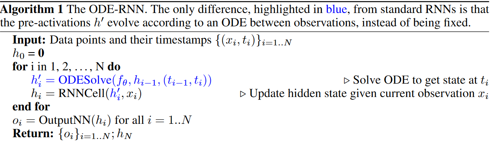
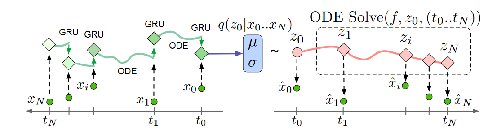

# Latent ODEs for Irregularly-Sampled Time Series

## Method

本节中，我们使用Neural ODE定义两个不同类的连续时间模型：

+ 自回归(autoregressive)ODE-RNN
+ 变分-自编码器-based Latent ODE

### Constructing an ODE-RNN Hybrid

我们的ODE-RNN主要分为两步：

$$
h_i^\prime = \text{ODESolve}(f_\theta, h_{i-1}, (t_{i-1},t_i))
$$

$$
h_i = \text{RNNCell}(h_i^\prime, x_i)
$$

**Autoregressive Modeling with the ODE-RNN**：ODE-RNN可以直接用来通过概率对序列进行建模。考虑一系列观测$\{x_i\}_{i=0}^N$在时间$\{t_i\}_{i=0}^N$上。自回归模型在历史观测的基础上做一步预测，它分解联合密度$p(x) = \prod_{i}p_\theta(x_i\mid x_{i-1},\cdots,x_0)$，我们可以利用ODE-RNN来确定条件分布$p_\theta(x_i\mid x_{i-1},\cdots,x_0)$。

### Latent ODEs: a Latent-variable Construction

我们的解码器为：

$$
\begin{aligned}
    z_0 &\sim p(z_0)\\
    z_0,z_1,\cdots,z_N &= \text{ODESolve}(f_\theta, z_0, (t_0,t_1,\cdots,t_N))\\
    x_i &\sim p(x_i\mid z_i)
\end{aligned}
$$

我们用ODE-RNN作为编码器：

$$
q(z_0\mid \{x_i,t_i\}_{i=0}^N) = \mathcal{N}(\mu_{z_0},\sigma_{z_0})\quad \mu_{z_0},\sigma_{z_0} = g(\text{ODE-RNN}_\phi(\{x_i,t_i\}_{i=0}^N))
$$

模型的ELBO为：

$$
\text{ELBO}(\theta,\phi) = \mathbb{E}_{z_0\sim q_\phi(z_0\mid \{x_i,t_i\}_{i=1}^N)}[\log p_{\theta}(x_0,\cdots,x_N)] - \mathbb{KL}[q_\phi(z_0\mid \{x_i,t_i\}_{i=0}^N)\| p(z_0)]
$$

