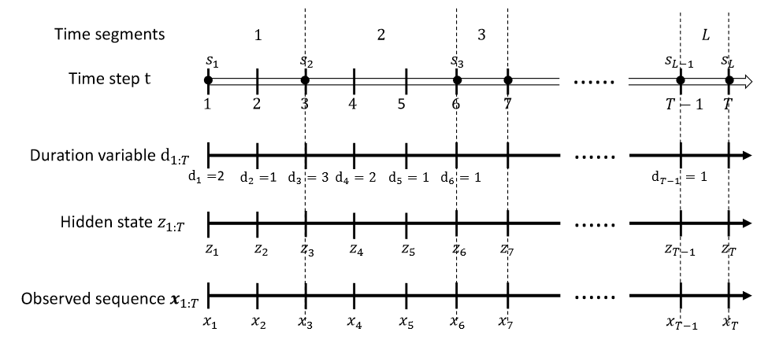

# Structured Inference for Recurrent Hidden Semi-Markov Model

## Preliminaries

HSMM是对HMM的拓展，除了含有隐变量$z_t$之外，HSMM引入时间停留变量$d_t \in \{1,2,\cdots,M\}$，其中$M$是每一个$x_t$的最大停留时间。我们令$d_{1:T} = [d_1,d_2,\cdots,d_T]$。HSMM将序列分割为$L$个片段，来找到最好的分割片段。与HMM的不同在于对应片段$i$，隐变量$z_{s_i:s_i+d_{s_i}-1}$在HSMM中是固定的。

## Stochastic Sequential Neural Network

### Generative Model

在图中，我们有三个隐变量，其中$h_t$是连续隐变量，而$z_t,d_t$为离散隐变量，分别表示标签和停留时间。联合分布可以被写作：

$$
\begin{aligned}
    p_\theta(x_{1:T},z_{1:T},d_{1:T}) = p_\theta(x_{1:T}\mid z_{1:T},d_{1:T})p_\theta(z_1)p_\theta(d_1\mid z_1)\cdot \prod_{t=2}^T p_\theta(z_t\mid z_{t-1},d_{t-1})p_\theta(d_t\mid z_t, d_{t-1})(1)
\end{aligned}
$$

其中$z_t, d_t$为分类随机变量。

$z_t,d_t$的分布为：

$$
p_\theta(z_t\mid z_{t-1}, d_{t-1}) = \begin{cases}
    \mathbb{I}(z_t=z_{t-1}) \quad \text{if }d_{t-1}>1\\
    p_\theta(z_t\mid z_{t-1}) \quad \text{otherwise}
\end{cases}
$$

$$
p_\theta(d_t\mid z_t,d_{t-1}) = \begin{cases}
    \mathbb{I}(d_t=d_{t-1}-1) \quad \text{if }d_{t-1}>1\\
    p_\theta(d_t\mid z_t) \quad \text{otherwise}
\end{cases}
$$

联合发射分布$p_\theta(x_{1:T}\mid z_{1:T},d_{1:T})$可以被进一步分解为多个片段。特殊地，对于第$i$个片段$x_{s_i:s_i+d_{s_i}-1}$，对应的生成分布为：

$$
\begin{aligned}
    p_\theta(x_{s_i:s_i+d_{s_i}-1}\mid z_{s_i},d_{s_i}) &= \prod_{t=s_i}^{s_i+d_i-1}p_\theta(x_t\mid x_{s_i:t-1},z_{s_i})\\
    &= \prod_{t=s_i}^{s_i+d_{s_i}-1}p_\theta(x_t\mid h_t,z_{s_i})
\end{aligned}
$$

我们认为$h_t$已经包含了$x_{s_i:t-1}$的信息。我们设置$h_t = \sigma(\mathrm{W}_x^{z_{s_i}}x_{t-1} + \mathrm{W}_h^{z_{s_i}}h_{t-1} + b_h^{z_{s_i}})$，$\mathrm{W}_x\in \mathbb{R}^{K\times h \times m}$。$W_x^{z_{s_i}}\in \mathbb{R}^{h\times m}$为第$z_{s_i}$个切片。

最后，在给定$h_t,z_{s_i}$下$x_t$的分布为：

$$
p_\theta(x_t\mid h_t, z_{s_i}) = \mathcal{N}(x;\mu,\sigma^2)
$$

其中$\mu = W_\mu^{z_{s_i}}h_t + b_\mu^{(z_{s_i})}$，而协方差矩阵的对角元素$\log \sigma^2 = W_\sigma^{z_{s_i}}h_t + b_\sigma^{(z_{s_i})}$。我们用$\theta$表示生成模型所有的参数。

### Structured Inference

采用随机梯度变分贝叶斯的方法进行优化，ELBO为：

$$
\begin{aligned}
\log p_\theta(\mathbf{x}) & \geq \mathcal{L}\left(\mathbf{x}_{1: T} ; \theta, \phi\right) \\
& =E_{q_\phi\left(z_{1: T}, d_{1: T} \mid \mathbf{x}_{1: T}\right)}\left[\log p_\theta\left(\mathbf{x}_{1: T}, z_{1: T}, d_{1: T}\right)\right. \\
& \left.-\log q_\phi\left(z_{1: T}, d_{1: T} \mid \mathbf{x}_{1: T}\right)\right](6)
\end{aligned}
$$

#### Bi-directional Inference

我们首先学习一个双向确定性变量$\hat{h}_t = \text{BiRNN}(x_{1:t},x_{t:T})$，其中我们利用的是双向LSTM。我们进一步定义一个后向递归函数$I_t = g_{\phi_I}(I_{t+1}, [x_t ,\hat{h}_t])$来显式捕捉前后向信息。

后验分布可以被近似为：

$$
\begin{aligned}
q_\phi\left(z_{1: T}, d_{1: T} \mid \mathbf{x}_{1: T}\right)= & q_\phi\left(z_1 \mid I_1\right) q_\phi\left(d_1 \mid z_1, I_1\right) \\
& \cdot \prod_{t=2}^T q_\phi\left(z_t \mid d_{t-1}, I_t\right) q_\phi\left(d_t \mid d_{t-1}, z_t, I_t\right)
\end{aligned}
$$

我们定义$z_t,d_t$的分布为分类分布：

$$
\begin{aligned}
    q(z_t\mid d_{t-1},I_t;\phi) &= \text{Cat}(\text{softmax}(\mathrm{W}_z^TI_t))\\
    q(d_t\mid d_{t-1},z_t,I_t;\phi) &= \text{Cat}(\text{softmax}(W_d^TI_t))
\end{aligned}
$$

#### Gumbel-Softmax Reparameterization

我们首先将离散对($z_t,d_t$)映射到一个$N$维向量$\gamma(t)$，并且$\gamma(t)\sim \text{Cat}(\pi(t))$，其中$\pi(t)$为单纯形上的N维向量，并且$N = K\times M$。之后我们用$y(t)\in \mathbb{R}^N$表示Gumbel-Softmax分布变量：

$$
y_i(t) = \frac{\exp((\log(\pi_i(t))+g_i)/\tau)}{\sum_{j=1}^k\exp((\log(\pi_j(t))+g_j)/\tau)}\quad i = 1,\cdots,N(10)
$$

其中$g_i \sim \text{Gumbel}(0, 1)$，$\tau$为temperature参数。我们表示为：

$$
y(t) \sim \text{Concrete}(\pi(t),\tau)
$$

为了简便，我们表示$F(z,d) = \log p_\theta(x_{1:T},z_{1:T},d_{1:T}) - \log q(z_{1:T},d_{1:T}\mid x_{1:T})$并且$\tilde{F}(y,g)$为对应的应用Gumbel-Sorfmax 技巧后的近似。我们有：

$$
\begin{aligned}
\mathcal{L}\left(\mathrm{x}_{1: T} ; \theta, \phi\right) & \approx E_{y \sim \operatorname{Concrete}(\boldsymbol{\pi}(t), \tau)}[\tilde{F}(y, g)] \\
& =E_{g \sim \prod_N \operatorname{Gumbel}(0,1)}[\tilde{F}(y, g)] .
\end{aligned}
$$

梯度计算为：

$$
\begin{aligned}
& \frac{\partial}{\partial \phi} E_{g \sim \prod_N \operatorname{Gumbel}(0,1)}[\tilde{F}(y, g)] \\
& =E_{g \sim \prod_N \operatorname{Gumbel}(0,1)}\left[\frac{\partial}{\partial \phi}(\tilde{F}(y, g))\right] \\
& \approx \frac{1}{B} \sum_{b=1}^B \frac{\partial}{\partial \phi}\left(\tilde{F}\left(y^b, g^b\right)\right)(12)
\end{aligned}
$$

其中$y^b := (y_1^b,\cdots,y_N^b)$，$y^b$为批量样本，$B$为批量的个数。对生成模型的参数求导不需要Gumbel-Softmax，只需要MCMC：

$$
\frac{\partial}{\partial \theta} E_{q_\phi\left(z_{1: T}, d_{1: T}\right)}[F(z, d)] \approx \frac{1}{B} \sum_{b=1}^B \frac{\partial}{\partial \theta}\left(F\left(z^b, d^b\right)\right)(13)
$$

