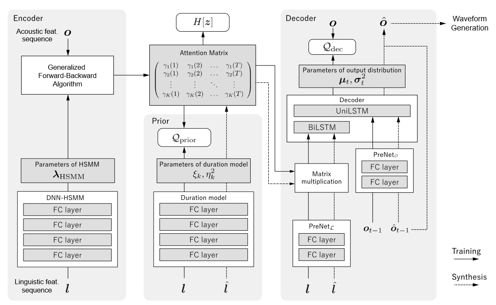

# Neural Sequence-To-Sequence Speech Synthesis Using A Hidden Semi-Markov Model Based Structured Attention Mechanism

## Related Work

### Seq2Seq models with an attention mechanism

Seq2Seq模型使用一个注意力机制可以学习两个不同长度序列对应关系。这些模型包含三个主要的成分：一个编码器、一个解码器和一个注意力机制。注意力机制在每一个解码器时间步依概率选择一个编码器隐状态，这使它能够获得合适的潜在表征各种长度的序列。时间$i$的上下文向量$c_i$，通过编码器隐状态$h_j$的加权求和表示：

$$
c_i = \sum_{j=1}^N \alpha_{ij}h_j
$$

其中$\sum_j \alpha_{ij}=1,N$为输入序列的长度，$\alpha_{ij}$为概率表示编码器第$j$个隐状态$h_j$的注意力的度(degree)，通过$h_j$和解码器的第$i-1$个状态得到。

### DNN-HSMM

HSMM的似然函数为：

$$
p(\mathrm{o}\mid \mathrm{l,\lambda_{\text{HSMM}}}) = \sum_z p(o,z\mid l) = \sum_z \left\{\prod_{t=1}^T p(o_t\mid z_t, l)\prod_{k=1}^K p(d_k\mid l)\right\}
$$

其中$o = (o_1,o_2,\cdots,o_T)$并且$l=(l_1,l_2,\cdots,l_K)$表示声学和语言学特征，$z$表示状态序列。状态持续$d_k$表示每个状态的持续时间，$k\in z$。

$$
\begin{aligned}
\boldsymbol{z} & =\left(z_1, z_2, \ldots, z_T\right) \\
& =(\underbrace{S_1, \ldots, S_1}_{\times d_1}, \underbrace{S_2, \ldots, S_2}_{\times d_2}, \ldots, \underbrace{S_K, \ldots, S_K}_{\times d_K})
\end{aligned}
$$

我们的DNN-HSMM假设模型为：

$$
\begin{aligned}
p\left(\boldsymbol{o}_t \mid z_t=k, \boldsymbol{l}\right) & =\mathcal{N}\left(\boldsymbol{o}_t \mid \boldsymbol{\mu}_k, \boldsymbol{\sigma}_k^2\right) \\
p\left(d_k \mid \boldsymbol{l}\right) & =\mathcal{N}\left(d_k \mid \xi_k, \eta_k^2\right) \\
\left\{\boldsymbol{\mu}_k, \boldsymbol{\sigma}_k^2, \xi_k, \eta_k^2\right\} & =\operatorname{DNN}\left(\boldsymbol{l}_k\right)
\end{aligned}
$$

## Proposed Method

### HSMM based structured attention

VAE通过最大化$\mathcal{L}_{\text{ELBO}}$来优化神经网络。隐变量$z$表示类似于HSMM的离散状态，近似后验分布$q(z)$可以通过DNN-HSMM表示：

$$
\begin{aligned}
    q(z) &= p(z\mid o, \lambda_{\text{HSMM}})\\
    \lambda_{\text{HSMM}} &= \text{DNN-HSMM}(l)
\end{aligned}
$$

因为$z$为离散变量，下列期望被用来将编码器的信息传播到解码器：

$$
\gamma_k(t) = p(z_t = k\mid o, l) = \sum_z q(z)\delta(z_t, k)
$$

很明显，$\gamma_k(t)$本身就为注意力，尽管$\gamma_k(t)$的计算需要列举所有的状态序列，但是在DNN-HSMM中可以通过 generalized forward-backward算法高效计算。

正如前面提到的，假设期望$\gamma = \{\gamma_k(t)\mid k=1,\cdots,K, t=1,\cdots,T\}$而不是$z$从编码器中传递，解码器有下列近似：

$$
\sum_{z}q(z)\log p(o\mid z, l) \approx \log p(o\mid \gamma, l)
$$
