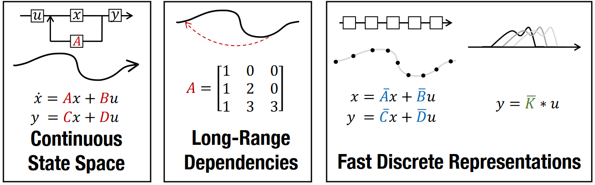
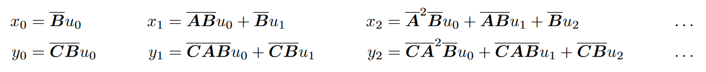
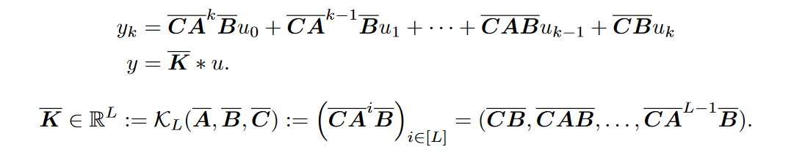
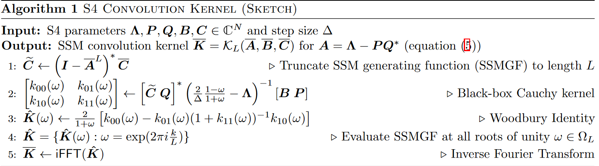

# Efficiently Modeling Long Sequences with Structured State Spaces

## Background: State Spaces

> (左边)：通过矩阵$\mathrm{A,B,C,D}$将输入信号$u(t)$映射到输出$y(t)$，通过隐状态$x(t)$的状态空间模型。(中间)：最近关于连续时间记忆的理论推导出特殊的 A 矩阵，允许 SSM 在数学上和经验上捕获 LRD(长时间依赖)。(右边)：SSM既可以通过递归(left)也可以通过卷积(right)。但是，实现这些概念需要利用对其参数的不同表示(red, blue, green)，但是计算很昂贵。S4引入一个新的参数化技巧可以高效在这些表示中切换，允许处理很多类任务，在训练和推理时都很高效，尤其是在长序列中。

### State Space Models: A Continuous-time Latent State Model

状态空间模型可以通过下面的公式定义。它将1-D 输入信号$u(t)$映射到N-D隐状态$x(t)$，之后将其投影到1-D输出信号$y(t)$。

$$
\begin{aligned}
    x^\prime(t) &= Ax(t) + Bu(t)\\
    y(t) &= Cx(t) + Du(t)
\end{aligned}
$$

我们的目的是简单地将SSM在深度序列模型中作为一个黑箱表示，其中$A,B,C,D$是需要通过梯度下降学习地参数。我们忽略$D$，因为$Du$可以被看作是跳跃连接并且很容易计算。

### Addressing Long-Range Dependencies with HiPPO

> Linear State Space Layer(LSSL)

一般的SMM在长序列时进行优化会面临梯度消失的情况，为了解决这个问题，LSSL结合了连续时间记忆的HiPPO理论。通过引入矩阵$A \in \mathbb{R}^{N\times N}$，允许状态$x(t)$记住输入$u(t)$的历史。

$$
A_{nk} = - \begin{cases}
    (2n+1)^{1/2}(2k+1)^{1/2} &\text{if } n > k\\
    n+1 &\text{if } n =k\\
    0 &\text{if } n < k
\end{cases}
$$

### Discrete-time SSM: The Recurrent Representation

为了应用到离散输入序列$(u_0,u_1,\cdots)$而不是$u(t)$，输入必须是以步长$\Delta$离散化。$u_k$可以看作是$u_k = u(k\Delta)$。

我们将状态矩阵$A$变为其离散形式$\bar{A}$。离散SSM为：

$$
\begin{aligned}
    x_k &= \bar{A}x_{k-1} + \bar{B}u_t &\quad \bar{A} = (I-\Delta/2\cdot A)^{-1}(I+\Delta/2\cdot A)\\
    y_k &= \bar{C}x_k &\quad \bar{B} = (I-\Delta/2\cdot A)^{-1}\Delta B\quad \bar{C}=C
\end{aligned}
$$

### Training SMMs: The Convolutional Representation

为了简便令$x_{-1}=0$，则展开上式：

我们可以将其向量化为卷积的形式：

## Method: Structured State Spaces(S4)

### Motivation: Diagonalization

我们需要计算矩阵$\bar{A}$的幂，对于$L$次乘积，需要$O(N^2L)$次操作和$O(NL)$空间。

**引理**：共轭是SSMs $(A,B,C)\sim (V^{-1}AV, V^{-1}B,CV)$上的等价关系。

**引理**：HiPPO矩阵$A$通过矩阵$V_{ij} = C_{i+j}^{i-j}$对角化。

### The S4 Parameterization: Normal Plus Low-Rank

使矩阵$A$对角化的矩阵并不是well-conditioned的。并且通过线性代数的谱定理可知，矩阵$A$不是normal matrices，即其不能被很好的对角化。但是其可以被分解为**一个normal矩阵和一个低秩矩阵的和**，但是即使这样，计算也会很繁琐。我们针对此问题进行了三点改进：

+ 我们不直接计算$\bar{K}$，我们通过计算它**截断生成函数(truncated generating function)**$\sum_{j=0}^{L-1}\bar{K}_j\zeta^j$在unity $\zeta$的root。$\bar{K}$之后可以通过应用逆傅里叶变换得到。
+ 这个生成函数与矩阵分解紧密相关，现在引入了矩阵求逆而不是幂，低秩项现在可以通过**Woodbury identity**来纠正，**Woodbury identity** reduces $(A+PQ^\star)^{-1}$ in terms of $A^{-1}$, turly reducing to the diagonal case。
+ 最后，我们证明对角矩阵情况下等价于计算柯西核(Cauchy kernel)$\frac{1}{w_j-\zeta_k}$，一个具有稳定 近线性算法(near-linear)。

我们的计数应用到可以被分解为 Normal Plus Low-Rank(NPLR)的所有矩阵。

**定理**： 所有HiPPO矩阵都有NPLR表示：
$$
A = V\Lambda V^\star - PQ^T = V(\Lambda - (V^\star P)(V^\star Q)^\star)V^\star
$$
对于unitary $V \in \mathbb{C}^{N\times N}$，对角矩阵$\Lambda$，低秩分解$P,Q\in \mathbb{R}^{N\times r}$。

