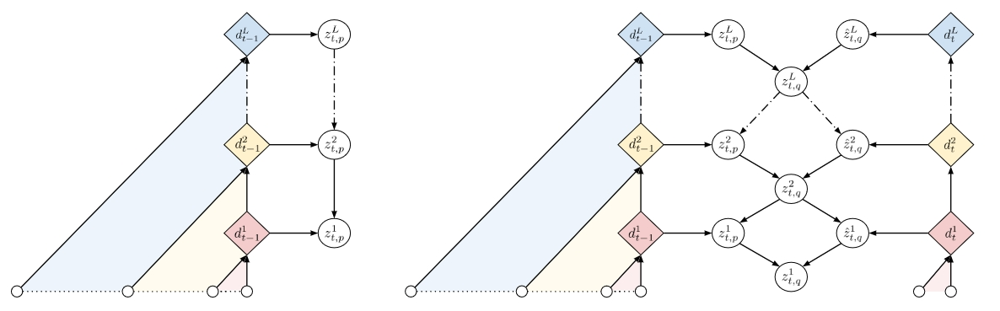

# STCN: Stochastic temporal convolutional networks

> 左边：生成网络；右边：推断网络

## Background

自回归模型如RNN和TCN将序列$\mathrm{x}=\{x_1,\cdots,x_T\}$的联合分布分解为条件分布：

$$
p_\theta(\mathrm{x}) = \prod_{t=1}^Tp_\theta(x_t\mid x_{1:t-1})
$$

### Temporal Convolutional Networks

一个确定的TCN(非随机)在时间$t$和层$l$的表示$d_t^l$总结输入序列$x_{1:t}$：

$$
d_t^l = \text{Conv}^{(l)}(d_t^{l-1}, d_{t-j}^{l-1})\quad \text{and} \quad d_t^1 = \text{Conv}^{(1)}(x_t, x_{t-j})
$$

