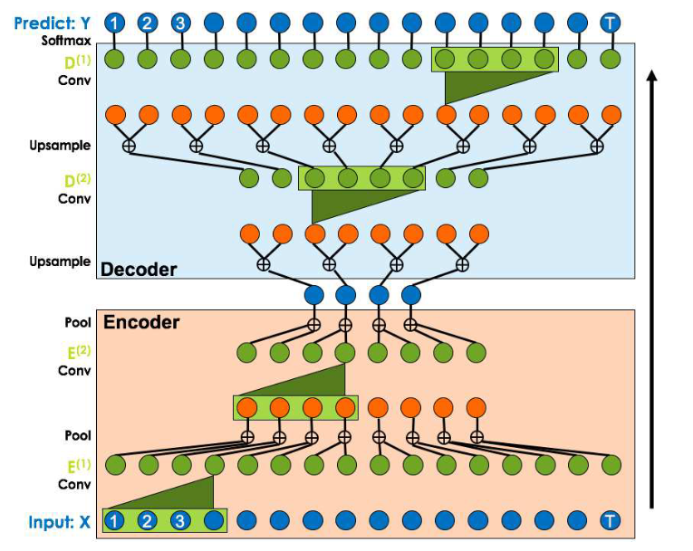
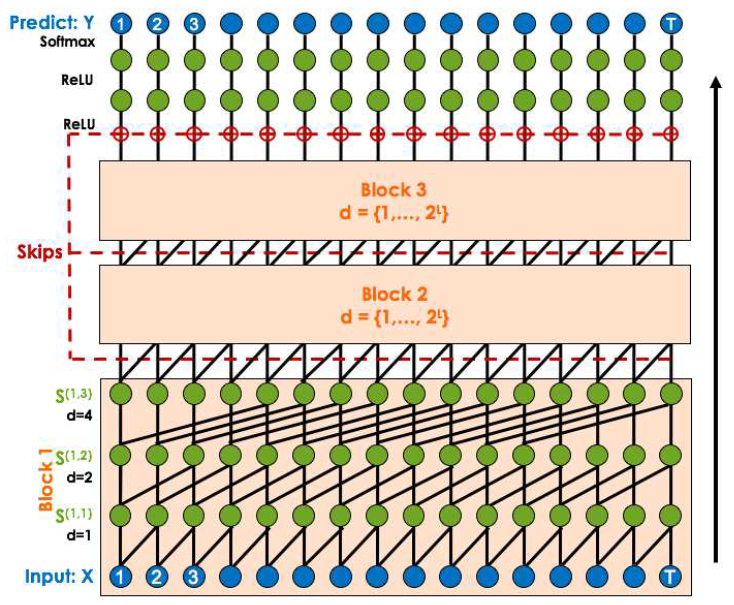

# Temporal Convolutional Networks for Action Segmentation and Detection

## Temporal Convolutional Network

我们定义两种TCN，每一个都有下列性质：

1. 一层一层执行计算，意味着每个时间步是同步更新的。
2. 跨时间的卷积计算(convolutions are computed across time)。
3. 在每一个时间点的预测是一个定长时间段的函数，被称为接受域(receptive field)。

TCN的输入为一系列特征，令$X_t \in \mathbb{R}^{F_0}$为长度为$F_0$的输入特征向量。每个时间点的输出为$Y_t\in \{0,1\}^C$，其中$C$为类别的数量。

### Encoder-Decoder TCN

> Encoder-Decoder TCN(ED-TCN)

我们的encoder-decoder 框架如上图所示。编码器包括$L$层，表示为$E^{(l)}\in \mathbb{R}^{F_l\times T_l}$，其中$F_l$为卷积核的数量，$T_l$为对应的时间步。每一层包括一个时序卷积，一个非线性激活函数，和一个时间最大池化。

我们定义每一层的滤波集合为$W = \{W^{(i)}\}_{i=1}^{F_l}$，而$W^{(i)}\in \mathbb{R}^{d\times F_{l-1}}$和相应的偏差向量$b\in \mathbb{R}^{F_l}$。给定上一层的信号$E^{(l-1)}$，我们计算：

$$
E^{(l)} = \text{max\_pooling}(f(W * E^{(l-1)} + b))
$$

其中$f(\cdot)$为激活函数而`*`为卷积操作。我们实行宽度为$2$的池化，因此$T_l = \frac{1}{2}T_{l-1}$。

我们的编码器类似于解码器，不过最大池化变为了上采样，操作的顺序变为了上采样、卷积和激活函数。上采样就是简单地将每个元素重复两次。解码器的每一层表示为$D^{(l)}\in \mathbb{R}^{F_l\times T_l}$。

在每个时间段$t$属于每一类的概率为$\hat{Y}_t \in [0,1]^C$，权重矩阵为$U\in \mathbb{R}^{C\times F_1}$和偏差$c\in \mathbb{R}^C$，使得：

$$
\hat{Y}_t  = \text{softmax}(UD^{(1)}_t+c)
$$

**Receptive Field**：在每个时间点的预测为固定长度时间的函数，定义为：$r(d, L)=d(2^L - 1) + 1$对于$L$层和持续时间(duration) $d$。

### Dilated TCN

> Dilated TCN

如上图所示，我们定义了一系列块(blocks)，每一个包含$L$个卷积层，在第$j$个块中第$l$层的激活值为$S^{(j,l)}\in \mathbb{R}^{F_w \times T}$。每一层都有相同数量的滤波$F_w$，这允许我们结合不同层的激活值使用跳跃连接。每一层包含一组比率参数为$s$的膨胀卷积(dilated convolutions)，一个非线性激活函数$f(\cdot)$和残差连接来结合层的输入和卷积信号。卷积只应用在两个时间步$t,t-s$，因此我们的滤波参数为$W = \{W^{(1)},W^{(2)}\}$，其中$W^{(i)}\in \mathbb{R}^{F_w\times F_w}$和残差向量$b\in \mathbb{R}^{F_w}$。令$\hat{S}_t^{(j,l)}$为在时间$t$扩充卷积的结果，$S_t^{(j,l)}$为添加残差连接后的结果：

$$
\begin{aligned}
    \hat{S}_t^{(j,l)} &= f(W^{(1)}S_{t-s}^{(j, l-1)}+W^{(2)}S_t^{(j, l-1)}+b)\\
    S_t^{(j,l)} &= S_t^{j, l-1} + V\hat{S}_t^{(j,l)}+e
\end{aligned}
$$

注意每层的参数$\{W,b,V,e\}$都是分开的。Dilation rate随着层数而增加：$s_l = 2^l$。

每一块的输出通过跳跃连接$Z^{(0)}$总结使得：

$$
Z_t^{(0)} = \text{ReLU}(\sum_{j=1}^BS_t^{j,L})
$$

有一系列隐状态$Z_t^{(1)}=\text{ReLU}(V_rZ_t^{(0)}+e_r)$，$V_r \in \mathbb{R}^{F_w \times F_w}$。每一时刻的预测为：

$$
\hat{Y}_t = \text{softmax}(UZ_t^{(1)} + c)
$$

$U\in \mathbb{R}^{C\times F_w}$。

**Receptive Field**：其长度为$r(B, L) = B*2^L$，其中$B$为块的数量而$L$为每块中层的数量。

### Causal versus Acausal

对于因果模型，对于时间点$t$和滤波的长度$d$，我们对$X_{t-d}$到$X_t$之间应用卷积。在反因果模型中我们对$X_{t-\frac{d}{2}}$到$X_{t+\frac{d}{2}}$之间应用卷积。

在反因果 Dilated TCN中，:

$$
\begin{aligned}
\hat{S}_t^{(j, l)}=f\left(W^{(1)} S_{t-s}^{(j, l-1)}\right. & +W^{(2)} S_t^{(j, l-1)} \\
& \left.+W^{(3)} S_{t+s}^{(j, l-1)}+b\right)
\end{aligned}
$$

