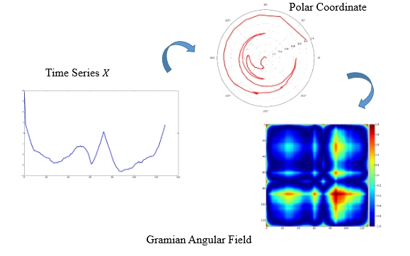
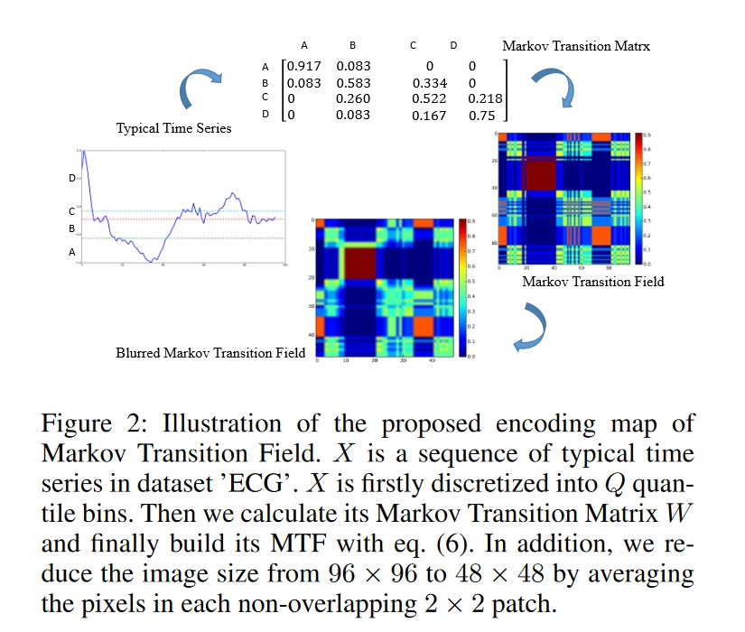

## Encoding Time Series as Images for Visual Inspection and Classification Using Tiled Convolutional Neural Networks

> 本文应对的时间序列是一维的，啊啊啊啊。

格拉姆矩阵实际上是一些向量的内积组成的矩阵：
$$
G(v_1,\cdots,v_k) = \begin{pmatrix}\langle v_1,v_1\rangle &\cdots&\langle v_1,v_k\rangle\\
\vdots &\cdots &\vdots\\
\langle v_k,v_1\rangle &\cdots &\langle v_k,v_k\rangle
\end{pmatrix}
$$
我们通过格拉姆角场(`Gramian Angular Fields`)和马尔科夫转移场(`Markov Transition Fields`)将时间序列编码为图像，之后再采用卷积神经网络的方法。我们使用tiled CNN进行分类。

### Encoding Time Series to Image

#### `Gramian` Angular Field

给定时间序列$X = \{x_1,x_2,\cdots,x_n\}$，我们对$X$归一化使其值位于区间$[-1,1]$：
$$
\tilde{x}_i = \frac{(x_i - \max(X)) + (x_i - \min(X))}{\max(X)-\min(X)}
$$
那么我们就可以应用下式将$\tilde{X}$在极坐标坐标系中进行编码：
$$
\begin{cases}
\phi &= \arccos(\tilde{x}_i),\quad &-1\le \tilde{x}_i \le 1,\tilde{x}_i \in \tilde{X}\\
r&= \frac{t_i}{N}, & t_i \in \mathbb{N}
\end{cases}
$$
在上式中$t_i$为时间点而$N$为常数。

我们的GAF定义为：
$$
\begin{aligned}
& G=\left[\begin{array}{ccc}
\cos \left(\phi_1+\phi_1\right) & \cdots & \cos \left(\phi_1+\phi_n\right) \\
\cos \left(\phi_2+\phi_1\right) & \cdots & \cos \left(\phi_2+\phi_n\right) \\
\vdots & \ddots & \vdots \\
\cos \left(\phi_n+\phi_1\right) & \cdots & \cos \left(\phi_n+\phi_n\right)
\end{array}\right] \\
& =\tilde{X}^{\prime} \cdot \tilde{X}-{\sqrt{I-\tilde{X}^2}}^{\prime} \cdot \sqrt{I-\tilde{X}^2} \\
&
\end{aligned}
$$
其中$I$指的是元素全为$1$的向量。通过定义内积：$<x,y> = x\cdot y - \sqrt{1-x^2}\cdot \sqrt{1-y^2}$，$G$为格拉姆矩阵：
$$
\left[\begin{array}{ccc}
<\tilde{x_1}, \tilde{x_1}> & \cdots & <\tilde{x_1}, \tilde{x_n}> \\
<\tilde{x_2}, \tilde{x_1}> & \cdots & <\tilde{x_2}, \tilde{x_n}> \\
\vdots & \ddots & \vdots \\
<\tilde{x_n}, \tilde{x_1}> & \cdots & <\tilde{x_n}, \tilde{x_n}>
\end{array}\right]
$$

> 流程

因为矩阵的大小为$n\times n$，为了减少GAF的维度，我们应用Piecewise Aggregation Approximation来平滑时间序列并且保持趋势。

#### Markov Transition Field

给定时间序列$X$，我们确定其$Q$分位数箱并且将每一个$x_i$分配到对应的箱$q_j(j\in [1, Q])$。因此我们构建了一个$Q\times Q$权重邻接矩阵。$w_{i,j}$表示一个点位于$Q_j$而其紧接着的点位于$Q_i$的频率，我们归一化使得$\sum_j w_{ij}=1$。我们定义MTF为：
$$
M=\left[\begin{array}{ccc}
w_{i j \mid x_1 \in q_i, x_1 \in q_j} & \cdots & w_{i j \mid x_1 \in q_i, x_n \in q_j} \\
w_{i j \mid x_2 \in q_i, x_1 \in q_j} & \cdots & w_{i j \mid x_2 \in q_i, x_n \in q_j} \\
\vdots & \ddots & \vdots \\
w_{i j \mid x_n \in q_i, x_1 \in q_j} & \cdots & w_{i j \mid x_n \in q_i, x_n \in q_j}
\end{array}\right]
$$

