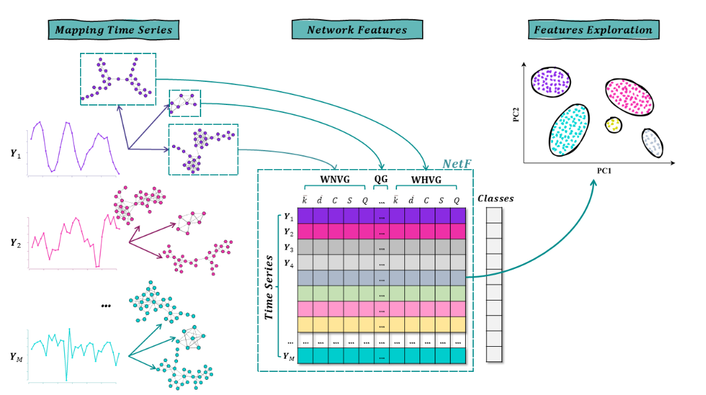
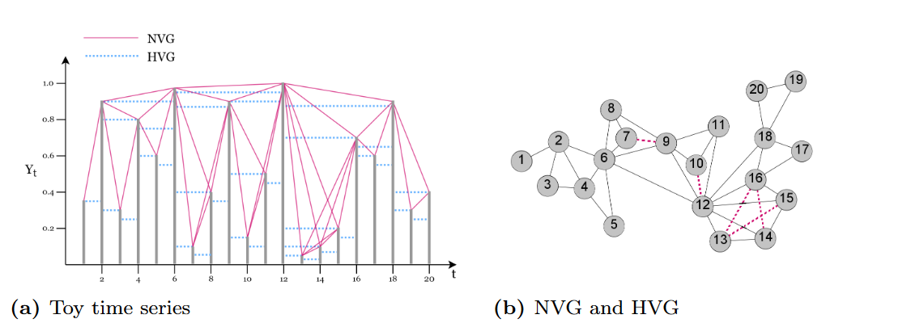
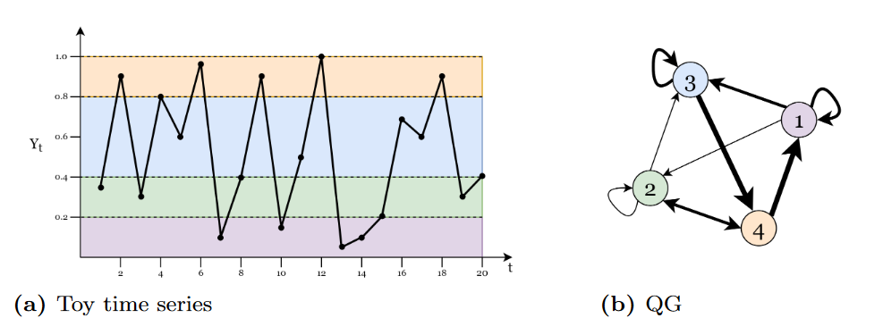
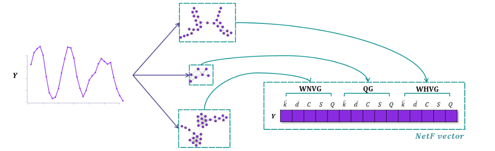

# Novel Features for Time Series Analysis: A Complex Networks Approach

在本文中，我们通过将时间序列映射到复杂网络来建立一组新的时间序列特征NetF。此外，我们提出了时间序列挖掘任务的程序，并解决了基于复杂网络的时间序列特征是否是时间序列挖掘任务中有用方法的问题。

## Mapping Time Series into Complex Networks

### Visibility Graphs
可视化图(Visibility graphs(VG))利用可见的线来在不同时间节点的观测(node)建立联系(edge)。这种方法的两种变体为：
**Natural Visibility Graph(NVG)** 基于每个观测$Y_t$被看作是一个垂直的bar，高度与其数值相等，这些bars被摆在地面上，其中每一个bar的顶端可以通过其他bars的顶端看见。每一个时间点$t$被映射到图中的一个节点，并且变$(v_i,v_j),i,j=1,\cdots,T,i\neq j$通过以下方式建立，如果两者之间的顶端可以互相看见(不被中间的其他点挡住)。公式化为：两个节点$v_i,v_j$是连结的如果任何观测$(t_k,Y_k),t_i < t_k < t_j$满足公式：
$$
Y_k < Y_j + (Y_i - Y_j)\frac{(t_j-t_k)}{(t_j-t_i)}
$$
任何仿射变换$Y^\prime = aY+b$都不会改变NVG。NVG对噪声的敏感性可以通过增加权重变量来缓解，定义$w_{i,j} = 1/\sqrt{(t_j-t_i)^2 + (Y_j-Y_i)^2}$。

**Horizontal Visibility Graph**(HVG)为NVG的简化版本，条件变为：
$$
Y_i, Y_j > Y_k
$$
我们也可以对其赋予权重。

### Quantile Graphs

分位数图(QG)是根据转移概率定义的。首先将数据分箱，分为$\eta$个箱$q_1,q_2,\cdots,q_\eta$。每个箱作为一个顶点，而节点之间的权重由转移概率确定。为有向、有权图：

### Complex Networks Topological Measures

在本文中，我们主要研究：
+ average weighted degree：$\bar{k}$
+ average path length：$\bar{d}$：两点之间最短距离的平均
+ global clustering coefficient：$C$：两个连结到同一个节点的节点也同样连结的概率
+ number of communities：$S$：我们将communities视为内部密集连结的节点组，也可以是具有相同或相似特征的一组节点
+ modularity：$Q$：不同communties的节点有多么不同

## NetF：A Novel Set of Time Series Features

### The 15 Features of NetF
15个特征来自前面提到的三个网路，每个网络提取前面提到的五个特征，共15个特征。

