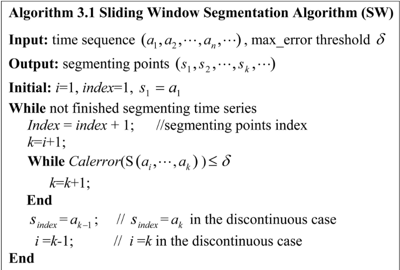

## Novel Online Methods for Time Series Segmentation

**Piecewise Linear Approximation(PAL)**

### Related Work

我们在本文中主要讨论PLA方法，因此我们的分割问题可以被陈述为：对于一个给定的时间序列$T=\{a_1,a_2,\cdots,a_n\}$，长度为$n$，目标是将$T$分割为片段的序列$S_1S_2\cdots S_k(1\le k\le n-1)$并将每个片段表示为一个直线。

### Novel Online Segmentation Algorithms: FSW and SFSW

#### Maximum Vertical Distance and Segmentation Criterion

> `Calerror`为计算当前分割误差的函数

在上述算法中，每次有新的点加入，我们都需要重新计算分割的误差。但是当我们使用MVD测度时此问题可以避免。

对于时间序列$T = \{\cdots,a_i,\cdots,a_j,\cdots\}$和$\delta > 0$，其中$\delta$为用户定义的最大误差并且$a_j = (x_j,y_j)$为