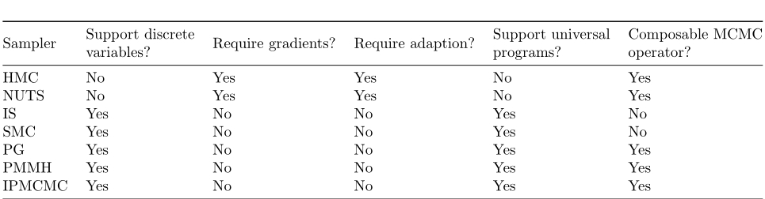
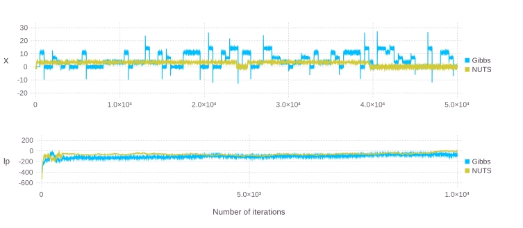
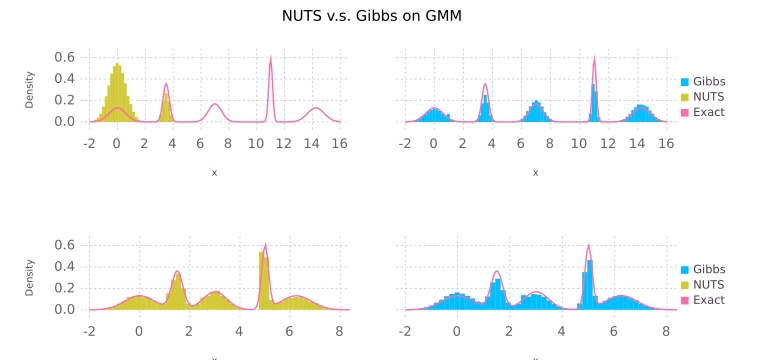

## Turing: a language for flexible probabilistic inference

> 文章链接：http://proceedings.mlr.press/v84/ge18b.html?ref=https://githubhelp.com

### Background

在概率模型中，我们关注的一般是$p(\theta\mid y,\gamma)$，其中$\theta$为参数，$y$为观测数据，$\gamma$为一些确定了的超参数。

#### Models as computer programs

最早的概率编程语言为BUGS，可以追溯到20世纪90年代。下面展示了概率程序的一般结构。

输入：数据$y$和超参数$\gamma$

步骤1：定义全局参数：
$$
\theta^{\text{global}}\sim p(\cdot\mid \gamma)
$$
步骤2：对于每一个观测$y_n$，定义(局部)隐变量并计算似然：
$$
\begin{aligned}
\theta_n^{\text{local}}&\sim p\left(\cdot\mid\theta_{1:n-1}^{\text{local}},\theta^{\text{global}},\gamma\right)\\
y_n&\sim p\left(\cdot\mid \theta_{1:n}^{\text{local}},\theta^{\text{global}},\gamma\right)
\end{aligned}
$$
其中$n=1,2,\cdots,N$。

参数分为两类：$\theta_n^{\text{local}}$表示对于观测$y_n$的模型参数，如混合高斯模型中$y_n$属于哪个高斯分布的参数，而$\theta^{\text{global}}$表示全局变量。

#### Inference for probabilistic programs

概率程序只有在与高效的推理引擎相结合时才能发挥其灵活性潜力。为了解释概率编程中推理如何工作，我们考虑以下具有$K$个状态的HMM例子：
$$
\begin{aligned}
\pi_k&\sim \text{Dir}(\theta)\\
\phi_k&\sim p(\gamma)\\
z_t\mid z_{t-1}&\sim \text{Cat}(\cdot\mid \pi_{z_{t-1}})\\
y_t\mid z_t&\sim h(\cdot\mid \phi_{z_t})
\end{aligned}
$$
其中$k = 1,2,\cdots,K$，$t = 1,\cdots,N$。

具有以下三个步骤的高效 Gibbs 采样器通常用于贝叶斯推理：

+ Step 1: Sample $z_{1: T} \sim z_{1: T} \mid \phi_{1: K}, \pi_{1: K}, y_{1: T} ;$
+ Step 2: Sample $\phi_{k} \sim \phi_{k} \mid z_{1: T}, y_{1: T}, \gamma$;
+ Step 3: Sample $\pi_{k} \sim \pi_{k} \mid z_{1: T}, \theta(k=1, \ldots, K)$.

#### Computation graph based inference

对概率程序进行建模的一大挑战是构建模型变量之间的计算图。对于一些编程语言，在推理之前概率图模型就已经生成，但是当程序中存在随机分支时就会出现问题，在这种情况下，我们不得不求助于其他推理方法。

### Composable MCMC inference

我们提出的可组合推理方法利用了HMC算法和粒子吉布斯(PG)算法。为了描述所提出的概率程序方法，我们利用潜在狄利克雷分配(LDA)的例子。

~~~julia
@model lda(K ,M, N, w, d, beta, alpha) = begin
    theta = Vector{Vector{Real}}(M)
    for m = 1:M
        theta[m] ~ Dirichlet(alpha)
    end
    phi = Vector{Vector{Real}}(K)
    for k = 1:K
        phi[k] ~ Dirichlet(beta)
    end
    
    z = tzeros(Int, N)
    for n = 1:N
        z[n] ~ Categorical(theta[d[n]])
        w[n] ~ Categorical(phi[z[n]])
    end
end
~~~

其中变量$\phi,\theta,z$表示模型参数，变量$K,M,N,d,\beta,\alpha$表示超参数，$w$表示观测数据。

一旦定义了模型，提供数据和执行推理就很直观了。

~~~julia
model = lda(K, V, M, N, w, d, beta, alpha)
sample(model, engine)
~~~

`engine`是我们想要使用的MCMC引擎。例如，如果要应用例子吉布斯采样，我们可以：

~~~julia
spl = PG(n, m)
sample(model, spl)
~~~

这将会用含有$m$个粒子的PG进行$n$次迭代。

我们也可以对不同的参数采用不同的采样器：

~~~julia
spl2 = Gibbs(1000, PG(10,2,:z), HMC(2, 0.1, 1, 5, :phi,:theta))
~~~

上述采样引擎`spl2`将参数分割为两部分，每个部分采用不同的采样方法，值得注意的是，分布的两个部分不需要是互斥的。

#### A family of MCMC operators

> Supported Monte Carlo algorithms in Turing

### Implementation and Experiments

#### The Turing library

Turing为Julia的一个包。因为Turing为一般的Julia程序，因此它可以利用Julia中丰富的数值和统计库。

##### Efficient particle Gibbs implementation

我们使用协程来实现粒子 Gibbs。协程可以看作是函数的泛化，具有可以在多个点暂停和恢复的特性。

##### Automatic differentiation

HMC在采样的过程需要梯度，当给定定义$\log p(\theta\mid z_{1:N},\gamma)$的计算程序时，这些梯度可以通过自动微分(AD)自动获得。为了简便和高效，我们率先使用了一种称为向量模式的前向微分技术。向量模式前向微分背后的主要概念是多维对偶数，其在标量函数上的行为定义为：
$$
f\left(\theta+\sum_{i=1}^D y_i\epsilon_i\right) = f(\theta) + f^{\prime}(\theta)\sum_{i=1}^Dy_i\epsilon_i
$$
其中$\epsilon_i\epsilon_j=0,\text{for }i\neq j$。

对于小模型，向量前向AD非常高效。但是对于大模型逆向模式的AD较为高效，因此Turing两种模式都存在。

##### Vectorized random variables

Turing支持利用以下语法对独立同分布的变量进行矢量化采样：

~~~julia
rv = Vector(10)
rv ~ [Normal(0, 1)]
~~~

##### Constrained random variables

Turing支持约束的变量。主要由三种类型的约束：

1. 有界的单变量。
2. 有简单约束的多维变量，如相加和为$1$。
3. 矩阵约束：例如协方差矩阵为半正定矩阵。

##### MCMC output analysis

在Turing中我们可以使用`describe`函数计算：

1. 均值
2. 标准差
3. naive standard error
4. 蒙特卡洛标准误差
5. 有效样本数
6. 分位数

也可以使用`hpd`函数计算高后验概率区间，互相关`cor`，自相关`autocor`，状态空间变化率`changerate`和偏差信息准则`dic`等等。

#### Finding the right inference engine

下面我们将比较`NUTS`和`Gibbs(PG,HMC)`在不同的概率模型上。

##### Models and inference engine setup

**Stochastic Volatility Model**：参数的集合为$\{\phi,\sigma,\mu,h_{1:N}\}$。所有这些参数对于目标分布来说都是可导的，因此NUTS算法是可用的：
$$
\begin{aligned}
\mu &\sim \mathcal{C} \mathrm{a}(0,10)), \phi \sim \mathcal{U} \mathrm{n}(-1,1), \sigma \sim \mathcal{C} \mathrm{a}(0,5), \quad(\sigma>0) \\
h_{1} & \sim \mathcal{N}\left(\mu, \sigma / \sqrt{1-\phi^{2}}\right), h_{n} \sim \mathcal{N}\left(\mu+\phi\left(h_{n-1}-\mu\right), \sigma\right) \\
y_{n} & \sim \mathcal{N}\left(0, \exp \left(h_{n} / 2\right)\right) \quad(n=2,3, \ldots, N) .
\end{aligned}
$$
其中$\mathcal{C}\mathrm{a}$表示柯西分布。

~~~julia
spl1 = NUTS(1e4, 1e3, 0.65)
spl2 = Gibbs(1e4, PG(5, 1, :h), NUTS(1, 1e3, 0.65, :mu, :phi, :sigma))
~~~

**Gaussian Mixture Model**：参数的集合为$\{z,\theta\}$，其中参数$\theta$是可导的，参数$z$不可以。为了运行NUTS算法，我们积分积掉$z$只对$\theta$采样：
$$
\begin{array}{r}
\mu=\left(\mu_{1: K}\right), \quad \sigma=\left(\sigma_{1: K}\right), \quad \pi=\left(p_{1: K}\right) \\
z \sim \operatorname{Cat}(\pi), \quad \theta \sim \mathcal{N}\left(\mu_{z}, \sigma_{z}\right)
\end{array}
$$

~~~julia
spl3 = NUTS(5e4, 1000, 0.65)
spl4 = Gibbs(5e4, PG(5, 1, :z), NUTS(5e2, 1e3, 0.65, :theta))
~~~

##### Results

> 上图为在GMM模型上trace plot，下图为联合分布的概率的对数的图，可以看到两个算法都达到了收敛，但是NUTS算法在某些对方被"困住了"。在下图更明显。

> 对具有$5$个混合的GMM采样的结果，可以更明显地看到NUTS算法被困住了，在图的上半部分只探索到了两个混合成分。

