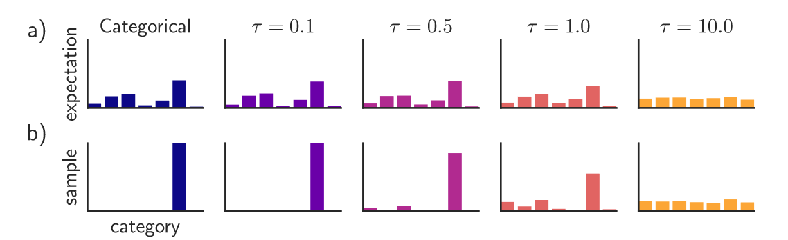

## Categorical Reparameterization With Gumbel-Softmax

### Introduction

本文的主要贡献是可以采用离散的隐变量。

本文的主要贡献主要分为三个方面：

1. 我们引入了Gumbel-Softmax，在单纯形上的一个连续分布，可以近似分类样本，并且参数梯度可以很容易通过重参数化的技巧计算。
2. 我们实验证明，Gumbel-Softmax在伯努利变量和分类变量上都优于所有单样本梯度估计器。
3. 我们证明这个估计器可以被用来高效训练半监督模型，不用费力将分类隐变量积分掉。

### The Gumbel-Softmax Distribution

令$z$为分类变量，类的概率为$\pi_1,\pi_2,\cdots,\pi_k$。我们假设分类样本编码为$k$维one-hot编码，位于$k-1$维的单纯形$\triangle^{k-1}$上。这允许我们定义元素级别上的量，如$\mathbb{E}_p[z] = [\pi_1,\cdots,\pi_k]$。

Gumbel-Max技巧提供了一个简单和高效的方法来从类概率$\pi$的分类分布来采样：
$$
z = \text{one\_hot}\left(\arg_i\max[g_i+\log\pi_i]\right)
$$
其中$g_1,\cdots,g_k$为从$\text{Gumbel}(0,1)$中采样得到的独立同分布的样本。我们使用softmax函数作为对`argmax`连续的可微的近似，并且产生$k-$维样本向量$y\in \triangle^{k-1}$：
$$
y_i = \frac{\exp((\log(\pi_i)+g_i)/\tau)}{\sum_{j=1}^k\exp((\log(\pi_j)+g_j)/\tau)},\quad \text{for }i=1,\cdots,k
$$
其概率密度为：
$$
p_{\pi,\tau}(y_1,\cdots,y_k) = \Gamma(k)\tau^{k-1}\left(\sum_{i=1}^k\pi_i/y_i^\tau\right)^{-k}\prod_{i=1}^k(\pi_i/y_i^{\tau +1})
$$
当`softmax`温度(temperature) $\tau$接近$0$，从Gumbel-Softmax中采样变为one-hot并且Gumbel-Softmax变为等价为分类分布$p(z)$。

> Gumbel分布(耿贝尔分布)：
>
> 其累积分布函数为：
> $$
> F(x;\mu,\beta) = e^{-e^{(x-\mu)/\beta}}
> $$
> 标准耿贝尔分布是在$\mu=0,\beta=1$时的个例，累积分布函数为：
> $$
> F(x) = e^{-e^{(-x)}}
> $$
> 概率密度函数为：
> $$
> f(x) = e^{-(x+e^{(-x)})}
> $$

#### Gumbel-Softmax Estimator

我们需要对$\tau$的大小进行权衡，当$\tau$很小时，我们的样本很接近one-hot但是样本的方差很大，当时当$\tau$很大时，我们的样本更加平滑(接近于均匀分布)但是梯度的方差会减小，如下图所示。

如果$\tau$是一个学习的参数，可以被解释为熵正则化，其中 Gumbel-Softmax 分布可以在训练过程中自适应调整建议样本的"置信度"。

