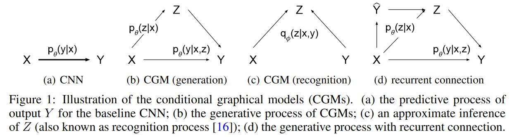

## Learning Structured Output Representation using Deep Conditional Generative Models

### Deep Conditional Generative Models for Structured Output Prediction

在深度条件生成网络(Deep CGM)中包含三种变量，输入变量$\mathrm{x}$，隐变量$\mathrm{z}$和输出变量$\mathrm{y}$。DCGM通过最大化条件对数似然来训练，模型的变分下界可以写作：
$$
\log p_\theta(\mathrm{y}\mid \mathrm{x}) \ge -\mathbb{KL}(q_\phi(\mathrm{z}\mid \mathrm{x,y})\| p_\theta(\mathrm{z\mid x})) + \mathbb{E}_{q_\phi(\mathrm{z\mid x,y})}\log p_\theta(\mathrm{y\mid x,z})
$$
