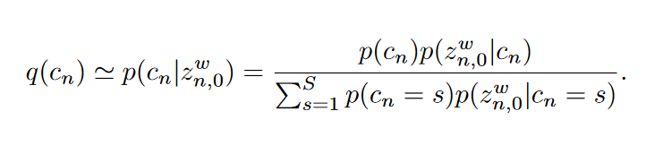

# Deep Markov Spatio-Temporal Factorization

## Introduction
因子分析是用低维的因子来描述高维数据的方法。换句话说，因子分析用$T$个时序和$D$个空间维度来表示数据$Y\in \mathbb{R}^{T\times D}$，即
$$
Y \simeq W^TF
$$
其中$W\in \mathbb{R}^{K\times T},K\ll D$表示时间因子，$F\in \mathbb{R}^{K\times D}$为空间因子。

## Deep Markov Spatio-Temporal Factorization
### Model Structure and Variational Inference

DMSFT定义了一个分层深度生成模型，对于$N$个数据$\{Y_n\}_{n=1}^N$：
$$
\begin{aligned}

Y_n & \sim \operatorname{Norm}\left(W_n^{\top} F_n, \sigma^{\mathrm{Y}} I\right) \\

W_n & \sim \operatorname{Norm}\left(\mu_\theta^{\mathrm{W}}\left(Z_n\right), \sigma_\theta^{\mathrm{W}}\left(Z_n\right)\right) \\

F_n & =\Phi\left(H_n\right), \quad H_n \sim \operatorname{Norm}\left(\mu_\theta^{\mathrm{F}}\left(Z_n\right), \sigma_\theta^{\mathrm{F}}\left(Z_n\right)\right) \\

Z_n & \sim p_\theta(Z)

\end{aligned}
$$
其中$p_\theta(Z)$为深度生成马尔可夫先验。其中$\sigma^{\mathrm{Y}}$表示观测误差。

我们采用随机变分方法来进行训练：
$$
\begin{aligned}

\mathcal{L}(\theta, \phi) & =\mathbb{E}_{q_\phi(W, H, Z)}\left[\log \frac{p_\theta(Y, W, H, Z)}{q_\phi(W, H, Z)}\right] \\

& =\log p_\theta(Y)-\operatorname{KL}\left(q_\phi(W, H, Z) \| p_\theta(W, H, Z \mid Y)\right)

\end{aligned}
$$
### Model Variants

>DMSTF的三种变体。

我们引入了一系列事件依赖的权重embedding $z_t^w$来定义权重矩阵$W$的每一行$w_t$的分布。进一步，因子矩阵的$K$行从一个共享的因子先验中采样得到，这个先验以因子embedding $z^f$为条件。
+ (a)图：对模型结构进行了简化，假设因子参数$H_n$和embeddings $z_n^f$在实例间是不变的。
+ (b)图：对每个实例添加了额外的离散变量$c$，鼓励在时间上一个多模态表示，可以用于聚类。
+ (c)图：模型引入了观测控制变量序列，用one-hot向量进行编码$\{u_0,\cdots,u_{T-1}\}$，控制分布$p_\theta(z_t^w\mid z_{t-1}^w, u_{t-1})$。

### Parameterization of the Generative Distribution

我们定义模型c中的依赖关系为：

令$Z = \{z^w, z^f\}$，我们的概率可以分解为：

**Markoovian Temporal Latent**：
$$
\mu_{z_t^w} = (1 - g)\bullet \mathbb{L}_{\theta}(z_{t-1}^w) + g\bullet \mathbb{F}_{\theta}(z_{t-1}^w,u_{t-1})
$$
其中$\mathbb{L}$为线性映射，$\mathbb{F}$为神经网络的非线性映射，$\bullet$表示元素级别的相乘，$g\in [0,1]$。

**Clustering Latent**：我们假设每一个序列$Y_n$属于$S$个可能状态中的一个，由类别变量$c_n$确定。其中$c_n\sim \text{Cat}(\pi), \pi = [\pi_1,\cdots,\pi_S]$。我们假设第一个时间隐变量$z_{n,0}^w$来自混合高斯分布：
$$
p_\theta(z_{n,0}^w\mid c_n = s) = \text{Norm}(\mu_s, \Sigma_s)
$$
**Temporal & Spatial Factors**：我们参数化对角高斯分布$p_\theta(w_t\mid z_t^w)$和因子参数$p_\theta(H\mid z^f)$用神经网络。$z^f\sim \text{Norm}(0,I)$。空间因子变量$H$依赖于任务本身，TFA模型参数$H_k = \{\rho_k, \gamma_k\}$：
$$
F_{kd}(\rho_k,\gamma_k) = \exp\left(-\frac{\|\rho_k - \gamma_k\|^2}{\exp(\gamma_k)}\right)
$$
而在交通预测实验中，我们不使用任何函数来学习空间因子，因此$H$直接通过高斯分布的均值和协方差参数化为$\{F_{kd}\}_{k=1,d=1}^{K,D}$，即$\Phi$为恒等映射。

### Parameterization of the Variational Distributions
我们假设变量$\{c,z^f, W, H\}$(mean-field)变分分布以及一个结构化变分分布$q_\phi(z_{1:T}^w\mid w_{1:T})$，因此：

我们假设这些变分分布都为高斯并且引入可训练的变分参数$\lambda$作为高斯的均值和协方差对角元素：

而对于结构变分分布$q_\phi(z_{1:T}^w\mid w_{1:T})$，我们使用双向RNN：

我们用$p(c_n\mid z_{n,0}^w)$来近似变分分布$q(c_n)$：

### Evidence Lower Bound(ELBO) for DMSTF
我们令$\mathcal{Z} = \{W,H,Z\}$，则：

进一步整理：

考虑到$\mathbb{KL}(q,p) = \mathbb{E}_q[\log \frac{q}{p}]$，我们可以把上式整理为：
$$
\mathcal{L}(\theta,\phi) = \sum_{n=1}^N \left(\mathcal{L}_n^\text{rec} + \mathcal{L}_n^H + \mathcal{L}_n^C + \sum_{t=1}^T(\mathcal{L}_{t,n}^{z^w} + \mathcal{L}_{t,n}^W)\right)
$$
其中：

