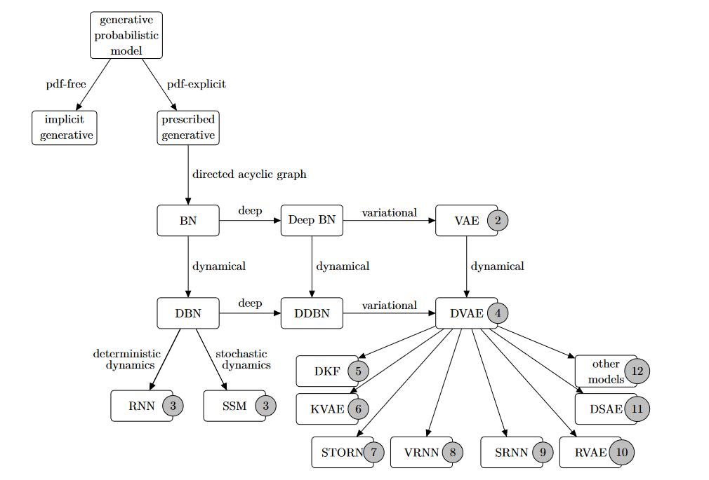
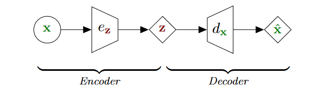
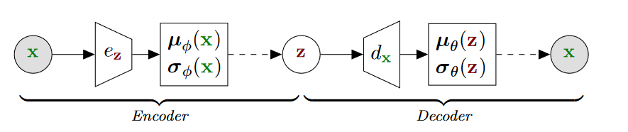

# Dynamical Variational Autoencoders

## Variational Autoencoders

### Principle

自编码器可以表示为如下：

> 其中菱形表示确定性的变量，$z$的维度要比$x$小。

### VAE generative model

形式上，VAE解码器定义为：
$$
p_\theta(\mathrm{x},\mathrm{z}) = p_{\theta_\mathrm{x}}(\mathrm{x}\mid \mathrm{z})p_{\theta_\mathrm{z}}(\mathrm{z})
$$
其中
$$
p_{\theta_z}(z) = \mathcal{N}(\mathrm{z};\mathrm{0}_L,\mathrm{I}_L)
$$

## Definition of Dynamical VAEs

### Generative model

