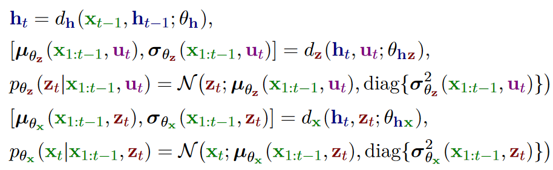
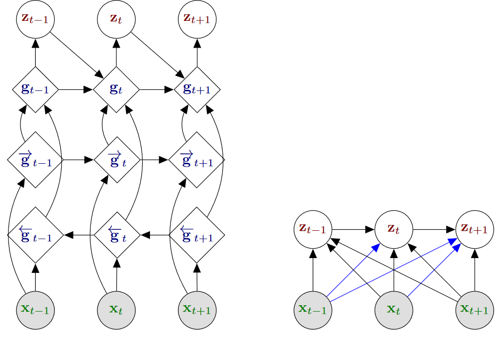

# Dynamical Variational Autoencoders

## Variational Autoencoders

### Principle

自编码器可以表示为如下：

> 其中菱形表示确定性的变量，$z$的维度要比$x$小。

### VAE generative model

形式上，VAE解码器定义为：
$$
p_\theta(\mathrm{x},\mathrm{z}) = p_{\theta_\mathrm{x}}(\mathrm{x}\mid \mathrm{z})p_{\theta_\mathrm{z}}(\mathrm{z})
$$
其中
$$
p_{\theta_z}(z) = \mathcal{N}(\mathrm{z};\mathrm{0}_L,\mathrm{I}_L)
$$

## Definition of Dynamical VAEs

### Generative model

DVAE考虑序列数据$x_{1:T} = \{x_t \in \mathbb{R}^F\}_{t=1}^T$，隐随机变量序列$z_{1:T} = \{z_t\in \mathbb{R}^L\}_{t=1}^T$。我们需要确定联合分布$p_\theta(x_{1:T},z_{1:T})$。

#### Structure of dependencies in the generative model

如果时间$t$时的变量依赖于$t-1$时刻或者以及之前的时刻，我们说依赖是因果的(causal)，如果依赖于之后时刻的变量，我们认为其是反因果的(anticausal)，如果既依赖于过去、现在，也依赖于未来，则认为是无因果的(noncausal)。

一般因果模型用的比较多，在DVAE中，联合分布可以分解为：

$$
p(x_{1:T},z_{1:T}) = \prod_{t=1}^T p(x_t,z_t\mid x_{1:t-1},z_{1:T-1}) = \prod_{t=1}^T p(x_t\mid x_{1:t-1},z_{1:t})p(z_t\mid x_{1:t-1},z_{1:t-1})
$$

在SSM中，我们通常做出以下假设：

$$
\begin{aligned}
    p(x_t\mid x_{1:t-1},z_{1:t}) &= p(x_t\mid z_t)\\
    p(z_t\mid x_{1:t-1}, z_{1:t-1}) &= p(z_t\mid z_{t-1})
\end{aligned}
$$

#### Parameterization with (R)NNs

我们以下面的依赖关系为例子进行建模：

$$
\begin{aligned}
    p(z_t \mid x_{1:t-1},z_{1:t-1}) &= p(z_t\mid x_{1:t-1})\\
    p(x_t\mid x_{1:t-1},z_{1:t}) &= p(x_t\mid x_{1:t-1},z_t)
\end{aligned}
$$

> 左边为概率图模型，说明了依赖关系；中间图使用一个RNN的中间状态变量$h_t$来生成$x_t,z_t$，右边使用两个不同中间变量$h_t,k_t$来分别产生$x_t, z_t$。

假设所有分布都是高斯分布，第一种实现方法可以表示为：

而第二种实现方法可以表示为：

### Inference model

我们需要用推断模型$q_\phi(z_{1:T}\mid x_{1:T})$来近似不可追踪的后验$p_\theta(z_{1:T}\mid x_{1:T})$。

#### Exploiting D-separation

D-separation 是基于贝叶斯网络推断出的三条原则，对于三个随机变量$a,b,c$：

+ *tail-to-tail*，对于概率图中$a\leftarrow c \rightarrow b$结构，有$p(a,b\mid c) = p(a\mid c) p(b\mid c)$
+ *head-to-tail*：对于结构$a\rightarrow c \rightarrow b$或者$a\leftarrow c \leftarrow b$，我们有$p(a,b\mid c) = p(a\mid c)p(b\mid c)$
+ *head to head*：对于结构$a\rightarrow c \leftarrow b$，我们有$p(a,b\mid c) \neq p(a\mid c)p(b\mid c)$

我们考虑一个贝叶斯网络，$A,B,C$为任意不重叠的节点集。在给定$C$的情况下$A,B$为D-separated的如果连接任何$A$中节点和$B$中任何节点的所有路径都被阻断。一个路径是被阻断的在给定观测到的节点$O$的情况下，如果它包含一个节点$c$满足下列之一：

+ $c$为*tail-to-tail*节点并且$c\in O$
+ $c$为*head-to-tail*节点并且$c\in O$
+ $c$为*head-to-head*节点并且$c\notin O$

那么我们有$P(A,B\mid C) = p(A\mid C)p(B\mid C)$。

#### Noncausal and causal inference

我们的推断模型建模为：

$$
q_\phi(z_{1:T}\mid x_{1:T}) = \prod_{t=1}^T q_\phi(z_t\mid z_{1:t-1},x_{1:T})
$$

在每个时间点都结合了过去、现在、未来的观测信息，我们使用双向RNN。

#### Sharing variables and parameters at generation and inference

我们可以看到分布$p_{\theta_z}(z_t\mid x_{1:t-1},z_{1:t-1})$和对应的推断模型$q_\phi(z_t\mid z_{1:t-1}, x_{1:T})$在随机变量依赖方面的相似之处。一个共同点是它们都依赖于$z_{1:t-1}$，因此我们可以用同一个RNN来进行建模。

之后我们用$h_t$表示解码器(decoder)的内部状态，$g_t$表示编码器(encoder)的内部状态，如果两者不同的话，否则统一使用$h_t$。

### VLB and training of DVAEs

在DVAE中，我们的VLB变为了：

我们可以将其展开：

我们可以将VLB展开为：

## Deep Kalman Filters

## Kalman Variational Autoencoders

KVAE增加了一个新的随机变量，表示为$a_t$。这可以让我们将模型分为两个部分，一个深度特征提取器将$a_t$和$x_t$联系在一起，和一个在$z_t$和"新的观测"$a_t$上的动态模型。

> KVAE的图模型

### Generative model

公式(6.1)和(6.3)都是**线性函数**。这个网络起着深度特征提取器的作用，$a_t$的维度比$x_t$要小。$a_t$编码$x_t$中的信息，而$z_t$则被用来编码动态特征。

我们的联合概率分布可以编码为：

$$
p_\theta(x_{1:T},a_{1:T},z_{1:T}) = \prod_{t=1}^Tp_{\theta_x}(x_t\mid a_t)p_{\theta_a}(a_t\mid z_t)p_{\theta_z}(z_t\mid z_{t-1})
$$

并且我们也有：

### Inference model

分解：

其中

为神经网络。

> KVAE的推断时的图模型

### Training

## STOchastic Recurrent Networks

STORN是第一个DVAE模型，将内部确定性状态$h_t$和内部随机状态$z_t$结合在一起。

> STORN的图模型

### Generative model

在STORN中，$z_t$假设是独立同分布的，来自于标准高斯分布：

$$
p_{\theta_z}(z_{1:T}) = \prod_{t=1}^Tp_{\theta_z}(z_t) \quad p_{\theta_z} = \mathcal{N}(z_t;0,I_L)
$$

$h_t$和$z_t$的关系比较复杂，$h_t$的解释是一个确定性的状态，但是其为$z_t$的函数，因此也是随机的。$h_t$的递归展开考虑$h_t$为一个确定性函数，$h_t = h_t(x_{1:t-1},z_{1:t})$。我们考虑$h_t$服从狄拉克分布。可以证明联合分布$p_\theta(x_{1:T},z_{1:T},h_{1:T})$对$h_{1:T}$积分：

$$
p_\theta(x_{1:T},z_{1:T}) = \prod_{t=1}^Tp_{\theta_x}(x_t\mid h_t(x_{1:t-1},z_{1:t}))p(z_t)
$$

我们也可以推导出条件分布：

$$
p_{\theta_x}(x_{1:T}\mid z_{1:T}) = \prod_{t=1}^Tp_{\theta_x}(x_t\mid h_t(x_{1:t-1},z_{1:t}))
$$

### Inference model

## Disentangled Sequential Autoencoders

我们给隐变量序列$z_{1:T}$添加序列级别的隐向量$v$。因此，$z_t$被用来编码时间依赖数据特征，而$v$假设可以用来编码其他任何特征。

### Generative model

$$
p_\theta(x_{1:T},z_{1:T},v) = p_{\theta_v}(v)\prod_{t=1}^Tp_{\theta_x}(x_t\mid z_t,v)p_{\theta_z}(z_t\mid z_{1:t-1})
$$

动态模型$p_{\theta_z}(z_t\mid z_{1:t-1})$为高斯分布，参数来自LSTM。观测模型$p_{\theta_x}(x_t\mid z_t,v)$为高斯分布，参数来自于DNN。

> DSAE的概率图

### Inference model

我们的后验分布按下面给出：

对于近似变分分布$q_\phi$，有两个模型，第一个为分解模型(factorized)：
$$
q_\phi(z_{1:T},v\mid x_{1:T}) = q_{\phi_v}(v\mid x_{1:T})\prod_{t=1}^T q_{\phi_z}(z_t\mid x_t)
$$

另一种被称为"full"：

$$
q_\phi(z_{1:T},v\mid x_{1:T}) = q_{\phi_v}(v\mid x_{1:T})q_{\phi_v}(z_{1:T}\mid v, x_{1:T})
$$

我们的full模型可以写作：

对于整个序列$z_{1:T}$我们有：

$$
q_{\phi_z\mid v, x_{1:T}} = \prod_{t=1}^T q_{\phi_z}(z_t\mid v, x_{1:T})
$$

### Training

