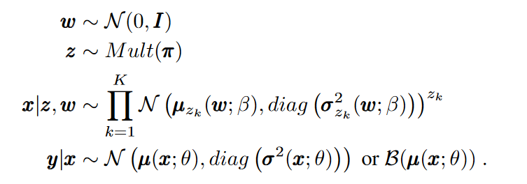
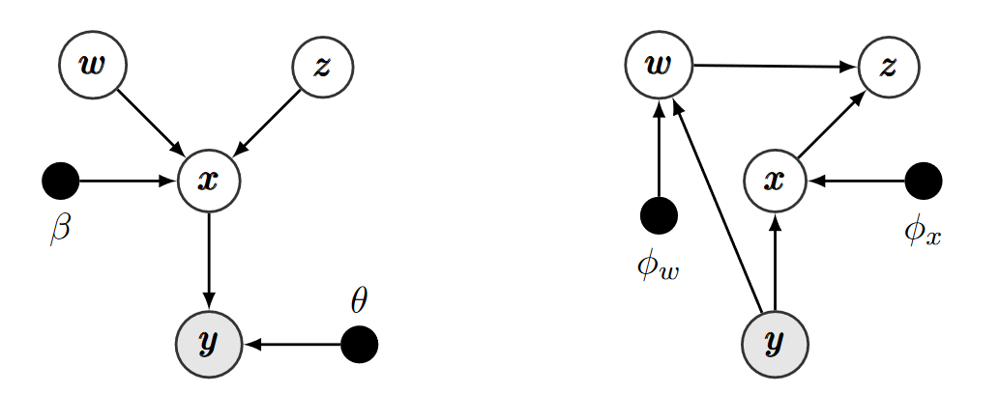
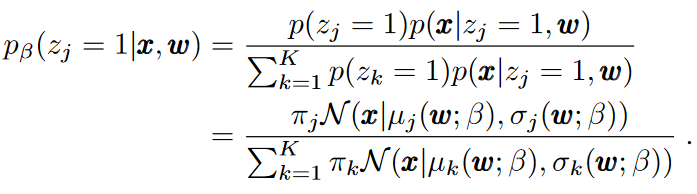
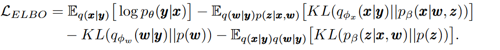

## Deep Unsupervised Clustering With Gaussian Mixture Variational Autoencoders

考虑生成模型$p_{\beta,\theta}(\mathrm{y,x,w,z}) = p(\mathrm{w})p(\mathrm{z})p_\beta(\mathrm{x\mid w,z})p_\theta(\mathrm{y\mid x})$，当观测样本$\mathrm{y}$是从一系列隐变量$\mathrm{x,w,z}$中通过下列过程中产生的：

那么我们的log-evidence lower bound(ELBO)可以定义为：
$$
\mathcal{L}_{\text{ELBO}} = \mathbb{E}_q\left[\log\frac{p_{\beta,\theta}(y,x,w,z)}{q(x,w,z\mid y)}\right]
$$
我们考虑`mean-field`变分族$q(x,w,z\mid y) = \prod_iq_{\phi_x}(x_i\mid y_i)q_{\phi_w}(w_i\mid y_i)p_\beta(z_i\mid x_i,w_i)$，其中$i$表示数据点的索引。为了简化符号，我们去除$i$一次只考虑一个数据点。我们用recognition网络$\phi_x,\phi_w$来参数化变分因子。我们推导$z$后验，$p_\beta(z\mid x,w)$为：

下界可以写作：

