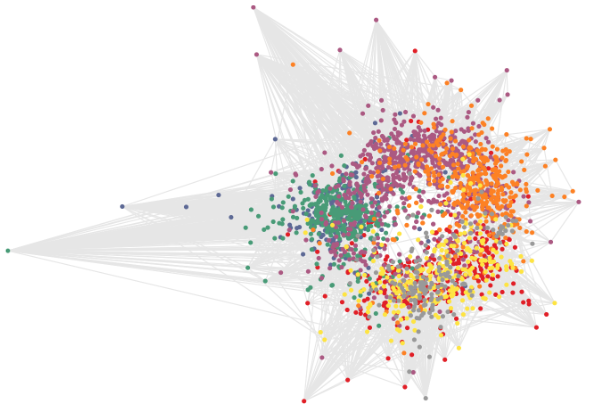

# Variational Graph Auto-Encoders

## A latent variable model for graph-structured data

我们引入变分图自编码器(variational graph auto-encoder(VGAE))。此网络利用隐变量并且可以捕获无向图的可解释的隐变量表示。

> 在Cora引用网络数据集上无监督VGAE的隐变量空间，灰色线表示引用关系。

我们使用图卷积神经网络来作为编码器，用内积作为解码器。

**定义**：给定一个无向无权图$\mathcal{G} = (\mathcal{V},\mathcal{E})$，其中$N = |\mathcal{V}|$节点。我们引入邻接矩阵$\mathrm{A}$(我们假设对角元素都为$1$，即都是自连接的)和其度矩阵(degree matrix)$\mathrm{D}$。我们进一步引入随机隐变量$\mathrm{z}_i$，总结为$N\times F$矩阵$\mathrm{Z}$。节点特征被总结为$N\times D$矩阵$\mathrm{X}$。

> 度矩阵$\mathrm{D}$是一个对角矩阵，元素表示每一个节点的度。

**Inference model**：我们介绍一个简单的推理模型，由两层GCN组成：

$$
q(\mathrm{Z}\mid \mathrm{X,A}) = \prod_{i=1}^N q(\mathrm{z}_i\mid \mathrm{X,A})\quad q(\mathrm{z}_i\mid \mathrm{X,A}) = \mathcal{N}({\mathrm{z}_i\mid \mathrm{\mu}_i, \text{diag}(\mathrm{\sigma}_i^2)})
$$

这里$\mathrm{\mu} = \text{GCM}_{\mathrm{\mu}}(\mathrm{X,A}), \log\mathrm{\sigma} = \text{GCN}_{\mathrm{\sigma}}(\mathrm{X,A})$。两层GCN定义为$\text{GCN}(\mathrm{X,A}) = \mathrm{\tilde{A}}\text{ReLU}(\mathrm{\tilde{A}XW_0})\mathrm{W}_1$，权重矩阵$\mathrm{W}_i$。

**Generative model**：我们的生成模型为隐变量的内积：

$$
p(\mathrm{A\mid Z}) = \prod_{i=1}^N\prod_[j=1]^N p(A_{ij}\mid \mathrm{z_i,z_j})\quad p(A_{ij}=1\mid \mathrm{z_i,z_j}) = \sigma(\mathrm{z_i^Tz_j})
$$
