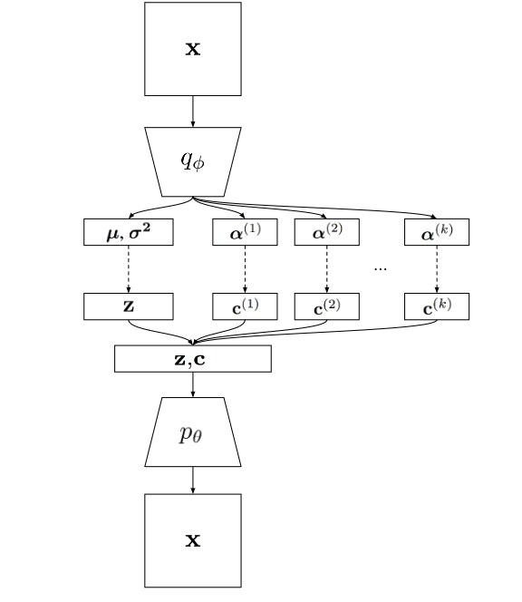

## Learning Disentangled Joint Continuous and Discrete Representations

分离(disentangles)表示被定义为这样一种表示，其中表示的单个单元的变化对应于数据变化的单个因素的变化，同时对其他因素不变。

有很多方法可以用于无监督的分离(disentanglement)，两种比较常见和实用的是`InfoGAN`和$\beta-$VAE. `InfoGAN`是基于生成对抗网络的，可以用于建模连续或者离散因子，但是训练过程中不是很稳定。而$\beta-$VAE训练过程稳定，但是不能建模离散因子变量，我们将这两种方法的有点结合起来得到我们现在的模型。

### Analysis of $\beta-$VAE

$\beta-$VAE对数据$\mathrm{x}$和一系列隐变量$\mathrm{z}$进行建模，学习连续分离表示，通过最大化下面的目标函数：
$$
\mathcal{L}(\theta,\phi) = \mathbb{E}_{q_\phi(\mathrm{z\mid x})}[\log p_\theta(\mathrm{x\mid z})] - \beta \mathbb{KL}(q_\phi(\mathrm{z\mid x})\| p(\mathrm{z}))
$$
我们可以进一步分析KL散度项的作用，在训练过程中，上述目标函数将会在数据$\mathrm{x}$的期望上优化，则KL项变为：
$$
\begin{aligned}
\mathbb{E}_{p(\mathbf{x})}\left[D_{K L}\left(q_\phi(\mathbf{z} \mid \mathbf{x}) \| p(\mathbf{z})\right)\right] & =I(\mathbf{x} ; \mathbf{z})+D_{K L}(q(\mathbf{z}) \| p(\mathbf{z})) \\
& \geq I(\mathbf{x} ; \mathbf{z})
\end{aligned}
$$

> 互信息：
> $$
> I(\mathrm{x;z}) = \int p(x,z)\log \frac{p(x,z)}{p(x)p(z)}dxdz
> $$

惩罚互信息项可以提升分离(disentanglement)但是会增大重建误差。表示可控信息容量为$C$，目标函数表示为：
$$
\mathcal{L}(\theta,\phi) = \mathbb{E}_{q_\phi(\mathrm{z\mid x})}[\log p_\theta(\mathrm{x\mid z})] - \gamma |\mathbb{KL}(q_\phi(\mathrm{z\mid x})\| p(\mathrm{z}))-C|
$$
其中$\gamma$为驱使KL散度去接近容量$C$的项。在训练过程中逐渐提升$C$来控制模型可以编码的信息。

### Joint VAE Model

令$\mathrm{z}$表示连续隐变量而$\mathrm{c}$表示离散隐变量，我们定义联合后验分布$q_\phi(\mathrm{z,c\mid x})$，先验$p(\mathrm{z,c})$和似然$p_\theta(\mathrm{x\mid z,c})$，并且假设隐变量是独立的，即$q_\phi(\mathrm{z,c\mid x}) = q_\phi(\mathrm{z\mid x})q_\phi(\mathrm{c\mid x})$和$p(\mathrm{z,c})=p(\mathrm{z})p(\mathrm{c})$。则我们的损失函数变为：
$$
\mathcal{L}(\theta, \phi)=\mathbb{E}_{q_\phi(\mathbf{z}, \mathbf{c} \mid \mathbf{x})}\left[\log p_\theta(\mathbf{x} \mid \mathbf{z}, \mathbf{c})\right]-\gamma\left|D_{K L}\left(q_\phi(\mathbf{z} \mid \mathbf{x}) \| p(\mathbf{z})\right)-C_z\right|-\gamma\left|D_{K L}\left(q_\phi(\mathbf{c} \mid \mathbf{x}) \| p(\mathbf{c})\right)-C_c\right|
$$
其中$C_z,C_c$随着训练过程逐渐增大。

#### Parametrization of continuous latent variables

我们参数化$q_\phi(\mathrm{z\mid x})$为可分解的高斯，如$q_\phi(\mathrm{z\mid x})=\prod_i q_\phi(z_i\mid \mathrm{x})$，其中$q_\phi(z_i\mid \mathrm{x})=\mathcal{N}(\mu_i,\sigma_i^2)$。并且令先验：$p(\mathrm{z}) = \mathcal{N}(0,I)$。

#### Parametrization of discrete latent variables

我们利用Gumbel Max trick来近似**类别分布**。如果$c$为类别变量，每一类的概率分别为$\alpha_1,\alpha_2,\cdots,\alpha_n$，则通过采样$g_k\sim \text{Gumbel}(0,1)$，则使用下列变换：
$$
y_k=\frac{\exp \left(\left(\log \alpha_k+g_k\right) / \tau\right)}{\sum_i \exp \left(\left(\log \alpha_i+g_i\right) / \tau\right)}
$$
我们同样假设$q_\phi(\mathrm{c\mid x}) = \prod_i q_\phi(c_i\mid \mathrm{x})$。先验$p(\mathrm{c})$为均匀Gumbel Sortmax分布的乘积。

#### Architecture

