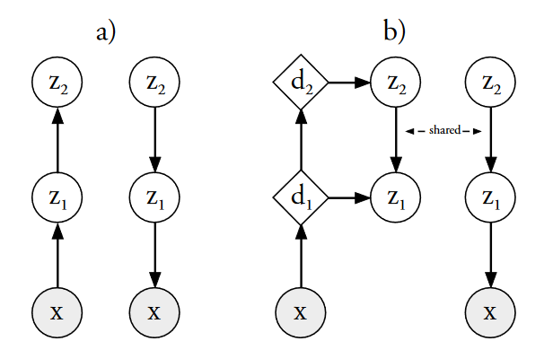

## Ladder Variational Autoencoders

### Introduction

> 普通的VAE和LVAE。LVAE在生成模型和推断模型之间共享信息，其与VAE只在推断模型上存在差异，生成模型是完全一致的。菱形变量表示确定性的变量，而圆形的表示随机变量。

我们的贡献主要分为三点：

+ 一种将近似高斯似然与生成模型相结合的新推理模型，其生成性能优于通常使用的自下而上 VAE 推理。
+ 我们提供了一个详细的学习隐变量分布的研究并且证明LVAE可以学习到一个更深和更具有表示型的分布。
+ 我们证明确定性的热身(deterministic warm-up)过程和批量归一化对训练深度随机网络模型非常重要。

### Method

在生成模型$p_\theta$中，隐变量$\mathrm{z}$被分割为$L$层$\mathrm{z}_i$：
$$
\begin{aligned}
p_\theta(\mathbf{z}) & =p_\theta\left(\mathbf{z}_L\right) \prod_{i=1}^{L-1} p_\theta\left(\mathbf{z}_i \mid \mathbf{z}_{i+1}\right) \\
p_\theta\left(\mathbf{z}_i \mid \mathbf{z}_{i+1}\right) & =\mathcal{N}\left(\mathbf{z}_i \mid \mu_{p, i}\left(\mathbf{z}_{i+1}\right), \sigma_{p, i}^2\left(\mathbf{z}_{i+1}\right)\right), p_\theta\left(\mathbf{z}_L\right)=\mathcal{N}\left(\mathbf{z}_L \mid \mathbf{0}, \mathbf{I}\right) \\
p_\theta\left(\mathbf{x} \mid \mathbf{z}_1\right) & =\mathcal{N}\left(\mathbf{x} \mid \mu_{p, 0}\left(\mathbf{z}_1\right), \sigma_{p, 0}^2\left(\mathbf{z}_1\right)\right) \text { or } P_\theta\left(\mathbf{x} \mid \mathbf{z}_1\right)=\mathcal{B}\left(\mathbf{x} \mid \mu_{p, 0}\left(\mathbf{z}_1\right)\right)
\end{aligned}
$$
则变分下界可以写作：
$$
\begin{aligned}
\log p(\mathbf{x}) & \geq E_{q_\phi(z \mid x)}\left[\log \frac{p_\theta(\mathbf{x}, \mathbf{z})}{q_\phi(\mathbf{z} \mid \mathbf{x})}\right]=\mathcal{L}(\theta, \phi ; \mathbf{x}) \\
& =-K L\left(q_\phi(\mathbf{z} \mid \mathbf{x}) \| p_\theta(\mathbf{z})\right)+E_{q_\phi(\mathbf{z} \mid \mathbf{x})}\left[\log p_\theta(\mathbf{x} \mid \mathbf{z})\right]
\end{aligned}
$$
通过使用重要性加权界限，可以以样本增加$K$倍为代价获得对可能性的严格更严格的界限：
$$
\log p(\mathbf{x}) \geq E_{q_\phi\left(z^{(1)} \mid x\right)} \ldots E_{q_\phi\left(z^{(K)} \mid x\right)}\left[\log \sum_{k=1}^K \frac{p_\theta\left(\mathbf{x}, \mathbf{z}^{(\mathbf{k})}\right)}{q_\phi\left(\mathbf{z}^{(\mathbf{k})} \mid \mathbf{x}\right)}\right] \geq \mathcal{L}_K(\theta, \phi ; \mathbf{x})
$$

#### Variational autoencoder inference model

VAE推断模型可以写作：
$$
\begin{aligned}
q_\phi(\mathbf{z} \mid \mathbf{x}) & =q_\phi\left(\mathbf{z}_1 \mid \mathbf{x}\right) \prod_{i=2}^L q_\phi\left(\mathbf{z}_i \mid \mathbf{z}_{i-1}\right) \\
q_\phi\left(\mathbf{z}_1 \mid \mathbf{x}\right) & =\mathcal{N}\left(\mathbf{z}_1 \mid \mu_{q, 1}(\mathbf{x}), \sigma_{q, 1}^2(\mathbf{x})\right) \\
q_\phi\left(\mathbf{z}_i \mid \mathbf{z}_{i-1}\right) & =\mathcal{N}\left(\mathbf{z}_i \mid \mu_{q, i}\left(\mathbf{z}_{i-1}\right), \sigma_{q, i}^2\left(\mathbf{z}_{i-1}\right)\right), i=2 \ldots L .
\end{aligned}
$$
但是这种方法中生成模型和推断模型是单独优化的，并没有交集。其参数可以建模为：
$$
\begin{aligned}
\mathbf{d}(\mathbf{y}) & =\operatorname{MLP}(\mathbf{y}) \\
\mu(\mathbf{y}) & =\operatorname{Linear}(\mathbf{d}(\mathbf{y})) \\
\sigma^2(\mathbf{y}) & =\text { Softplus }(\text { Linear }(\mathbf{d}(\mathbf{y})))
\end{aligned}
$$

#### Ladder variational autoencoder inference model

我们的参数优化为：
$$
\begin{aligned}
\mathbf{d}_n & =\operatorname{MLP}\left(\mathbf{d}_{n-1}\right) \\
\hat{\mu}_{q, i} & =\operatorname{Linear}\left(\mathbf{d}_i\right), i=1 \ldots L \\
\hat{\sigma}_{q, i}^2 & =\operatorname{Softplus}\left(\text { Linear }\left(\mathbf{d}_i\right)\right), i=1 \ldots L
\end{aligned}
$$
其中$\mathrm{d}_0 = \mathrm{x}$。

接下来是随机向下传递递归计算近似后验分布和生成分布：
$$
\begin{gathered}
q_\phi(\mathbf{z} \mid \mathbf{x})=q_\phi\left(\mathbf{z}_L \mid \mathbf{x}\right) \prod_{i=1}^{L-1} q_\phi\left(\mathbf{z}_i \mid \mathbf{z}_{i+1}\right) \\
\sigma_{q, i}=\frac{1}{\hat{\sigma}_{q, i}^{-2}+\sigma_{p, i}^{-2}} \\
\mu_{q, i}=\frac{\hat{\mu}_{q, i} \hat{\sigma}_{q, i}^{-2}+\mu_{p, i} \sigma_{p, i}^{-2}}{\hat{\sigma}_{q, i}^{-2}+\sigma_{p, i}^{-2}} \\
q_\phi\left(\mathbf{z}_i \mid \cdot\right)=\mathcal{N}\left(\mathbf{z}_i \mid \mu_{q, i}, \sigma_{q, i}^2\right)
\end{gathered}
$$
其中$\mu_{q,L}=\hat{\mu}_{q,L},\sigma^2_{q,L}=\hat{\sigma}^2_{q,L}$.

#### Warm-up from deterministic to variational autoencoder

为了防止训练在早期崩溃，我们将损失函数修改为：
$$
\mathcal{L}(\theta,\phi;\mathrm{x})_T = -\beta\mathbb{KL}(q_\phi(z\mid x)\| p_\theta(\mathrm{z})) + \mathbb{E}_{q_\phi(z\mid x)}[\log p_\theta(\mathrm{x\mid z})]
$$
其中$\beta$在前$N_t$迭代是由$0$线性变换到$1$。

