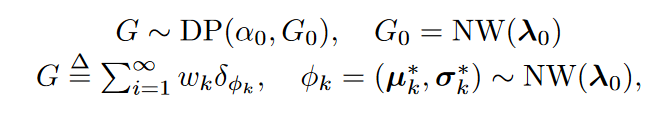
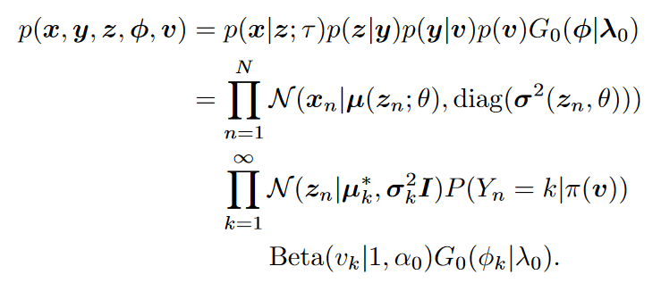
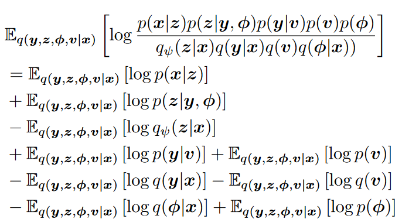

# Streaming Adaptive Nonparametric Variational Autoencoder

## Generative Process of AdapVAE

我们的AdapVAE可以描述为：

我们假设$\sigma_k^\star$是对角矩阵，NW表示Normal-Wishart分布，参数为$\lambda_0$，其为基分布(base distribution)$G_0$。NW的超参数$\lambda_0 = (m_0, \beta_0, \nu_0, W_0) = (0, 0.2, D+2, I_{D\times D})$，其中$D$为隐变量$\mathrm{z}$的维度。数据可以被认为是从下列过程中产生的：

+ 采样$V_i\mid \alpha_0 \sim \text{Beta}(1,\alpha_0),i=\{1,2,\cdots,\}$
+ 采样$(\mu_k^\star,\sigma_k^\star)\mid G_0\sim G_0,k=\{1,2,\cdots\}$
+ 对于第$n$个数据点$x_n$：
	+ 采样聚类类别$Y_n\sim \text{Cat}(\pi(v))$，其中$$\pi_k = \begin{cases}v_1&\text{if }k=1\\v_k\prod_{j=1}^{k-1}(1-v_j)&\text{if }k>1\end{cases}$$
	+ 采样隐变量$Z_n\mid Y_n = k\sim \mathcal{N}(\mu_k^\star, \sigma_k^\star)$
	+ 生成第$n$个观测$x_n$，通过$X_n\mid Z_n = z_n \sim \mathcal{N}(\mu(z_n;\theta),\sigma^2(z_n;\theta))$，我们有$(\mu(z_n;\theta),\sigma^2(z_n,\theta))=g_\theta(z_n;\tau)$作为decoder。
我们的联合分布为：

## Streaming Variational Inference for AdapVAE

### ELBO Derivation

我们无法追踪后验分布$p(y,z,\phi, v\mid x)$，但是我们可以选择变分分布$q(y,z,\phi,v\mid x)$。给定生成过程，数据$x$的对数似然为：
$$
\log p(x) = \log \int_z\sum_y\int_v\int_\phi p(x,y,z,\phi,v)dzdvd\phi
$$
使用琴生不等式，我们可以得到：
$$
\log p(x) \ge \mathbb{E}_{q(y,z,\phi,v\mid x)}\left\{\log \frac{p(x,y,z,\phi,v)}{q(y,z,\phi,v\mid x)}\right\} = \mathcal{L}_{\text{ELBO}}(x)
$$
将其展开，可得：

