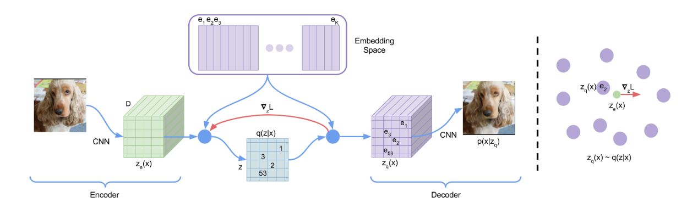

## Neural Discrete Representation Learning

我们的模型：向量化变分自编码器(`Vector Quantised-Variational AutoEncoder`(VQ-VAE))与一般的VAE有两点不同：

+ 编码器网络输出离散值
+ 先验是学习得到而不是静态的

## VQ-VAE

VAE包含下列组成：一个编码器$q(z\mid x)$，其中$z$为离散随机变量，一个先验分布$p(z)$，和一个解码器$p(x\mid z)$。

### Discrete Latent variables

我们定义embedding space $e\in \mathbb{R}^{K\times D}$，$K$为离散隐空间的大小(如一个$K$-way分类)，而$D$为每一个隐embedding向量$e_i$的维度。注意有$K$个embedding向量$e_i \in \mathbb{R}^D, i\in 1,2,\cdots,K$。模型取输入$x$，传入到编码器得到输出$z_e(x)$。离散隐变量$z$通过最近邻查看，使用embedding向量$e_k$。解码器的输入是对应的embedding向量$e_k$。

> 左边：对VQ-VAE的描述。右：embedding space可视化。
>
> 编码器$z(x)$的输出映射到最近的点$e_2$。梯度$\nabla_z L$将会推动编码器改变其输出。

后验分类分布$q(z\mid x)$概率定义为one-hot，如下：
$$
q(z=k\mid x)   = \begin{cases}1\quad &\text{for }k = \arg\min_j \|z_e(x) - e_j\|_2\\
0&\text{otherwise}&\text{}\end{cases}
$$
而
$$
z_q(x) = e_k, \quad \text{where }\quad k=\arg\min_j \|z_e(x) - e_j\|_2
$$

### Learning

看到上式并没有梯度，我们可以把$z_e(x)$的梯度复制到$z_q(x)$。我们的损失函数定义为：
$$
L = \log p(x\mid z_q(x)) + \|\text{sg}[z_e(x)] - e\|_2^2  + \beta\|z_e(x) - \text{sg}[e]\|_2^2
$$
其中sg表示梯度截断算子，在前向计算是等价于等价函数，后向梯度传播时梯度为$0$。

整个模型的对数似然$\log p(x)$可以计算为：
$$
\log p(x) = \log \sum_k p(x\mid z_k)p(z_k)
$$

### Prior

离散先验隐分布$p(z)$是一个分类分布，并且可以依赖feature map的其他$z$中实现自回归。当训练VQ-VAE，先验保持常数和均匀。训练之后，我们拟合一个$z$上的自回归分布，因此我们可以通过原始采样法(ancestral sampling)生成$x$。