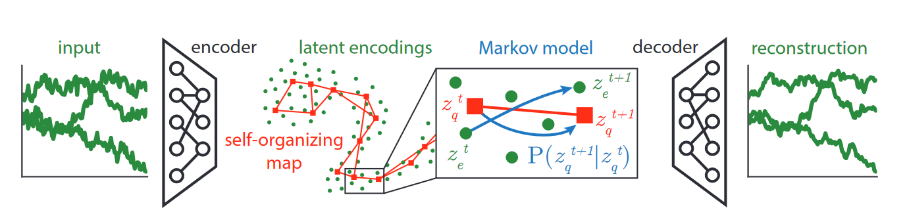

# SOM-VAE: INTERPRETABLE DISCRETE REPRESENTATION LEARNING ON TIME SERIES

本文的主要贡献主要在于：
+ 提出了一个来解释时间序列离散表示学习的框架。
+ 显示了表示学习框架中的隐概率模型提高了时间序列表示的聚类和可解释性
+ 显示模型在基准数据和真实世界医疗数据集上的卓越聚类性能，它还有助于下游任务
## Probabilistic SOM-VAE
我们的模型结合了自组织映射(self-organizing maps)，变分自解码器和概率模型的观点。

### Introducing Topological Structure In the Latent Space

> 我们的模型大致可以描述为上图，首先我们的输入通过encoder映射到latent encodings中的$z_e^t$，之后通过self-organizing map寻找离$z_e^t$最近的离散表示$z_q^t$，之后通过我们的马尔可夫模型由$z_q^t$生成$z_q^{t+1}$，最后通过decoder重建时间序列。

我们详细看一下上图的流程，首先输入$x\in \mathbb{R}^d$被映射到隐编码(latent encoding) $z_e \in \mathbb{R}^m$通过计算$z_e = f_\theta(x)$。之后编码被分配给embedding $z_q \in \mathbb{R}^m$，在embeddings字典中$z_q\in E = \{e_1,\cdots,e_k\mid e_i \in \mathbb{R}^m\}$，通过采样$z_q\sim p(z_q\mid z_e)$。在本文中我们采用的是距离$z_e$最近的点，即$p(z_q\mid z_e) = \mathbb{1}[z_q = \arg\min_{e\in E}\|z_e-e\|^2]$。重建$\hat{x}$可以通过$\hat{x}=g_\phi(z)$，我们可以重建两个$\hat{x}_e = g_\phi(z_e),\hat{x}_q=g_\phi(z_q)$。

为了得到一个拓扑上可解释的邻接结构，embeddings被连结来形成一个self-organizing map(SOM)。一个SOM包含$k$个节点$V = \{v_1,\cdots,v_k\}$，每个节点对应于数据空间中的嵌入$e_v\in \mathbb{R}^d$和在低维离散空间的表示$m_v\in M$，其中一般$M\subset \mathbb{N}^2$。在数据集$\mathcal{D}=\{x_1,\cdots,x_n\}$训练的过程中，一个winner节点$\tilde{v}$被选择对于每个点$x_i$根据$\tilde{v}=\arg\min_{v\in V}\|e_v-x_i\|^2$。每一个节点$u\in V$的embedding向量根据下式更新：
$$
e_u\leftarrow e_u + N(m_u,m_{\tilde{v}})\eta(x_i - e_u)
$$
其中$\eta$为学习率并且$N(m_u,m_{\tilde{v}})$为邻接函数，我们可以定义不同的邻接函数。

我们选用二维的SOM以便于可视化。由于我们要做到端到端的训练，因此我们不能用传统的SOM训练算法进行迭代，我们用下列方式进行训练。对于任何时间一个位于位置$(i,j)$的embedding $e_{i,j}$被更新，同样也更新在它的邻域$N(e_{i,j})$中的embedding。邻域定义为：$N(e_{i,j}) = \{e_{i-1,j},e_{i+1,j},e_{i,j-1},e_{i,j+1}\}$。
单个输入$x$的损失函数为：
$$
\mathcal{L}_{\text{SOM-VAE}}(x,\hat{x}_q,\hat{x}_{e}) = \mathcal{L}_{\text{reconstruction}}(x,\hat{x}_q,\hat{x}_e) + \alpha \mathcal{L}_{\text{commitment}}(x) + \beta \mathcal{L}_{\text{SOM}}(x)
$$
其中$x, z_e,z_q,\hat{x}_e,\hat{x}_q$为上面定义的而$\beta,\alpha$为权重超参数。
第一项为重建误差：
$$
\mathcal{L}_{\text{reconstruction}}(x,\hat{x}_q,\hat{x}_e) = \|x-\hat{x}_q\|^2 + \|x-\hat{x}_e\|^2
$$
$\mathcal{L}_{\text{commitment}}$希望编码和赋值的SOM节点可以尽可能近，我们将其定义为：
$$
\mathcal{L}_{\text{commitment}}(x) = \|z_e(x)-z_q(x)\|^2
$$
SOM损失$\mathcal{L}_{\text{SOM}}$定义为：
$$
\mathcal{L}_{\text{SOM}}(x) = \sum_{\tilde{e}\in N(z_q(x))}\|\tilde{e}-\text{sg}[z_e(x)]\|^2
$$
其中$N(\cdot)$为在离散空间中的邻域，而$\text{sg}[\cdot]$为梯度停止算子，在前向过程中并不会改变输出，但在后向过程中会将梯度设置为$0$。

### Encouraging Smoothness over time
我们最终的目的是以一个可解释的方式预测时间序列的发展。为了达到这个目的，我们使用时间概率模型。我们也需要学习状态之间的转移，损失函数为：
$$
\mathcal{L}(x^{t-1},x^t,\hat{x}_q^t,\hat{x}_e^t) = \mathcal{L}_{\text{SOM-VAE}}(x^t,\hat{x}_q^t,\hat{x}_e^t) + \gamma\mathcal{L}_{\text{transitions}}(x^{t-1},x^t) + \tau\mathcal{L}_{\text{smoothness}}(x^{t-1},x^t)
$$
其中
$$
\mathcal{L}_{\text{transitions}}(x^{t-1},x^t) = -\log P_M(z_q(x^{t-1})\rightarrow z_q(x^t))
$$
$$
\mathcal{L}_{\text{smoothness}}(x^{t-1},x^t) = \mathbb{E}_{P_M(z_q(x^{t-1}\rightarrow \tilde{e}))}[\|\tilde{e}-z_e(x_t)\|^2]
$$
