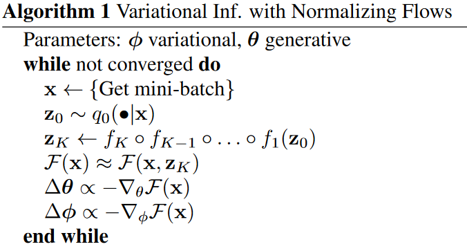

## Variational Inference with Normalizing Flows

### Normalizing Flow
Normalizing flow描述了概率密度通过一系列可逆映射的转换，初始密度通过可逆映射序列，得到一个有效的概率分布。

---
#### Finite Flows
变换的简单规则考虑对密度的可逆的，平滑的映射$f:\mathbb{R}^d\rightarrow \mathbb{R}^d$，其逆为$f^{-1}=g$，其中$g\circ f(\mathrm{z}) = \mathrm{z}$。如果我们用这个映射对分布为$q(\mathrm{z})$的变量$\mathrm{z}$变换，得到的随机变量$\mathrm{z}^\prime = f(\mathrm{z})$的分布为：

$$
q(\mathrm{z}^\prime) = q(\mathrm{z})\left|\det \frac{\partial f^{-1}}{\partial \mathrm{z}^\prime}\right| = q(\mathrm{z})\left|\det \frac{\partial f}{\partial \mathrm{z}}\right|^{-1}
$$
我们可以构建任意复杂的概率密度，通过组合若干简单的映射。密度$q_K(\mathrm{z})$通过接连对密度为$q_0$的随机变量$\mathrm{z}_0$变换得到：
$$
\mathrm{z}_K = f_K\circ \cdots \circ f_2\circ f_1(\mathrm{z}_0)
$$
$$
\ln q_K(\mathrm{z}_K) = \ln q_0(\mathrm{z}_0) - \sum_{k=1}^K\ln\left|\det \frac{\partial f_k}{\partial \mathrm{z}_{k-1}}\right|
$$
随机变量$\mathrm{z}_k = f_k(\mathrm{z}_{k-1})$走过的路径被称为flow，接连的分布$q_k$经过的路径被称为normalizing flow。有一个性质，就是我们可以在不知道$q_K$的情况下计算得到期望$\mathbb{E}_{q_K}[h(\mathrm{z})]$：
$$
\mathbb{E}_{q_K}[h(\mathrm{z})] = \mathbb{E}_{q_0}[h(f_K\circ f_{K-1}\circ \cdots \circ f_1(\mathrm{z}_0))]
$$
#### Infinitesimal Flows
很自然地想到normalizing flow的长度变为无穷大的情况。在此情况下，我们得到了infinitesimal flow。我们可以将其描述为：
$$
\frac{\partial}{\partial t} q_t(\mathbf{z})=\mathcal{T}_t\left[q_t(\mathbf{z})\right]
$$

---
**Langevin Flow**：flows的非常重要的一族由Langevin stochastic differential equation(SDE)给定：
$$
d\mathrm{z}(t) = \mathrm{F}(\mathrm{z}(t), t)dt + \mathrm{G}(\mathrm{z}(t),t)d\xi(t)
$$
其中$d\xi(t)$为维纳过程，其中$\mathbb{E}[\xi_i(t)]=0$并且$\mathbb{E}[\xi_i(t)\xi_j(t^\prime)] = \delta_{i,j}\delta(t-t^\prime)$，其中$\mathrm{F}$为偏移向量(drift vector)并且$\mathrm{D=GG^T}$为扩散矩阵(diffusion matrix)。如果我们对初始密度为$q_0(\mathrm{z})$的随机变量$\mathrm{z}$进行变换，则在时间$t$的密度$q_t(\mathrm{z})$为：
$$
\frac{\partial }{\partial t}q_t(\mathrm{z}) = -\sum_i \frac{\partial}{\partial z_i}[F_i(\mathrm{z},t)q_t] + \frac{1}{2}\sum_{i,j}\frac{\partial^2}{\partial z_i\partial z_j}[D_{ij}(\mathrm{z},t)q_t]
$$
在机器学习中，我们一般用$F(\mathrm{z},t)=\Delta_z\mathcal{L}(\mathrm{z})$和$G(\mathrm{z},t)=\sqrt{2}\delta_{i,j}$，其中$\mathcal{L}$为模型的未标准化对数密度。
在此种情况下，我们的解为Boltzmann分布：$q_\infty(\mathrm{z})\propto e^{-\mathcal{L}(\mathrm{z})}$。

---
**Hamiltonian Flow**：Hamiltonian Flow可以看作是在扩展空间(augmented space)$\tilde{\mathrm{z}}=(\mathrm{z,\omega})$上的normalizing flow，其动态来自Hamiltonian $\mathcal{H}(\mathrm{z,\omega}) = -\mathcal{L}(\mathrm{z})-\frac{1}{2}\omega^T\mathrm{M}\omega$。

---

### Inference with Normalizing Flows
如果我们用神经网络来构建可逆变换，那么计算雅可比矩阵的行列式的时间复杂度为$O(LD^3)$，其中$D$为隐藏层的维度，$L$为隐藏层的数量。时间复杂度过高，我们需要时间复杂度低的算法。

#### Invertible Linear-time Transformations
我们考虑下列形式的变换：
$$
f(\mathrm{z}) = \mathrm{z} + \mathrm{u}h(\mathrm{w^T z}+b)
$$
其中$\lambda = \{\mathrm{w}\in \mathbb{R}^D, \mathrm{u}\in \mathbb{R}^D, b\in \mathbb{R}\}$为参数，$h(\cdot)$为激活函数，导数$h^\prime(\cdot)$。对于此映射，我们可以计算对数行列式以$O(D)$时间：
$$
\psi(\mathrm{z}) = h^\prime(\mathrm{w^T z} + b)\mathrm{w}
$$
$$
\left|\det \frac{\partial f}{\partial \mathrm{z}}\right| = |\det(\mathrm{I + u\psi(z)^T})| = |1 +\mathrm{ u^T\psi(z)}|
$$
所以我们有：
$$
\ln q_K(\mathrm{z}_K) = \ln q_0(\mathrm{z}) - \sum_{k=1}^K\ln|1 + \mathrm{u}_k^T\psi_k(\mathrm{z}_{k-1})|
$$
我们将此flow称为planar flows。

####  Flow-Based Free Energy Bound
如果我们用一个长度为$K$的flow参数化近似后验分布：$q_\phi(\mathrm{z\mid x}):= q_K(\mathrm{z}_K)$，那么我们可以写作：
$$
\begin{aligned}

\mathcal{F}(\mathbf{x}) & =\mathbb{E}_{q_\phi(z \mid x)}\left[\log q_\phi(\mathbf{z} \mid \mathbf{x})-\log p(\mathbf{x}, \mathbf{z})\right] \\

& =\mathbb{E}_{q_0\left(z_0\right)}\left[\ln q_K\left(\mathbf{z}_K\right)-\log p\left(\mathbf{x}, \mathbf{z}_K\right)\right] \\

& =\mathbb{E}_{q_0\left(z_0\right)}\left[\ln q_0\left(\mathbf{z}_0\right)\right]-\mathbb{E}_{q_0\left(z_0\right)}\left[\log p\left(\mathbf{x}, \mathbf{z}_K\right)\right] \\

& -\mathbb{E}_{q_0\left(z_0\right)}\left[\sum_{k=1}^K \ln \left|1+\mathbf{u}_k^{\top} \psi_k\left(\mathbf{z}_{k-1}\right)\right|\right]

\end{aligned}
$$
我们现在只需要构建观测$\mathrm{x}$到初始密度$q_0 = \mathcal{N}(\mu,\sigma)$的神经网络。

### Alternative Flow-based Posteriors

上面讲述的Flow都是`general normalizing flows`，可以通过线性时间来计算雅可比行列式。相比较，`volume preserving flows`使得雅可比行列式始终为$1$。

非线性独立成分估计(Non-linear Independent Components Estimation)(NICE)为`finite volume-preserving flow`的一个例子。变换使用神经网络$f(\cdot)$，其有容易计算的逆$g(\cdot)$：
$$
\begin{aligned}
f(\mathrm{z}) &= (\mathrm{z}_A,\mathrm{z}_B + h_\lambda(\mathrm{z}_A))\\
g(\mathrm{z}^\prime) &= (\mathrm{z}_A^\prime,\mathrm{z}_B^\prime  - h_\lambda(\mathrm{z}^\prime_A))
\end{aligned}
$$
