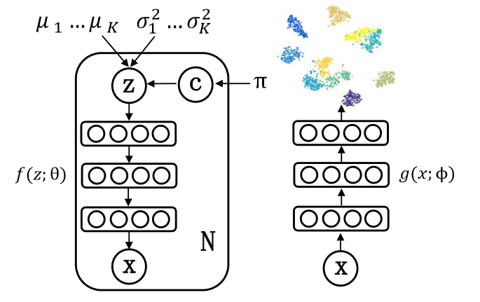

## Variational Deep Embedding: A Generative Approach to Clustering

### Variational Deep Embedding

#### The Generative Process

假设有$K$类，样本$x\in \mathbb{R}^D$通过以下方式生成：

1. 选择类$c\sim \text{Cat}(\pi)$
2. 选择隐向量$\mathrm{z} \sim \mathcal{N}(\mu_c,\sigma_c^2I)$
3. 选择样本$\mathrm{x}$
   1. 如果$\mathrm{x}$为二元变量
      1. 计算期望向量$\mu_x$，$\mu_x = f(\mathrm{z};\theta)$
      2. 选择样本$\mathrm{x}\sim \text{Ber}(\mu_x)$
   2. 如果$\mathrm{x}$为实值
      1. 计算$[\mu_x;\log\sigma_x^2] = f(\mathrm{z};\theta)$
      2. 选择样本$\mathrm{x}\sim \mathcal{N}(\mu_x,\sigma_x^2I)$

则联合分布可以分解为：
$$
f(\mathrm{x,z},c) = p(\mathrm{x\mid z})p(\mathrm{z}\mid c)p(c)
$$
并且概率定义为：
$$
\begin{aligned}
p(c) &= \text{Cat}(c\mid \pi)\\
p(\mathrm{z}\mid c) &= \mathcal{N}(\mathrm{z}\mid \mu_c,\sigma_c^2I)\\
p(\mathrm{x\mid z}) &= \text{Ber}(\mathrm{x}\mid \mu_x) \text{ or }\mathcal{N}(\mathrm{x}\mid \mu_x,\sigma_x^2I)
\end{aligned}
$$

#### Variational Lower Bound

VaDE的变分下界可以写作：
$$
\begin{aligned}
\log p(\mathrm{x}) &= \log \int_\mathrm{z}\sum_{c}p(\mathrm{x,z},c)d\mathrm{z}\\
&= \log \int_\mathrm{z}\sum_c q(\mathrm{z},c\mid \mathrm{x})\frac{p(\mathrm{x,z},c)}{q(\mathrm{z},c\mid \mathrm{x})}d\mathrm{z}\\
&\ge \int_\mathrm{z}\sum_c q(\mathrm{z},c \mid \mathrm{x}) \log \frac{p(\mathrm{x,z},c)}{q(\mathrm{z},c\mid \mathrm{x})} d\mathrm{z}\\
&= E_{q(\mathrm{z},c\mid \mathrm{x})}\left[\frac{p(\mathrm{x,z},c)}{q(\mathrm{z},c\mid \mathrm{x})}\right] = \mathcal{L}_{\text{ELBO}}(\mathrm{x})
\end{aligned}
$$
我们假设
$$
q(\mathrm{z},c\mid \mathrm{x} ) = q(\mathrm{z}\mid \mathrm{x})q(c\mid \mathrm{x})
$$
我们使用神经网络$g$对$q(\mathrm{z\mid x})$进行建模：
$$
\begin{aligned}
\tilde{\mu};\log \tilde{\sigma}^2 &= g(\mathrm{x};\phi)\\
q(\mathrm{z}\mid \mathrm{x}) &= \mathcal{N}(\mathrm{z;\tilde{\mu},\tilde{\sigma^2}I})
\end{aligned}
$$
$q(c\mid \mathrm{x})$可以定义为：
$$
q(c\mid \mathrm{x}) = E_{q(\mathrm{z\mid x})}[p(c\mid \mathrm{z})]
$$
其中$p(c\mid \mathrm{z})$可以计算为：
$$
p(c\mid \mathrm{z}) = \frac{p(c)p(\mathrm{z}\mid c)}{\sum_{c^\prime = 1}^K p(c^\prime)p(\mathrm{z}\mid c^\prime)}
$$

那么我们要优化的参数变为：
$$
\{\pi,\mu_i,\sigma_i,\theta,\phi\},\quad i \in \{1,\cdots,K\}
$$
