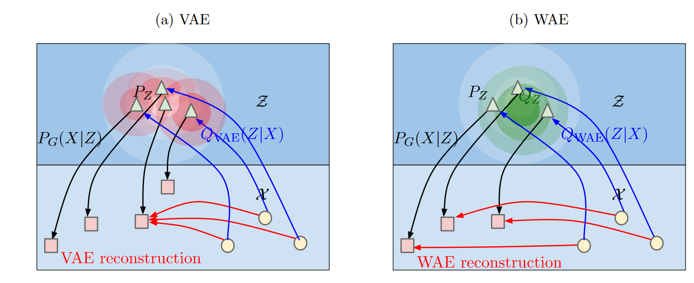

# Wasserstein Auto-Encoder

本工作基于最优传输(OT)理论。OT代价是一个用于测量概率分布之间距离的方法，并且提供了一个更弱的拓扑结构，包括与原始GAN算法相联系的$f$发散($f$-divergences)。

在此工作中，我们目的在于最小化$\text{OT}W_c(P_X,P_G)$，其中$P_X$为数据真实但是未知的分布，并且隐变量模型$P_G$通过先验分布$P_Z,Z\in\mathcal{Z}$和生成模型$P_G(X\mid Z), X\in \mathcal{X}$确定。我们的主要贡献为：
+ 新的一类正则化自编码器，我们称为*Wasserstein Auto-Encoders*(WAE)，最小化最优传输$W_c(P_X,P_G)$对于任何损失函数$c$。与VAE类似，WAE的目标包含两项：重建(reconstruction)损失和正则项$\mathcal{D}_Z(P_Z,Q_Z)$惩罚$\mathcal{Z}$上两个分布的不一致性，即$P_Z$和$Q_Z:=\mathbb{E}_{P_X}[Q(Z\mid X)]$。

## Proposed method
我们的新方法最小化最优传输损失$W_c(P_X,P_G)$。在此优化问题中解码器(decoder)视图精确重建解码训练数据在损失函数$c$的度量下。编码器试图同时达到两个矛盾的目标：试图去匹配训练数据的编码器分布$Q_Z:=\mathbb{E}_{P_X}[Q(Z\mid X)]$和先验分布$P_Z$，通过某种散度$\mathcal{D}_Z(Q_Z,P_Z)$来衡量，然而还需要保证隐变量可以提供足够的信息来重建训练数据。

> VAE和WAE都最小化两项：重建损失和正则化惩罚先验分布$P_Z$和编码器$Q$分布的不一致性。VAE注重$Q(Z\mid X=x)$来匹配$P_Z$对于所有从$P_X$中抽样得到的$x$。见上图(a)，每单个红球被强制去匹配白色形状表示的$P_Z$。红球开始交叉，将会对重建产生影响。与之相比，WAE强制连续混合$Q_Z:=\int Q(Z\mid X)dP_X$来匹配$P_Z$，在(b)图中为绿球。作为结果不同样本的隐变量有机会去互相远离，可以提升重建效果。

本文我们将考虑若干衡量概率分布$P_X,P_G$不一致的散度。$f$散度类被定义为：$D_f(P_X\| P_G);+\int f(\frac{P_X(x)}{P_G(x)})P_G(x)dx$，其中$f:(0,\infty)\rightarrow \mathcal{R}$为凸函数满足$f(1)=0$。

## Optimal transport and its dual formulations
不同类的两个分布之间的散度通过**最优传输**问题引入。Kantorovich的公式为：
$$
W_c(P_X,P_G) := \inf_{\Gamma \in \mathcal{P}(X\sim P_X, Y\sim P_G)}\mathbb{E}_{(X,Y)\sim \Gamma}[c(X,Y)]
$$
其中$c(x,y):\mathcal{X\times X}\rightarrow \mathcal{R}_+$为损失函数并且$\mathcal{P}(X\sim P_X, Y\sim P_G)$为$(X,Y)$的联合概率密度函数，边缘分布为$P_X,P_G$。一个特殊有趣的情况是当$(\mathcal{X},d)$是一个度量空间并且$c(x,y)=d^p(x,y), p\ge 1$。在此时$W_p$，$p-$th root of $W_c$，被称为$p-$Wasserstein 距离。
当$c(x,y) = d(x,y)$，即$p=1$，下列的Kantorovich-Rubinstein对偶成立：
$$
W_1(P_X,P_G) = \sup_{f\in \mathcal{F}_L}\mathbb{E}_{X\sim P_X}[f(X)] - \mathbb{E}_{Y\sim P_G}[f(Y)]
$$
其中$\mathcal{F}_L$为有界1-Lipschitz function。
> 1-Lipschitz function，满足下列条件的函数：
$$
\left|\frac{f(x)-f(y)}{x-y}\right|\le 1
$$

## Application to generative model: Wasserstein auto-encoders
我们通过两步来定义隐变量模型$P_G$，首先从一个隐变量空间$\mathcal{Z}$固定的分布$P_Z$上采样得到$Z$，之后$Z$被映射到象$X\in \mathcal{X} = \mathcal{R}^d$，通过一个变换。这形成了下列形式的密度：
$$
p_G(x) := \int_{\mathcal{Z}}p_G(x\mid z)p_z(z)dz, \forall x\in \mathcal{X}
$$
在此模型下，OT损失可以得到一个更为简单的形式，通过映射$G$：我们不用再找到$\Gamma$，相反，我们我们可以找到一个条件分布$Q(Z\mid X)$使得它的$Z$边缘分布$Q_Z(Z):=\mathbb{E}_{X\sim P_X}[Q(Z\mid X)]$等价于先验分布$P_Z$。

定理1：对于确定性分布$P_G(X\mid Z)$定义的$P_G$和任何函数$G:\mathcal{Z}\rightarrow \mathcal{X}$：
$$
\inf_{\Gamma\in \mathcal{P}(X\sim P_X, Y\sim P_G)}\mathbb{E}_{(X,Y)\sim \Gamma}[c(X,Y)] = \inf_{Q:Q_Z=P_Z}\mathbb{E}_{P_X}\mathbb{E}_{Q(Z\mid X)}[c(X,G(Z))]
$$
其中$Q_Z$为$Z$的边缘分布，$X\sim P_X, Z\sim Q(Z\mid X)$。
这允许我们去优化编码器$Q(Z\mid X)$而不是优化$X,Y$上的所有分布。为了得到数值上的解，我们放松限制并增加了惩罚项，这就产生了WAE目标函数：
$$
D_{\text{WAE}}(P_X,P_G) := \inf_{Q(Z\mid X)\in \mathcal{Q}}\mathbb{E}_{P_X}\mathbb{E}_{Q(Z\mid X)}[c(X,G(X))] + \lambda\cdot \mathcal{D}_Z(Q_Z,P_Z)
$$
