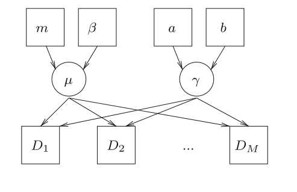

## Variational Bayesian inference

### Log-likelihood and Evidence Lower Bound(ELOB)

下列表达式总是成立：
$$
\ln(p(X)) = \ln(p(X,Z)) - \ln(P(Z\mid X))
$$
所以下式也成立：
$$
\ln(P(X)) = \left[\ln(p(X,Z))-\ln(q(Z))\right] - \left[\ln(p(Z\mid X))-\ln(q(Z))\right]
$$
所以现在我们有
$$
\ln(p(X)) = \ln\left(\frac{p(X,Z)}{q(Z)}\right) - \ln\left(\frac{p(Z\mid X)}{q(Z)}\right)
$$
两边同时取期望：
$$
\begin{aligned}
\ln (p(X)) &=\int q(Z) \ln \left(\frac{p(X, Z)}{q(Z)}\right) \mathrm{d} Z-\int q(Z) \ln \left(\frac{p(Z \mid X)}{q(Z)}\right) \mathrm{d} Z \\
&=\underbrace{\int q(Z) \ln (p(X, Z)) \mathrm{d} Z-\int q(Z) \ln (q(Z)) \mathrm{d} Z}_{\mathcal{L}(q)}+\underbrace{\left(-\int q(Z) \ln \left(\frac{p(Z \mid X)}{q(Z)}\right) \mathrm{d} Z\right)}_{\mathbb{K} \mathbb{L}(q \| p)} \\
&=\mathcal{L}(q)+\mathbb{K} \mathbb{L}(q \| p)
\end{aligned}
$$
KL散度一般用于度量两个概率分布函数之间的距离，其定义如下：
$$
\mathbb{KL}[p(X)\mid q(X)] = \sum_{x\in X}\left[p(x)\log\frac{p(x)}{q(x)}\right] = \mathbb{E}_{x\sim p(x)}\left[\log\frac{p(x)}{q(x)}\right]
$$
我们要做的就是找到与后验分布$p(Z\mid X)$最接近的简单分布$p(Z)$。

### Alternative Evidence Lower Bound(ELOB)

我们看另一种推导方法：
$$
\begin{aligned}
\ln (p(X)) &=\log \int_{Z} p(X, Z) \mathrm{d} z \\
&=\log \int_{Z} p(X, Z) \frac{q(Z)}{q(Z)} \mathrm{d} z \\
&=\log \left(\mathbb{E}_{q}\left[\frac{p(X, Z)}{q(Z)}\right]\right) \\
& \geq \mathbb{E}_{q}\left[\log \left(\frac{p(X, Z)}{q(Z)}\right)\right] \text { using Jensen's inequality } \\
&=\mathbb{E}_{q}[\log (p(X, Z))]-\mathbb{E}_{q}[\log (q(Z))] \\
& \triangleq \mathcal{L}(q)
\end{aligned}
$$

### Maximize Evidence Lower Bound(ELOB)

我们给每个部分一个名字：
$$
\begin{array}{ll}
\text {Evidence Lower Bound (ELOB):} & \mathcal{L}(q)=\int q(Z) \ln (p(X, Z)) \mathrm{d} Z-\int q(Z) \ln (q(Z)) \mathrm{d} Z \\
\mathrm{KL} \text { divergence: } & \mathbb{K} \mathbb{L}(q \| p)=-\int q(Z) \ln \left(\frac{p(Z \mid X)}{q(Z)}\right) d Z
\end{array}
$$

+ 注意$p(X)$对于$q(Z)$的选择是固定的。我们想要去选择一个$q(Z)$函数最小化KL散度，因此$q(Z)$变得离$p(Z\mid X)$越来越近。很容易验证，当$q(Z)=p(Z\mid X)$时，KL散度为$0$。
+ 我们知道$\ln p(X) = \mathcal{L}(q)+\mathbb{KL}(q\| p)$。最小化$\mathbb{KL}(q\| p)$等同于最大化$\mathcal{L}(q)$。

我们可以选择$q(Z)$使得
$$
q(Z) = \prod_{i=1}^Mq_i(Z_i)
$$
其中$M$为$Z$的维度，也就是说$q(Z)$的各个维度是独立的，这被称为**平均场变分贝叶斯**。

> 注意$q(Z)$对联合概率密度函数$p(Z\mid X)$是一个很好地近似，但是边缘分布$q(Z_i)$对$p(Z_i\mid x)$的近似不一定好。

将其带入到$\mathcal{L}(q)$中：
$$
\begin{aligned}
\mathcal{L}(q) &=\int q(Z) \ln (p(X, Z)) \mathrm{d} Z-\int q(Z) \ln (q(Z)) \mathrm{d} Z \\
&=\underbrace{\int \prod_{i=1}^{M} q_{i}\left(Z_{i}\right) \ln (p(X, Z)) \mathrm{d} Z}_{\text {part (1) }}-\underbrace{\int \prod_{i=1}^{M} q_{i}\left(Z_{i}\right) \sum_{i=1}^{M} \ln \left(q_{i}\left(Z_{i}\right)\right) \mathrm{d} Z}_{\text {part (2) }}
\end{aligned}
$$
我们先看Part1，假设我们只对$Z_i$感兴趣，将其拿出来，变为：
$$
(\operatorname{Part} 1)=\int_{Z_{j}} q_{j}\left(Z_{j}\right)\left(\int_{Z_{i \neq j}} \ldots \int \prod_{i \neq j}^{M} q_{i}\left(Z_{i}\right) \ln (p(X, Z)) \prod_{i \neq j}^{M} d Z_{i}\right) d Z_{j}
$$
或者将其写为更紧凑的形式：
$$
(\operatorname{Part} 1)=\int_{Z_{j}} q_{j}\left(Z_{j}\right)\left(\int_{Z_{i \neq j}} \cdots \int \ln (p(X, Z)) \prod_{i \neq j}^{M} q_{i}\left(Z_{i}\right) d Z_{i}\right) d Z_{j}
$$
或者，为了让其更具有意义，可以将其放进一个期望函数里：
$$
(\operatorname{Part} 1)=\int_{Z_{j}} q_{j}\left(Z_{j}\right)\left[\mathbb{E}_{i \neq j}[\ln (p(X, Z))]\right] d Z_{j}
$$
现在再看Part2：
$$
(\text { Part 2) }=\int \prod_{i=1}^{M} q_{i}(Z_{i}) \sum_{i=1}^{M} \ln \left(q_{i}(Z_{i}\right)) d Z
$$
将其化简：
$$
\begin{aligned}
\operatorname{(Part2)} &= \int q(Z)\sum_{i=1}^M\ln(q_i(Z_i))dZ\\
&=\sum_{i=1}^M\int_{Z}q(Z_1,\cdots,Z_M)\ln(q_i(Z_i))dZ\\
&=\sum_{i=1}^M\int_{Z_i}q_i(Z_i)\ln(q_i(Z_i))dZ_i
\end{aligned}
$$

假设现在我们只对$q_j(Z_j)$感兴趣，则其余部分可以看作常数，因此上式可以进一步写为：
$$
(\text { Part } 2)=\int_{Z_{j}} q_{j}\left(Z_{j}\right) \ln \left(q_{j}\left(Z_{j}\right)\right) d Z_{j}+\text { const}
$$
则$\mathcal{L}(q)$变为：
$$
\mathcal{L}(q)=\operatorname{Part}(1)-\operatorname{Part}(2)=\int_{Z_{j}} q_{j}\left(Z_{j}\right) \mathbb{E}_{i \neq j}[\ln (p(X, Z))] \mathrm{d} Z_{j}-\int_{Z_{j}} q_{j}\left(Z_{j}\right) \ln \left(q_{j}\left(Z_{j}\right)\right) \mathrm{d} Z_{j}+\operatorname{const}
$$
我们定义：
$$
\ln(\tilde{p}_j(X,Z_j)) = \mathbb{E}_{i\neq j}[\ln(p(X,Z))]
$$
或者定价的我们可以将ELOB写为：
$$
\mathcal{L}(q_j) = \int_{Z_j}q_j(Z_j)\ln\left[\frac{\tilde{p}_j(X,Z_j)}{q_j(Z_j)}\right]+\text{const}
$$
这与
$$
-\mathbb{KL}\left(\exp(\mathbb{E}_{i\neq j}[\ln(p(X,Z))])\| q_i(Z_i)\right)
$$
相等。

**所以我们可以最大化ELOB，或者$\mathcal{L}(q)$，通过最小化这个特殊的KL散度，也就是找到近似和最优$q^\star_i(Z_i)$，使得**
$$
\ln(q_i^\star(Z_i)) = \mathbb{E}_{i\neq j}[\ln(p(X,Z))]
$$

### Example

令数据$\mathcal{D}=\{x_1,\cdots,x_n\}$，则
$$
\begin{gathered}
p(\mathcal{D} \mid \mu, \tau)=\prod_{i=1}^{n}\left(\frac{\tau}{2 \pi}\right)^{\frac{1}{2}} \exp \left(\frac{-\tau}{2}\left(x_{i}-\mu\right)^{2}\right) \\
=\left(\frac{\tau}{2 \pi}\right)^{\frac{n}{2}} \exp \left(\frac{-\tau}{2} \sum_{i=1}^{n}\left(x_{i}-\mu\right)^{2}\right) \\
p(\mu \mid \tau)=\mathcal{N}\left(\mu_{0},\left(\lambda_{0} \tau\right)^{-1}\right) \propto \exp \left(\frac{-\lambda_{0} \tau}{2}\left(\mu-\mu_{0}\right)^{2}\right) \\
p(\tau)=\operatorname{Gamma}\left(\tau \mid a_{0}, b_{0}\right) \propto \tau^{a_{0}-1} \exp ^{-b_{0} \tau}
\end{gathered}
$$
并且
$$
p(\mathcal{D},\mu,\tau) = p(\mathcal{D}\mid \mu,\tau)p(\mu\mid \tau)p(\tau)
$$
则：
$$
p(\mu,\tau\mid d)\propto p(\mathcal{D}\mid \mu,\tau)p(\mu\mid \tau)p(\tau)=\mathcal{N}(\mu_n,(\lambda \tau)^{-1})\text{Gamma}(\tau\mid a_n,b_n)
$$
其中
$$
\begin{aligned}
\mu_{n} &=\frac{\lambda_{0} \mu_{0}+n \bar{x}}{\lambda_{0}+n} \\
\lambda_{n} &=\lambda_{0}+n \\
a_{n} &=a_{0}+n / 2 \\
b_{n} &=b_{0}+\frac{1}{2} \sum_{i=1}^{n}\left(x_{i}-\bar{x}\right)^{2}+\frac{\lambda_{0} n\left(\bar{x}-\mu_{0}\right)^{2}}{2\left(\lambda_{0}+n\right)}
\end{aligned}
$$
可以看出是由解析解的，但是为了例子，我们再采用变分贝叶斯的方法，我们假设$q(\mu,\tau)$：
$$
q(\mu,\tau) = q_{\mu}(\mu)q_\tau(\tau)
$$
则：
$$
\begin{aligned}
\ln \left(q_{\mu}^{*}(\mu)\right) &=\mathbb{E}_{q_{\tau}}[\ln (p(\mu, \tau \mid \mathcal{D}))] \\
&=\mathbb{E}_{q_{\tau} \tau}[\ln (p(\mathcal{D} \mid \mu, \tau))+\ln p(\mu \mid \tau)]+\text { const. } \quad \text { remove terms do NOT contain } \mu \\
&=\mathbb{E}_{q_{\tau}}[\underbrace{-\frac{\tau}{2} \sum_{i=1}^{n}\left(x_{i}-\mu\right)^{2}+\underbrace{\frac{\lambda_{0} \tau}{2}\left(\mu-\mu_{0}\right)^{2}}_{\ln p(\mu \mid \gamma)}]}_{\ln (p(\mathcal{D} \mid \mu, \tau))}+\text { const. }\\
&=-\frac{\mathbb{E}_{q_{\tau}}[\tau]}{2} \underbrace{\left[\sum_{i=1}^{n}\left(x_{i}-\mu\right)^{2}+\lambda_{0}\left(\mu-\mu_{0}\right)^{2}\right]}_{\text {terms contain } \mu \text { but does not contain } \tau}+\text { const. }
\end{aligned}
$$
将关于$\mu$的项展开：
$$
\begin{aligned}
& \sum_{i=1}^{n}\left(x_{i}-\mu\right)^{2}+\lambda_{0}\left(\mu-\mu_{0}\right)^{2}=n \mu^{2}-2 n \mu \bar{x}+\lambda_{0} \mu^{2}-2 \lambda_{0} \mu_{0} \mu+\text { const. } \\
=&\left(n+\lambda_{0}\right) \mu^{2}-2 \mu\left(n \bar{x}+\lambda_{0} \mu_{0}\right)=\left(n+\lambda_{0}\right)\left(\mu^{2}-\frac{2 \mu\left(n \bar{x}+\lambda_{0} \mu_{0}\right)}{\left(n+\lambda_{0}\right)}\right) \\
=&\left(n+\lambda_{0}\right)\left(\mu-\frac{\left(n \bar{x}+\lambda_{0} \mu_{0}\right)}{\left(n+\lambda_{0}\right)}\right)^{2}+\text { const. }
\end{aligned}
$$
因此我们有：
$$
\begin{aligned}
\ln \left(q_{\mu}^{*}(\mu)\right) &=-\frac{\mathbb{E}_{q_{\tau}}[\tau]}{2}\left[\sum_{i=1}^{n}\left(x_{i}-\mu\right)^{2}+\lambda_{0}\left(\mu-\mu_{0}\right)^{2}\right]+\text { const. } \\
&=-\frac{\mathbb{E}_{q_{\tau}}[\tau]\left(n+\lambda_{0}\right)}{2}\left(\mu-\frac{\left(n \bar{x}+\lambda_{0} \mu_{0}\right)}{\left(n+\lambda_{0}\right)}\right)^{2}+\text { const. } \\
&=\mathcal{N}\left(\frac{n \bar{x}+\lambda_{0} \mu_{0}}{n+\lambda_{0}}, \mathbb{E}_{q_{\tau}}[\tau]\left(n+\lambda_{0}\right)\right)
\end{aligned}
$$
关于$\tau$，我们有
$$
\begin{aligned}
\ln \left(q_{\tau}^{*}(\tau)\right) &=\mathbb{E}_{q_{\mu}}[\ln (p(\mu, \tau \mid \mathcal{D}))] \\
&=\mathbb{E}_{q_{\mu}}[\ln (p(\mathcal{D} \mid \mu, \tau))+\ln p(\mu \mid \tau)+\ln p(\tau)]+\text { const. } \\
&=\mathbb{E}_{q_{\mu}}[\underbrace{\frac{n}{2} \ln (\tau)-\frac{\tau}{2} \sum_{i=1}^{n}\left(x_{i}-\mu\right)^{2}}_{\ln (p(\mathcal{D} \mid \mu, \tau))} \underbrace{-\frac{\lambda_{0} \tau}{2}\left(\mu-\mu_{0}\right)^{2}}_{\ln p(\mu \mid \gamma)} \underbrace{+\left(a_{0}-1\right) \ln (\tau)-b_{0} \tau}_{\ln p(\tau)}]+\text { const. }
\end{aligned}
$$
将没有$\mu$的项拿出积分：
$$
\begin{aligned}
&=\frac{n}{2} \ln (\tau)+\left(a_{0}-1\right) \ln (\tau)-b_{0} \tau-\frac{\tau}{2} \mathbb{E}_{q_{\mu}(\mu)}\left[\sum_{i=1}^{n}\left(x_{i}-\mu\right)^{2}+\lambda_{0}\left(\mu-\mu_{0}\right)^{2}\right]+\text { const. } \\
&=(\underbrace{\frac{n}{2}+a_{0}}_{a_{n}}-1) \ln (\tau)-\tau(\underbrace{b_{0}+\frac{1}{2} \mathbb{E}_{q_{\mu}(\mu)}\left[\sum_{i=1}^{n}\left(x_{i}-\mu\right)^{2}+\lambda_{0}\left(\mu-\mu_{0}\right)^{2}\right]}_{b_{n}}+\text { const. }
\end{aligned}
$$
重写为：
$$
\begin{aligned}
b_{n} &=b_{0}+\frac{1}{2} \mathbb{E}_{q_{\mu}}\left[\sum_{i=1}^{n}\left(x_{i}-\mu\right)^{2}+\lambda_{0}\left(\mu-\mu_{0}\right)^{2}\right] \\
&=b_{0}+\frac{1}{2} \mathbb{E}_{q_{\mu}}\left[-2 \mu n \bar{x}+n \mu^{2}+\lambda_{0} \mu^{2}-2 \lambda_{0} \mu_{0} \mu\right]+\sum_{i=1}^{n}\left(x_{i}\right)^{2}+\lambda_{0} \mu_{0}^{2} \\
&=b_{0}+\frac{1}{2}\left[\left(n+\lambda_{0}\right) \mathbb{E}_{q_{\mu}}\left[\mu^{2}\right]-2\left(n \bar{x}+\lambda_{0} \mu_{0}\right) \mathbb{E}_{q_{\mu}}[\mu]+\sum_{i=1}^{n}\left(x_{i}\right)^{2}+\lambda_{0} \mu_{0}^{2}\right]
\end{aligned}
$$
因为$q_{\mu}(\mu)$事先定义好了我们可以计算$\mathbb{E}_{q_\mu}[\mu]$和$\mathbb{E}_{q_\mu}[\mu^2]$。

### 随机梯度变分推断

上面提到的基于平均场的变分推断实际上是坐标上升法，其存在一些问题：

+ 假设太强，对复杂模型也许假设不好甚至不成立。
+ 即使假设是成立的，但是因为其递推式包含很多积分，也可能无法计算。

下面我们采用随机梯度上升的方法来求解变分推断问题：

我们知道目标函数：
$$
\hat{q} = \arg\min _q\mathbb{KL}(q\| p) = \arg\max_q\mathcal{L}(q)
$$
其中$q$是$z$的函数，设其参数为$\phi$，我们将其记为$q_{\phi}(z)$，那么我们的目标函数变为：
$$
\hat{q} = \arg\max_{\phi}\mathcal{L}(\phi)
$$
其中
$$
\mathcal{L}(\phi) = \mathbb{E}_{q_\phi}[\log P]
$$
因为是随机梯度下降，所以我们每次选取一个样本，假设选取的样本为$x_i$，那么目标函数变为：
$$
\mathcal{L}(\phi) = \mathbb{E}_{q_\phi}[\log P(x_i,z) - \log q_{\phi}(z)]
$$
对其进行求导，得：
$$
\begin{aligned}
\nabla_{\phi} \mathcal{L}(\phi) &=\nabla_{\phi} \mathbb{E}_{q_{\phi}}\left[\log P\left(x_i, z\right)-\log q_{\phi}\right] \\
&=\nabla_{\phi} \int q_{\phi}\left[\log P\left(x_i, z\right)-\log q_{\phi}\right] d z \\
&=\int \nabla_{\phi}\left(q_{\phi}\left[\log P\left(x_i, z\right)-\log q_{\phi}\right]\right) d z \\
&=\underbrace{\int \nabla_{\phi} q_{\phi} \cdot\left[\log P\left(x_i, z\right)-\log q_{\phi}\right] d z}_{\text{Part1}}+\underbrace{\int q_{\phi} \cdot \nabla_{\phi}\left[\log P\left(x_i, z\right)-\log q_{\phi}\right] d z}_{\text{Part2}}
\end{aligned}
$$
我们首先看Part2：
$$
\begin{aligned}
\text { Part2 } &=\int q_{\phi} \cdot \nabla_{\phi}\left[\log P\left(x_i, z\right)-\log q_{\phi}\right] d z \\
&=\int q_{\phi} \cdot\left(-\nabla_{\phi} \log q_{\phi}\right) d z \\
&=\int q_{\phi} \cdot\left(-\frac{1}{q_{\phi}} \nabla_{\phi} q_{\phi}\right) d z \\
&=-\int \nabla_{\phi} q_{\phi} d z \\
&=-\nabla_{\phi} \int q_{\phi} d z \\
&=-\nabla_{\phi} 1 \\
&=0
\end{aligned}
$$
所以
$$
\nabla_\phi\mathcal{L}(\phi) = \int\nabla_\phi q_\phi\cdot[\log P(x_i,z)-\log q_\phi]dz
$$
如果能写成期望的形式，我们就可以采用蒙特卡洛的方法对其进行采样，因此进行一个小的变换：$\nabla_\phi q_\phi = \nabla(\log q_\phi)q_\phi$，得到
$$
\begin{aligned}
\nabla_\phi\mathcal{L}(\phi) &= \int \nabla_\phi(\log q_\phi)\cdot q_\phi\cdot[\log P(x_i,z)-\log q_\phi]dz\\
&= \mathbb{E}_{q_\phi}[\nabla_\phi(\log q_\phi)\cdot (\log P(x_i,z)-\log q_\phi)]
\end{aligned}
$$
这样就可以采用蒙特卡洛的方式进行采样后求解期望：

从$q_{\phi}(z)$中采样$z$，$z_l \sim q_{\phi}(z),l=1,2,\cdots,L$，因此：
$$
\nabla_\phi\mathcal{L}(\phi)\approx \frac{1}{L}\sum_{l=1}^L\nabla_\phi\log q_{\phi}(z_l)(\log P(x_i,z_l)-\log q_\phi(z_l))
$$
但是存在一个问题，因为$q_{\phi}(z)$为概率密度函数，所以其值位于$[0,1]$，在$[0,1]$内对数函数的变化非常大，这就导致其方差较大，导致此方法很可能无法使用。

因此我们采用了重参数化技巧，假定$z = g_\phi(\epsilon,x_i),\epsilon\sim P(\epsilon)$，其中$g_\phi$为参数变换的函数，相当于$z$把随机性转移到了$\epsilon$上，根据随机变量变换的性质：
$$
|q_\phi(z)dz| = |P(\epsilon)d\epsilon|
$$

> 即：
> $$
> \frac{q_\phi(z)}{P(\epsilon)} = \left|\frac{dz}{d\epsilon}\right|
> $$

将上述变换代入梯度，得：
$$
\begin{aligned}
\nabla_{\phi} \mathcal{L}(\phi) &=\nabla_{\phi} \int\left[\log P\left(x_i, z\right)-\log q_{\phi}\right] q_{\phi} d z \\
&=\nabla_{\phi} \int\left[\log P\left(x_i, z\right)-\log q_{\phi}\right] \cdot P(\epsilon) d \epsilon \\
&=\nabla_{\phi} \mathbb{E}_{P(\epsilon)}\left[\log P\left(x_i, z\right)-\log q_{\phi}\right]
\end{aligned}
$$
因为$P(\epsilon)$与$\phi$的梯度无关，因此可以将其放在期望内部：
$$
\begin{aligned}
\nabla_{\phi} \mathcal{L}(\phi) &=E_{P(\epsilon)}\left[\nabla_{\phi}\left(\log P\left(x_i, z\right)-\log q_{\phi}\right)\right] \\
&=E_{P(\epsilon)}\left[\nabla_{z}\left(\log P\left(x_i, z\right)-\log q_{\phi}(z)\right) \nabla_{\phi} z\right] \\
&=E_{P(\epsilon)}\left[\nabla_{z}\left(\log P\left(x_i, z\right)-\log q_{\phi}(z)\right) \nabla_{\phi} g_{\phi}\left(\epsilon, x_i\right)\right]
\end{aligned}
$$
这样就可以再次采用蒙特卡洛的方法：
$$
\begin{aligned}
&\epsilon_l \sim P(\epsilon), \quad l=1,2, \cdots, L \\
&\nabla_{\phi} \mathcal{L}(\phi) \approx \frac{1}{L} \sum_{l=1}^{L}\left[\nabla_{z}\left(\log P\left(x_i, z\right)-\log q_{\phi}(z)\right) \nabla_{\phi} g_{\phi}\left(\epsilon_l, x_i\right)\right]
\end{aligned}
$$

### Variational Bayes with message passing

上述的手动推导的方式有些繁琐，但是现在的变分信息传递算法(variational message passing(VMP))可以自动对共轭指数分布族进行推导。对于非共轭指数网络，如果需要以牺牲精度为代价快速逼近，VMP 可能仍然有用。

对于指数族分布，其形式为：
$$
P(x\mid \eta) = h(x)\exp\left(\eta^T\phi(x)-A(\eta)\right)
$$
其中$\eta$为参数，$\phi(x)$为充分统计量。

关于指数族分布的标准理论证明了指数分布的充分统计量的性质为：
$$
\langle \phi(x)\rangle = \nabla_{\eta}A(\eta)\mid_\eta
$$
即充分统计量的期望为$A(\eta)$函数对$\eta$的导数。

我们用$\text{pa}(z_i)$表示$z_i$的父结点，$\text{ch}(z_i)$表示其子结点，$\text{cop}(z_i;\text{ch})$表示与$x_i$共同子结点为$\text{ch}$父结点的集合；$\text{cop}(z_i)$表示与$z_i$有共同子结点的父结点。我们的更新公式为：
$$
\ln q_i(z_i) = \langle\ln P(z_i,\text{mb}(z_i)),D\rangle_{q(\text{mb}(z_i))}
$$
其中$\langle\rangle_{q(\text{mb}(z_i))}$相当于对$q(\text{mb}(z_i))$求期望，而$\text{mb}$表示马尔可夫毯。

> 马尔可夫毯：在随机变量的全集$U$中，对于给定的变量$\mathrm{X}\in \mathrm{U}$和变量集$\mathrm{MB}\subset \mathrm{U}$，若有：
> $$
> \mathrm{X}\perp \{\mathrm{U-MB-\{X\}}\mid\mathrm{MB}\}
> $$
> 则称能满足上述条件的最小变量集$\mathrm{MB}$为$\mathrm{X}$的马尔可夫毯。

则可以写为：
$$
=\langle\ln P(\text{pa}(z_i))+\ln P(\text{cop}(z_i))+\ln P(z_i\mid\text{pa}(z_i))+\ln P(\text{ch}(z_i)\mid z_i,\text{cop}(z_i))\rangle_{q(\text{mb}(z_i))}
$$
去除和$z_i$无关的常数项：
$$
=\langle \ln P(z_i\mid \text{pa}(z_i))\rangle_{q(\text{pa}(z_i))} +\langle\ln P(\text{ch}(z_i)\mid z_i,\text{cop}(z_i))\rangle_{q(\text{ch}(z_i),\text{cop}(z_i))}
$$
将子结点拆开得：
$$
=\langle \ln P(z_i\mid \text{pa}(z_i))\rangle_{q(\text{pa}(z_i))} +\sum_{\text{ch}\in\text{ch}(z_i)}\langle\ln P(\text{ch}\mid z_i,\text{cop}(z_i))\rangle_{q(\text{ch},\text{cop}(z_i))}
$$
我们将会将这两部分分开考虑

#### Messages from parents

共轭指数节点$z_i$由自然参数向量$\phi_i$参数化。通过这些节点的定义：
$$
\begin{aligned}
\langle\ln P(z_i\mid \text{pa}(z_i))_{q(\text{pa}(z_i))} &= \langle \phi_i\mu(z_i) + f_i(z_i)+g_i(\phi_i)\rangle_{q(\text{pa}(z_i))}\\
&=\langle\phi_i\rangle_{q(\text{pa}(z_i))}\mu_i(z_i)+f_i(z_i)+\langle g(\phi_i)\rangle_{q(\text{pa}(z_i))}
\end{aligned}
$$
由于$\phi$和$g$是父节点充分统计量的多线性函数（通过构造），并且使用平均场假设，我们可以简单地采用它们的公式（定义为以父节点的单个值为条件）并将期望替换为充分统计，根据需要得到整个表达式的期望值。因此$z_i$的父结点只需要将它们的充分统计期望作为信息传递给$z_i$。

#### Messages to parents

指数族的一个关键性质是我们可以通过将其自然参数相加来得到相似分布的乘积：
$$
\begin{aligned}
&\exp\left[\phi_1\mu(z_i)+f(z_i)+g(\phi_1)\right]\cdot\exp\left[\phi_2\mu(z_i)+f(z_i)+g(\phi_2)\right]\\
&= \exp\left[(\phi_1+\phi_2)\mu(z_i)+f(z_i)+g(\phi_1+\phi_2)\right]
\end{aligned}
$$
第二个性质是关于共轭，$\phi$和$g$在父结点的充分统计量中也是多线性的。因此我们总是可以通过找到函数$\phi_{ij},f_j,g_{ij}$来重新组合公式是其像是一个父结点$z_j\in\text{pa}(z_i)$的函数：
$$
\left\langle\ln P\left(z_{i} \mid \text{pa}\left(z_{i}\right)\right)\right\rangle_{q\left(\text{pa}\left(z_{i}\right)\right)}=\left\langle\phi_{i j} u_{j}\left(z_{j}\right)+f_{i j}\left(z_{j}\right)+g_{i j}\left(\phi_{i j}\right)\right\rangle_{q\left(\text{pa}\left(z_{i}\right)\right)}
$$
和以前一样，我们可以通过使用多线性属性来处理期望，以将所有期望推到充分统计量附近。因此，从父结点的角度来看，这是根据其子结点和共同父结点的充分统计期望来写的。因此，我们可以传递一个似然信息，包括：
$$
\phi_{ij}\left(\langle\mu(z_i)\rangle,\{\langle\mu(\text{cop})\rangle\}_{\text{cop}\in\text{cop}(z_j;z_i)}\right)
$$
然后，父结点可以通过第一个属性将这些简单地添加到其先前的参数中。

### Example

则：
$$
\ln P(\mu\mid m,\beta) = \begin{bmatrix}m\beta&-\beta/2\end{bmatrix}\cdot \begin{bmatrix}\mu\\\mu^2\end{bmatrix} - \frac{1}{2}(-\ln \beta + \beta m^2+\ln2\pi)
$$
其中$\phi(x) = \begin{bmatrix}\mu\\\mu^2\end{bmatrix}, \eta^T = \begin{bmatrix}m\beta&-\beta/2\end{bmatrix},A(\eta) = \frac{1}{2}(-\ln \beta + \beta m^2+\ln2\pi)$。

所以很容易得到充分统计量的期望为：
$$
\left\langle \begin{bmatrix}\mu\\\mu^2\end{bmatrix}\right\rangle = \nabla A(\eta) = \begin{bmatrix}\mu\\\mu^2+\beta^{-1}\end{bmatrix}
$$

>参考文献
>
>1. [徐亦达老师变分推断课件](https://github.com/roboticcam/machine-learning-notes/blob/master/files/variational.pdf)
>2. [A tutorial on variational Bayesian inference](https://link.springer.com/article/10.1007/s10462-011-9236-8)
>3. [白板推导指数族分布](https://www.bilibili.com/video/BV1QW411y7D3?spm_id_from=333.337.search-card.all.click&vd_source=6177c61c946280bb88c727585de76bc8)
>4. [白板推导变分推断](https://www.bilibili.com/video/BV1DW41167vr?spm_id_from=333.337.search-card.all.click&vd_source=6177c61c946280bb88c727585de76bc8)

