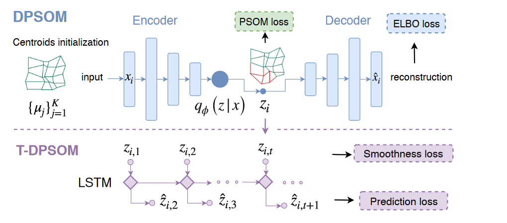

# DPSOM: Deep Probabilistic Clustering with Self-Organizing Maps
我们主要的贡献为：
1. PSOM：一种使用概率聚类分配拟合SOM的新方法。
2. DPSOM：深度聚类的一种架构，通过结合PSOM和VAE来生成一个可解释的离散表示。
3. T-DPSOM：对此架构到时间序列的一个拓展，提升了聚类表现并允许时序预测。

## Probabilistic clustering with the DPSOM
给定数据点$\{x_i\}_{i=1,\cdots,N}$，其中$x_i\in \mathbb{R}^d$，我们的目的是将数据分割为类$\{S_j\}_{j=1,\cdots,K}$。

> DPSOM及其拓展T-DPSOM的架构。

---
### Background

一个SOM包含$K$个节点$M = \{m_j\}_{j=1}^K$，节点通过邻域关系连结，其中节点$m_j$与输入空间的一个中心$\mu_j$对应。给定一个对中心点的初始化，SOM算法随机选择一个输入$x_i$并且更新它最近的中心$\mu_j$和它的邻域使其离$x_i$更近。
给定嵌入函数$z_i = f(x_i)$，使用学生$t-$分布$S$作为核来测量嵌入数据点$z_i$和中心$\mu_j$之间的相似度。它可以提高聚类纯度通过使分布$S$接近目标分布$T$：
$$
s_{i,j} = \frac{\left(1 + \|z_i-\mu_j\|^2/\alpha\right)^{-\frac{\alpha + 1}{2}}}{\sum_{j^\prime}\left(1+\|1+\|z_i - \mu_{j^\prime}\|/\alpha\right)^{-\frac{\alpha+1}{2}}};\quad t_{i,j} = \frac{s_{ij}^\kappa /\sum_{i^\prime }s_{i^\prime j}}{\sum_{j^\prime} s_{ij^\prime}^\kappa/\sum_{i^\prime}s_{i^\prime j^\prime}}
$$
通过将原始分布取为$\kappa$次方并对其进行归一化，目标分布更加强调被赋予高置信度的数据点，从而降低分布的熵。我们选择$\kappa=2$，则聚类损失为：
$$
\mathcal{L}_{\text{CAH}} = \mathbb{KL}(T\| S) = \sum_{i=1}^N\sum_{j=1}^K t_{ij}\log\frac{t_{ij}}{s_{ij}}
$$
---
### PSOM：Probabilistic SOM clustering
给定$K$个节点，$M = \{m_j\}_{j=1}^K$，我们定义邻域函数为$N(j) = \{n_z(j)\}_{z=1}^Z,j\in \{1,\cdots,K\}$，其中$n_z(j)$返回$m_j$第$z$个邻域的索引。我们需要$\cup_j m_{n_z(j)}=M$(没看懂什么意思)。在隐空间内，每个节点都与一个中心$\mu_j$相对应。我们可以定义一个损失函数：
$$
\mathcal{L}_{\text{S-SOM}} = -\frac{1}{N}\sum_{i=1}^N\sum_{j=1}^K s_{ij}\sum_{e\in N(j)}\log s_{ie} = \sum_{z=1}^Z-\frac{1}{N}\sum_{i=1}^N\sum_{j=1}^K s_{ij}\log s_{in_z(j)}
$$
注意：$\sum_j s_{in_z(j)}=1$。我们的PSOM聚类损失为：
$$
\mathcal{L}_{\text{PSOM}} = \mathcal{L}_{\text{CAH}} + \beta \mathcal{L}_{\text{S-SOM}}
$$
---
### DPSOM：VAE for representation learning
$$
\mathcal{L}_{\mathrm{VAE}}=\sum_{i=1}^N\left[-\mathbb{E}_{q_\phi\left(z \mid x_i\right)}\left(\log p_\theta\left(x_i \mid z\right)\right)+D_{K L}\left(q_\phi\left(z \mid x_i\right) \| p(z)\right)\right]
$$
损失函数变为：
$$
\mathcal{L}_{\text{DPSOM}} = \gamma \mathcal{L}_{\text{CAH}} + \beta\mathcal{L}_{\text{S-SOM}} + \mathcal{L}_{\text{VAE}}
$$
---
### T-DPSOM：Extension to time series data
假设我们有$N$个长为$T$的时间序列$\{x_{i,t}\}_{i=1,\cdots,N;t=1,\cdots,T}$。增加损失项：
$$
\mathcal{L}_{\text{smooth}} = -\frac{1}{NT}\sum_{i=1}^N\sum_{t=1}^T u_{i_t,i_{t+1}}
$$
其中$u_{i_t,i_{t+1}} = g(z_{i,t},z_{i,t+1})$为利用学生$t$分布度量的$z_{i,t}$和$z_{i,t+1}$之间的相似度。
我们构建模型的一个重要用途是预测，我们可以使用LSTM对隐变量进行建模。LSTM的每一个单元接受隐状态$z_t$作为输入，预测下一个隐变量的分布$p_\omega(z_{t+1}\mid z_t)$。我们规定损失函数为：
$$
\mathcal{L}_{\text{pred}} = -\sum_{i=1}^N\sum_{t=1}^T \log p_\omega(z_{t+1}\mid z_t)
$$
那我们的损失函数最终为：
$$
\mathcal{L}_{\text{T-DPSOM}} = \mathcal{L}_{\text{DPSOM}} + \mathcal{L}_{\text{smooth}} + \mathcal{L}_{\text{pred}}
$$
