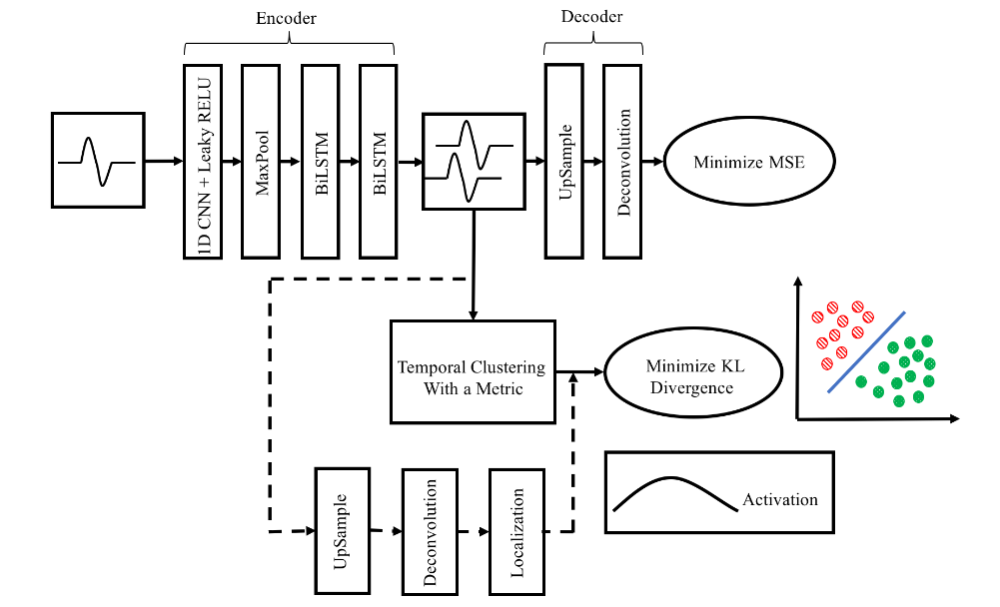

# Deep Temporal Clustering: Fully Unsupervised Learning of Time-Domain Features

## Deep Temporal Clustering
考虑$n$个未标记的实例$\mathrm{x}_1,\cdots,\mathrm{x}_n$。目标是利用无监督学习将$n$条未标记序列聚类为$k\le n$类。

### Temporal Clustering Layer
Temporal clustering layer包含$k$个中心$w_j,j\in 1,\cdots,k$。聚类中心由隐信号$z_i$初始化形成。然后利用$z_i$通过相似性度量在特征空间$Z$中执行具有完整链接的层次聚类。执行$k$ cut 来获得聚类，然后对每个聚类中的元素进行平均来获得初始中心的估计$w_j,j=1\cdots k$。

#### Clustering Criterion

在得到了中心后，我们使用下列几步来训练temporal clustering layer：
+ 首先，输入$x_i$属于类$j$的概率。
+ 之后根据损失函数，中心点被更新。

第$i$个数据属于第$j$个类的概率定义为：
$$
q_{ij} = \frac{\left(1 + \frac{\text{siml}(z_i,w_j)}{\alpha}\right)^{-\frac{\alpha+1}{2}}}{\sum_{j=1}^k \left(1 + \frac{\text{siml}(z_i,w_j)}{\alpha}\right)^{-\frac{\alpha+1}{2}}}
$$
我们一般设置$\alpha = 1$。siml表示相似度函数，有很多选择。
我们将训练聚类层转换为$q_{ij}$和目标分别$p_{ij}$之间的KL散度。我们定义：
$$
p_{ij} = \frac{q_{ij}^2/f_j}{\sum_{j=1}^k q_{ij}^2/f_j}
$$
其中$f_j = \sum_{i=1}^n q_{ij}$。那么KL散度变为：
$$
L = \sum_{i=1}^n\sum_{j=1}^k p_{ij}\log \frac{p_{ij}}{q_{ij}}
$$

